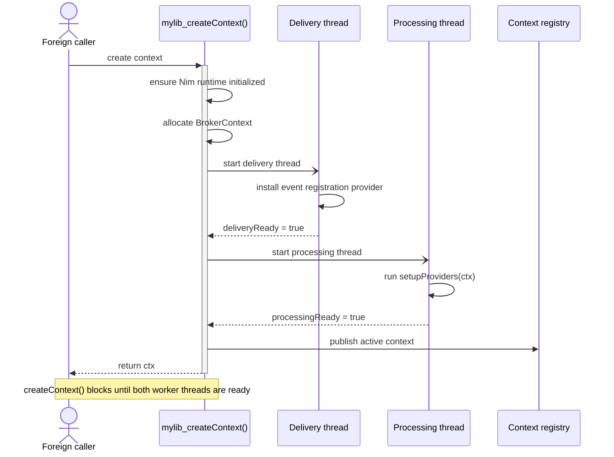
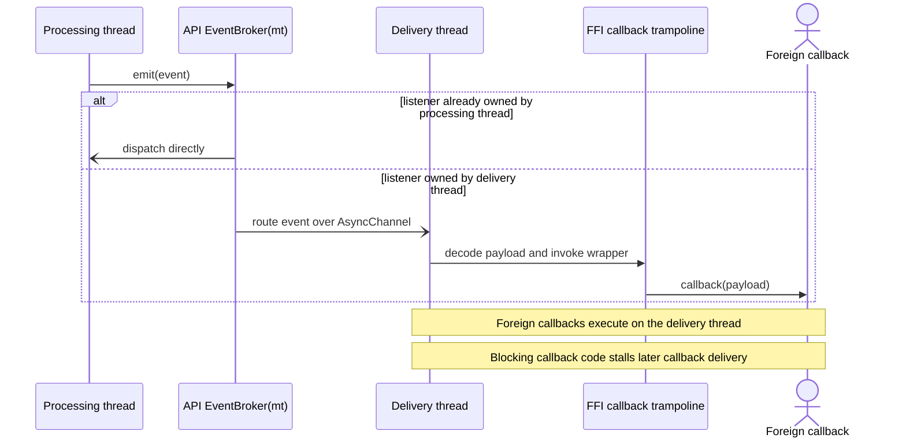
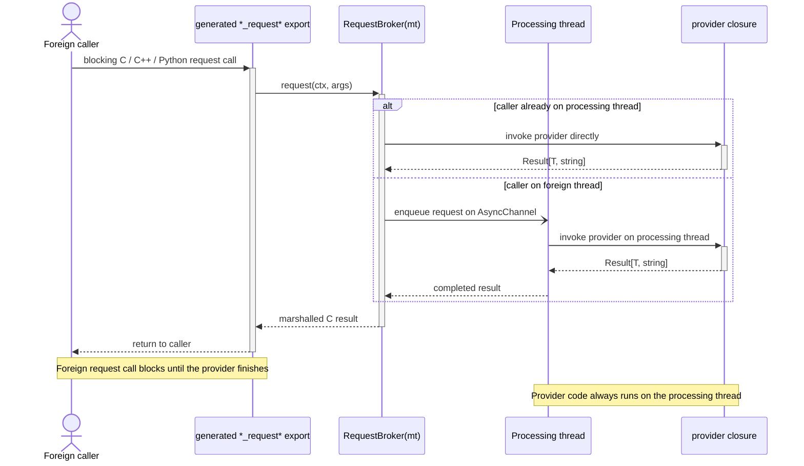

# Broker FFI API

## Overview

The Broker FFI API is the shared-library integration layer built on top of
`RequestBroker(API)`, `EventBroker(API)`, and `registerBrokerLibrary`.

It is intended for cases where a Nim component should be consumed from foreign
languages while still using nim-brokers internally for typed request/response
and event delivery.

Typical consumers are:

- plain C applications
- C++ applications through the generated wrapper class
- Python applications through the generated ctypes wrapper

The FFI API solution provides:

- C-callable request functions for API request brokers
- C-callable event registration functions for API event brokers
- a generated library lifecycle API
- a generated C header
- a generated C++ wrapper layer inside that header
- an optional generated Python wrapper module

Generated `CItem` and `CResult` structs use the platform's normal C ABI
layout. They are not emitted as packed structs, and the generated C header,
C++ wrapper, and Python `ctypes.Structure` definitions all assume that default
layout.

The FFI API is designed around a per-library-context runtime model. Each call to
`<lib>_createContext()` creates one independent broker context with its own worker
threads and broker registrations.

---

## Building Blocks

The FFI API layer is composed from three parts.

### 1. `RequestBroker(API)`

Defines a request type that is exported as a C ABI function.

Example:

```nim
RequestBroker(API):
  type GetDevice = object
    deviceId*: int64
    name*: string

  proc signature*(deviceId: int64): Future[Result[GetDevice, string]] {.async.}
```

This generates:

- a C result struct
- a C-exported request function such as `mylib_get_device(...)` once the broker is
  registered into a library
- a library-prefixed `mylib_free_*_result(...)` function for result-owned memory
- C++ and Python wrapper methods built from the same declaration

### 2. `EventBroker(API)`

Defines an event type that can be subscribed to from foreign code.

Example:

```nim
EventBroker(API):
  type DeviceDiscovered = object
    deviceId*: int64
    name*: string
```

This generates:

- a C callback typedef
- `on<EventType>(ctx, callback)`
- `off<EventType>(ctx, handle)`
- generated wrapper registration methods in C++ and Python

### 3. `registerBrokerLibrary`

This macro ties the API request and event brokers into a complete shared
library surface.

Example:

```nim
registerBrokerLibrary:
  name: "mylib"
  initializeRequest: InitializeRequest
  shutdownRequest: ShutdownRequest
```

This generates:

- `mylib_createContext()`
- `mylib_shutdown(ctx)`
- `mylib_free_string(...)`
- the library context registry
- the delivery and processing threads
- aggregate event registration routing
- generated header and optional Python wrapper output

---

## Lifecycle Model

The FFI API exposes a single public creation entry point.

### Per-context creation

`<lib>_createContext()` creates one independent library instance.

Responsibilities:

- ensure the Nim runtime is initialized once per process
- allocate a fresh `BrokerContext`
- start the delivery thread
- start the processing thread
- wait until both threads report readiness
- publish the context in the library registry

The startup handshake is synchronous from the caller point of view. When
`<lib>_createContext()` returns a context, the delivery side and processing side
are already ready for use.

This is why the examples do not need a post-create sleep.

The generated C API returns a small result struct with:

- `ctx`
- `error_message`

When startup fails, `ctx` is zero and `error_message` contains a descriptive
message that must be released with `free_<lib>_create_context_result(...)`.

Sequence overview:



### Post-create configuration

`InitializeRequest` is the request broker type used for configuration after the
context exists.

Typical responsibilities:

- load configuration files
- initialize thread-local provider state
- register additional providers lazily
- validate environment or external dependencies

### Shutdown

`ShutdownRequest` is the broker request type for orderly application-level
teardown.

`<lib>_shutdown(ctx)` first invokes `ShutdownRequest` on the processing thread,
then stops the delivery and processing threads and marks the context inactive in
the registry.

Foreign callers only need to call `<lib>_shutdown(ctx)`.

---

## Threading Architecture

Each created library context owns two threads.

### Processing thread

Purpose:

- hosts API request providers
- runs `setupProviders(ctx)` during startup
- serves requests for `RequestBroker(API)` types

This is the thread on which provider closures execute.

### Delivery thread

Purpose:

- hosts the generated event-listener registration broker
- accepts `on<Event>` / `off<Event>` calls from foreign code
- executes foreign callback trampolines for API event delivery

This is the thread that invokes C callbacks and the callback trampolines used by
the generated C++ and Python wrappers.

### Why there are two threads

The split avoids mixing foreign callback delivery with request provider logic.

Benefits:

- event callback dispatch is isolated from request execution
- request providers can keep request-local state on the processing thread
- event registration is always owned by the delivery thread
- shutdown ordering is predictable

### Startup ordering

The generated create function starts the threads in this order:

1. delivery thread
2. processing thread

The delivery thread is started first so event registration requests are routable
before the context is returned to the caller.

The create function waits for:

- delivery thread readiness after the event registration provider is installed
- processing thread readiness after `setupProviders(ctx)` completes

The sequence above is the reason `create()` behaves synchronously even though
the implementation starts two background threads internally.

### Event behavior

When foreign code registers an event callback:

- the registration call goes through the generated `RegisterEventListenerResult`
  request broker
- that request is served on the delivery thread
- the delivery thread stores the listener handle and callback wrapper

When the Nim side emits an API event:

- the event is routed by the generated multi-thread event broker
- same-thread delivery uses direct async dispatch
- cross-thread delivery uses async channels
- foreign callbacks run on the delivery thread



### Request behavior

API request brokers use the same multi-thread request broker runtime as
`RequestBroker(mt)`.

That means:

- same-thread requests call the provider directly
- cross-thread requests are routed through an `AsyncChannel`
- the provider thread owns the provider closure
- one provider exists per broker type per broker context



See [Multi-Thread RequestBroker](MultiThread_RequestBroker.md) for the lower
level request-routing behavior that the FFI API builds on.

---

## Requirements on `InitializeRequest` and `ShutdownRequest`

`registerBrokerLibrary` requires that the types named in `initializeRequest:` and
`shutdownRequest:` exist at compile time. The legacy `destroyRequest:` alias is
still accepted for compatibility.

It does not itself force those providers to be registered.

In practice:

- `InitializeRequest.setProvider(ctx, ...)` should be installed in `setupProviders`
  if you want the generated `mylib_initialize(...)` export to be immediately usable
- `ShutdownRequest.setProvider(ctx, ...)` should also usually be installed there
  if you want `mylib_shutdown(ctx)` to perform orderly application teardown

For other API request brokers, lazy registration is allowed.

For example, a library may:

- register `InitializeRequest` and `ShutdownRequest` during startup
- use `InitializeRequest.request(...)` to install additional API broker providers

This works because `InitializeRequest` executes on the processing thread, which is
the correct owner thread for `setProvider` on API request brokers.

The main limitation is that a provider can only be registered once per broker
type per context unless it is cleared first.

---

## Authoring a Broker FFI Library

### Minimal structure

```nim
import brokers/[event_broker, request_broker, broker_context]
when defined(BrokerFfiApi):
  import brokers/api_library

RequestBroker(API):
  type InitializeRequest = object
    initialized*: bool

  proc signature*(configPath: string): Future[Result[InitializeRequest, string]] {.async.}

RequestBroker(API):
  type ShutdownRequest = object
    status*: int32

  proc signature*(): Future[Result[ShutdownRequest, string]] {.async.}

EventBroker(API):
  type StatusChanged = object
    label*: string

var gProviderCtx {.threadvar.}: BrokerContext

proc setupProviders(ctx: BrokerContext) =
  gProviderCtx = ctx

  discard InitializeRequest.setProvider(
    ctx,
    proc(configPath: string): Future[Result[InitializeRequest, string]] {.closure, async.} =
      return ok(InitializeRequest(initialized: true))
  )

  discard ShutdownRequest.setProvider(
    ctx,
    proc(): Future[Result[ShutdownRequest, string]] {.closure, async.} =
      return ok(ShutdownRequest(status: 0))
  )

when defined(BrokerFfiApi):
  registerBrokerLibrary:
    name: "mylib"
    initializeRequest: InitializeRequest
    shutdownRequest: ShutdownRequest
```

### `setupProviders(ctx)` convention

If a proc named `setupProviders(ctx: BrokerContext)` exists, the generated
library startup calls it automatically on the processing thread.

That proc is the main hook for:

- registering request providers
- capturing thread-local state
- remembering the active provider context
- installing lazily created providers if desired

### Batch request inputs

For request parameters that need to cross the foreign-function boundary as a
collection, prefer `seq[ApiType]` over `seq[tuple[...]]`.

Example:

```nim
ApiType:
  type AddDeviceSpec = object
    name*: string
    deviceType*: string
    address*: string

RequestBroker(API):
  type AddDevice = object
    devices*: seq[DeviceInfo]
    success*: bool

  proc signature*(devices: seq[AddDeviceSpec]):
    Future[Result[AddDevice, string]] {.async.}
```

Why this shape is preferred:

- `ApiType` already generates a stable foreign representation for each item:
  a C `*CItem` struct, a C++ value type, and a Python dataclass plus
  `ctypes.Structure`
- the generated request export can pass the batch as pointer plus count at the
  C ABI boundary and reconstruct `seq[AddDeviceSpec]` on the Nim side
- the same declaration maps cleanly into the generated C++, Python, and C
  surfaces without handwritten marshalling

In contrast, literal tuple sequences are not a good fit for the current FFI
generator because tuple items do not participate in the `ApiType` registry that
drives foreign struct generation.

Current limitation:

- `RequestBroker(API)` supports one zero-argument signature and one argument-
  bearing signature for a broker type
- if you need to add a batch form such as `AddDevice(devices: seq[AddDeviceSpec])`,
  replace the existing argument-bearing signature or model the variants as
  separate request broker types

### Data ownership for request results

The generated C request exports return C structs that may own allocated strings
or arrays.

Foreign code must free them using the generated `free_*_result(...)` function.
For registered libraries these functions are library-prefixed, for example
`mylib_free_initialize_result(...)`.

The generated C++ and Python wrappers hide that cleanup automatically.

---

## Generated Foreign Surfaces

### C API

The generated C surface contains:

- lifecycle functions
- one exported request function per API request broker signature
- one free function per request result type
- event callback typedefs and `on/off` registration functions

Example:

```c
typedef struct {
  uint32_t ctx;
  const char* error_message;
} mylibCreateContextResult;

mylibCreateContextResult mylib_createContext(void);
void free_mylib_create_context_result(mylibCreateContextResult* r);
void mylib_shutdown(uint32_t ctx);

InitializeRequestCResult mylib_initialize(uint32_t ctx, const char* configPath);
void mylib_free_initialize_result(InitializeRequestCResult* r);

uint64_t mylib_onDeviceDiscovered(uint32_t ctx, DeviceDiscoveredCCallback callback);
void mylib_offDeviceDiscovered(uint32_t ctx, uint64_t handle);
```

### C++ wrapper

The generated header also contains a wrapper class.

Current lifecycle shape:

- inert `Mylib lib;`
- `lib.createContext()` for per-context creation
- `lib.shutdown()` for shutdown
- request wrapper methods such as `initializeRequest(...)`, `listDevices()`, and
  `getDevice(...)`

Example:

```cpp
Mylib lib;
auto created = lib.createContext();
if (!created.ok()) {
    return 1;
}

auto res = lib.initializeRequest("/opt/devices.yaml");
if (!res.ok()) {
    std::fprintf(stderr, "%s\n", res.error().c_str());
}
```

### Python wrapper

When Python generation is enabled, a ctypes wrapper module is emitted.

The Python wrapper mirrors the C++ lifecycle shape closely:

- `Mylib()` loads the library but starts without a context
- `createContext()` performs per-context creation explicitly
- `validContext()` and truthiness reflect whether a live context exists
- `shutdown()` is exposed for explicit teardown

Example:

```python
from mylib import Mylib

with Mylib() as lib:
  create_res = lib.createContext()
  if not create_res.ok:
    raise RuntimeError(create_res.error)

  res = lib.initializeRequest("/opt/devices.yaml")
  print(res.configPath)
```

---

## Build Requirements

### Required compiler flags

The FFI API needs:

- `-d:BrokerFfiApi`
- `--threads:on`
- `--app:lib`
- `--nimMainPrefix:<libname>`

The example build also uses an explicit output directory.

Example:

```sh
nim c \
  -d:BrokerFfiApi \
  --threads:on \
  --app:lib \
  --nimMainPrefix:mylib \
  --path:src \
  --outdir:examples/ffiapi/nimlib/build \
  examples/ffiapi/nimlib/mylib.nim
```

Optional:

- `-d:BrokerFfiApiGenPy` to generate the Python wrapper

### Memory manager

Use one of:

- `--mm:orc`
- `--mm:refc`

The repository examples and tests support both.

### Why `--nimMainPrefix` matters

The generated `registerBrokerLibrary` code imports `<libname>NimMain`.

That symbol is produced by compiling with the matching Nim main prefix. If the
prefix does not match the library name used in `registerBrokerLibrary`, the
library will fail to link.

### Example tasks in this repository

The repository provides convenience tasks:

- `nimble buildFfiExample`
- `nimble buildFfiExamplePy`
- `nimble buildFfiExampleC`
- `nimble buildFfiExampleCpp`
- `nimble runFfiExampleC`
- `nimble runFfiExampleCpp`
- `nimble runFfiExamplePy`
- `nimble testApi`

---

## Operational Expectations

### What `mylib_createContext()` guarantees

When `mylib_createContext()` succeeds:

- the event registration provider is already installed
- the processing thread already ran `setupProviders(ctx)`
- API requests and event listener registration can be used immediately

### What it does not guarantee

It does not guarantee that every API broker has a provider unless your
`setupProviders(ctx)` registered them.

If a generated request export is called before its broker has a provider, it
returns a normal broker error result rather than crashing.

### Callback behavior

Foreign event callbacks should be treated as non-blocking callback code.

Recommended practice:

- do lightweight work in the callback
- hand off expensive processing to your own queue or thread
- avoid blocking the delivery thread for long periods

### Provider behavior

Request providers run on the processing thread and may be async. That means:

- multiple requests can be interleaved across await points
- provider code should protect mutable shared state if reentrancy matters
- shutting down external resources should account for in-flight work

---

## Related Documents

- [Multi-Thread RequestBroker](MultiThread_RequestBroker.md)
- [Multi-Thread EventBroker](MultiThread_EventBroker.md)
