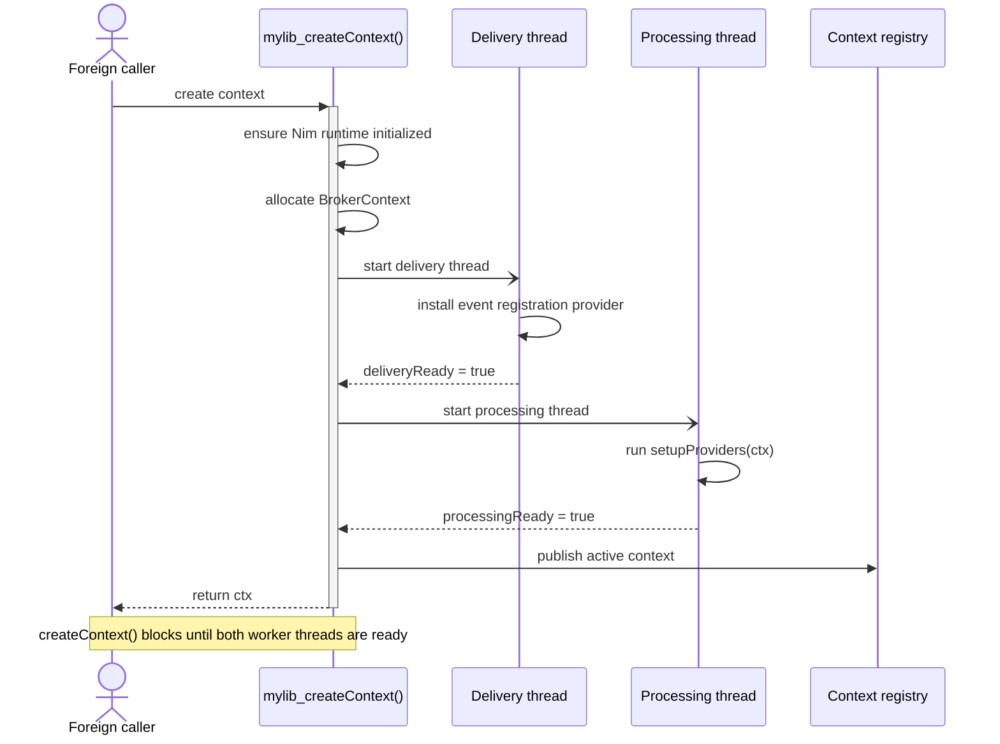
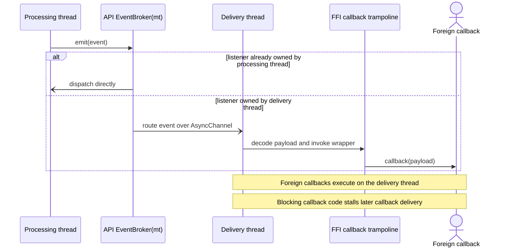
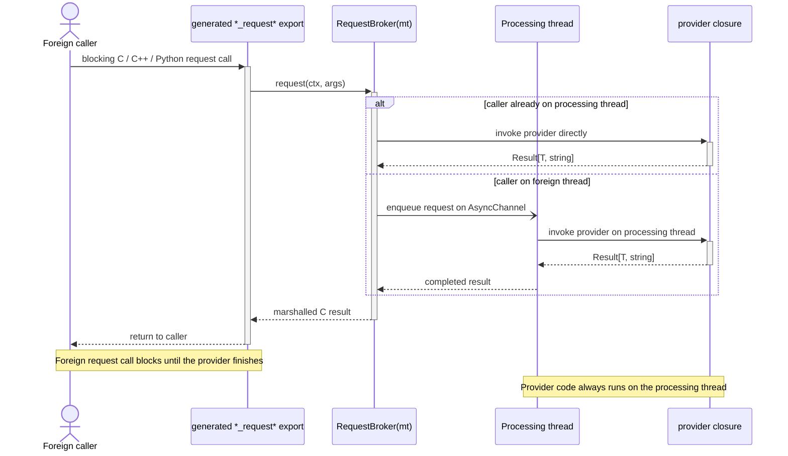

# Broker FFI API

## Overview

The Broker FFI API is the shared-library integration layer built on top of
`RequestBroker(API)`, `EventBroker(API)`, and `registerBrokerLibrary`.

It is intended for cases where a Nim component should be consumed from foreign
languages while still using nim-brokers internally for typed request/response
and event delivery.

Typical consumers are:

- plain C applications
- C++ applications through the generated wrapper class
- Python applications through the generated ctypes wrapper

The FFI API solution provides:

- C-callable request functions for API request brokers
- C-callable event registration functions for API event brokers
- a generated library lifecycle API
- a generated C header (`.h`)
- a generated C++ wrapper header (`.hpp`) that includes the C header
- an optional generated Python wrapper module (`.py`)

Generated `CItem` and `CResult` structs use the platform's normal C ABI
layout. They are not emitted as packed structs, and the generated C header,
C++ wrapper, and Python `ctypes.Structure` definitions all assume that default
layout.

The FFI API is designed around a per-library-context runtime model. Each call to
`<lib>_createContext()` creates one independent broker context with its own worker
threads and broker registrations.

---

## Code Structure

The FFI API system is split into focused modules, each owning one concern.

### Source Layout

```
src/
  api_schema.nim              Type registry (ApiTypeEntry, gApiTypeRegistry)
  api_type_resolver.nim       Two-phase external type auto-resolution
  api_codegen_c.nim           C type mapping + header generation (.h)
  api_codegen_cpp.nim         C++ type mapping + wrapper generation (.hpp)
  api_codegen_python.nim      Python type mapping + wrapper generation (.py)
  api_codegen_nim.nim         Nim → C ABI type mapping (toCFieldType, isCStringType)
  api_common.nim              Re-export hub + legacy bridge + runtime memory helpers
  api_type.nim                Deprecated ApiType shim (→ generateApiType)
  api_request_broker.nim      RequestBroker(API) macro + deferred codegen
  api_event_broker.nim        EventBroker(API) macro + deferred codegen
  api_library.nim             registerBrokerLibrary — lifecycle + file orchestration
  helper/broker_utils.nim     Shared AST parsing (parseSingleTypeDef, parseTypeDefs)
```

### Module Dependency Graph

```
helper/broker_utils.nim        (no API deps)
      |
api_schema.nim                 (type registry)
      |
api_codegen_c.nim              (C mapping, accumulators, generateCHeaderFile)
      |
      +-- api_codegen_cpp.nim   (C++ mapping, accumulators, generateCppHeaderFile)
      |
      +-- api_codegen_python.nim (Python mapping, accumulators, generatePythonFile)
      |
      +-- api_codegen_nim.nim    (Nim → C ABI mapping)
      |
api_common.nim                 (re-exports all above + legacy bridge + runtime helpers)
      |
api_type_resolver.nim          (two-phase auto-resolution)
      |
api_type.nim                   (deprecated ApiType shim)
      |
api_request_broker.nim         (RequestBroker(API) generation)
api_event_broker.nim           (EventBroker(API) generation)
      |
api_library.nim                (lifecycle + file orchestration)
```

**Key rule**: Codegen modules (C, C++, Python, Nim) have no dependencies on each
other. Each owns its accumulators and type mapping functions. Adding a new
language surface means adding one new module with no changes to existing ones.

### Codegen Module Responsibilities

Each codegen module owns:

1. **Type mapping procs** — convert Nim types to the target language
   (`nimTypeToCOutput`, `nimTypeToCpp`, `nimTypeToCtypes`, `toCFieldType`)
2. **Compile-time accumulators** — collect code fragments during macro expansion
3. **File generator** — reads accumulators and writes the output file

| Module | Output | Accumulators |
|--------|--------|-------------|
| `api_codegen_c.nim` | `.h` | `gApiHeaderDeclarations`, `gApiCExportWrappers` |
| `api_codegen_cpp.nim` | `.hpp` | `gApiCppStructs`, `gApiCppClassMethods`, `gApiCppPreamble`, `gApiCppPrivateMembers`, etc. |
| `api_codegen_python.nim` | `.py` | `gApiPyCtypesStructs`, `gApiPyDataclasses`, `gApiPyMethods`, `gApiPyEventMethods`, etc. |
| `api_codegen_nim.nim` | (AST) | none — provides type mapping for Nim `{.exportc.}` struct generation |

### Compile-Time Data Flow

```
1. User defines plain Nim types (DeviceInfo, AddDeviceSpec)

2. Broker macros expand:
   a. discoverExternalTypes() scans AST for non-primitive types
   b. emitAutoRegistrations() emits autoRegisterApiType(T) calls
   c. Deferred codegen macro emitted (runs after registrations)

3. autoRegisterApiType(T) typed macro expands (runs first):
   a. getTypeImpl() extracts fields
   b. Recursion for nested object types
   c. Registers in gApiTypeRegistry
   d. Generates CItem type + encode proc
   e. Appends to all language accumulators (C, C++, Python)

4. Deferred broker codegen expands (runs after step 3):
   a. lookupFfiStruct() succeeds — registry populated
   b. Generates CResult struct, encode proc, exported C functions
   c. Appends to all language accumulators

5. registerBrokerLibrary macro:
   a. Generates lifecycle code (createContext, shutdown, threads)
   b. Calls file generators:
      - generateCHeaderFile()   → <libName>.h
      - generateCppHeaderFile() → <libName>.hpp
      - generatePythonFile()    → <libName>.py
```

---

## Type Auto-Resolution

External types referenced in broker macros are automatically discovered and
registered at compile time. No separate `ApiType` registration macro is needed.

### Usage

Define types as plain Nim objects before the broker macro:

```nim
type DeviceInfo* = object
  deviceId*: int64
  name*: string
  online*: bool

RequestBroker(API):
  type ListDevices = object
    devices*: seq[DeviceInfo]
  proc signature*(): Future[Result[ListDevices, string]] {.async.}
```

`DeviceInfo` is auto-discovered from the `seq[DeviceInfo]` field and
auto-registered. The CItem struct, encode proc, C header struct, C++ struct, and
Python dataclass are all generated automatically.

### How It Works

The auto-resolution uses a two-phase approach to work within Nim's macro system
constraints:

**Phase 1 — Discovery (untyped context)**:
`discoverExternalTypes(body)` scans the raw AST for non-primitive type
references in type fields, proc parameters, and type aliases.

**Phase 2 — Resolution (typed macro)**:
`autoRegisterApiType(T: typed)` receives a resolved type symbol, introspects its
fields via `getTypeImpl()`, recursively resolves nested object types, and
registers everything in the compile-time type registry.

The **deferred codegen pattern** ensures proper ordering: auto-registration macro
calls are emitted before the broker codegen macro, so the type registry is
populated when the codegen needs to look up fields.

### What Is Auto-Discovered

- `seq[T]` in type fields: `devices: seq[DeviceInfo]` → discovers `DeviceInfo`
- `seq[T]` in proc parameters: `proc signature*(items: seq[AddDeviceSpec])` → discovers `AddDeviceSpec`
- Plain custom type fields: `info: DeviceInfo` → discovers `DeviceInfo`
- Type aliases: `type MyEvent = ExternalType` → discovers `ExternalType`
- Nested objects: if `DeviceInfo` has `address: Address`, `Address` is recursively resolved

### Constraints

- External types must be defined **before** the broker macro call site (standard
  Nim compilation order)
- Only `object` types can be fully introspected. Enums, distinct types, etc.
  pass through without field registration.

### ApiType Deprecation

The `ApiType` macro still works but emits a compile-time deprecation warning.
Existing code continues to compile. New code should use plain types.

---

## Building Blocks

The FFI API layer is composed from three parts.

### 1. `RequestBroker(API)`

Defines a request type that is exported as a C ABI function.

Example:

```nim
RequestBroker(API):
  type GetDevice = object
    deviceId*: int64
    name*: string

  proc signature*(deviceId: int64): Future[Result[GetDevice, string]] {.async.}
```

This generates:

- a C result struct
- a C-exported request function such as `mylib_get_device(...)` once the broker is
  registered into a library
- a library-prefixed `mylib_free_*_result(...)` function for result-owned memory
- C++ and Python wrapper methods built from the same declaration

### 2. `EventBroker(API)`

Defines an event type that can be subscribed to from foreign code.

Example:

```nim
EventBroker(API):
  type DeviceDiscovered = object
    deviceId*: int64
    name*: string
```

This generates:

- a C callback typedef
- `on<EventType>(ctx, callback, userData)`
- `off<EventType>(ctx, handle)`
- generated wrapper registration methods in C++ and Python

### 3. `registerBrokerLibrary`

This macro ties the API request and event brokers into a complete shared
library surface.

Example:

```nim
registerBrokerLibrary:
  name: "mylib"
  initializeRequest: InitializeRequest
  shutdownRequest: ShutdownRequest
```

This generates:

- `mylib_createContext()`
- `mylib_shutdown(ctx)`
- `mylib_free_string(...)`
- the library context registry
- the delivery and processing threads
- aggregate event registration routing
- generated header and optional Python wrapper output

---

## Lifecycle Model

The FFI API exposes a single public creation entry point.

### Per-context creation

`<lib>_createContext()` creates one independent library instance.

Responsibilities:

- ensure the Nim runtime is initialized once per process
- allocate a fresh `BrokerContext`
- start the delivery thread
- start the processing thread
- wait until both threads report readiness
- publish the context in the library registry

The startup handshake is synchronous from the caller point of view. When
`<lib>_createContext()` returns a context, the delivery side and processing side
are already ready for use.

This is why the examples do not need a post-create sleep.

The generated C API returns a small result struct with:

- `ctx`
- `error_message`

When startup fails, `ctx` is zero and `error_message` contains a descriptive
message that must be released with `free_<lib>_create_context_result(...)`.

Sequence overview:



### Post-create configuration

`InitializeRequest` is the request broker type used for configuration after the
context exists.

Typical responsibilities:

- load configuration files
- initialize thread-local provider state
- register additional providers lazily
- validate environment or external dependencies

### Shutdown

`ShutdownRequest` is the broker request type for orderly application-level
teardown.

`<lib>_shutdown(ctx)` first invokes `ShutdownRequest` on the processing thread,
then stops the delivery and processing threads and marks the context inactive in
the registry.

Foreign callers only need to call `<lib>_shutdown(ctx)`.

---

## Threading Architecture

Each created library context owns two threads.

### Processing thread

Purpose:

- hosts API request providers
- runs `setupProviders(ctx)` during startup
- serves requests for `RequestBroker(API)` types

This is the thread on which provider closures execute.

### Delivery thread

Purpose:

- hosts the generated event-listener registration broker
- accepts `on<Event>` / `off<Event>` calls from foreign code
- executes foreign callback trampolines for API event delivery

This is the thread that invokes C callbacks and the callback trampolines used by
the generated C++ and Python wrappers.

### Why there are two threads

The split avoids mixing foreign callback delivery with request provider logic.

Benefits:

- event callback dispatch is isolated from request execution
- request providers can keep request-local state on the processing thread
- event registration is always owned by the delivery thread
- shutdown ordering is predictable

### Startup ordering

The generated create function starts the threads in this order:

1. delivery thread
2. processing thread

The delivery thread is started first so event registration requests are routable
before the context is returned to the caller.

The create function waits for:

- delivery thread readiness after the event registration provider is installed
- processing thread readiness after `setupProviders(ctx)` completes

The sequence above is the reason `create()` behaves synchronously even though
the implementation starts two background threads internally.

### Event behavior

When foreign code registers an event callback:

- the registration call goes through the generated `RegisterEventListenerResult`
  request broker
- that request is served on the delivery thread
- the delivery thread stores the listener handle, callback function pointer, and
  opaque `userData` pointer

When the Nim side emits an API event:

- the event is routed by the generated multi-thread event broker
- same-thread delivery uses direct async dispatch
- cross-thread delivery uses async channels
- foreign callbacks run on the delivery thread



### Request behavior

API request brokers use the same multi-thread request broker runtime as
`RequestBroker(mt)`.

That means:

- same-thread requests call the provider directly
- cross-thread requests are routed through an `AsyncChannel`
- the provider thread owns the provider closure
- one provider exists per broker type per broker context



See [Multi-Thread RequestBroker](MultiThread_RequestBroker.md) for the lower
level request-routing behavior that the FFI API builds on.

---

## Requirements on `InitializeRequest` and `ShutdownRequest`

`registerBrokerLibrary` requires that the types named in `initializeRequest:` and
`shutdownRequest:` exist at compile time. The legacy `destroyRequest:` alias is
still accepted for compatibility.

It does not itself force those providers to be registered.

In practice:

- `InitializeRequest.setProvider(ctx, ...)` should be installed in `setupProviders`
  if you want the generated `mylib_initialize(...)` export to be immediately usable
- `ShutdownRequest.setProvider(ctx, ...)` should also usually be installed there
  if you want `mylib_shutdown(ctx)` to perform orderly application teardown

For other API request brokers, lazy registration is allowed.

For example, a library may:

- register `InitializeRequest` and `ShutdownRequest` during startup
- use `InitializeRequest.request(...)` to install additional API broker providers

This works because `InitializeRequest` executes on the processing thread, which is
the correct owner thread for `setProvider` on API request brokers.

The main limitation is that a provider can only be registered once per broker
type per context unless it is cleared first.

---

## Authoring a Broker FFI Library

### Minimal structure

```nim
import brokers/[event_broker, request_broker, broker_context, api_library]

RequestBroker(API):
  type InitializeRequest = object
    initialized*: bool

  proc signature*(configPath: string): Future[Result[InitializeRequest, string]] {.async.}

RequestBroker(API):
  type ShutdownRequest = object
    status*: int32

  proc signature*(): Future[Result[ShutdownRequest, string]] {.async.}

EventBroker(API):
  type StatusChanged = object
    label*: string

var gProviderCtx {.threadvar.}: BrokerContext

proc setupProviders(ctx: BrokerContext) =
  gProviderCtx = ctx

  discard InitializeRequest.setProvider(
    ctx,
    proc(configPath: string): Future[Result[InitializeRequest, string]] {.closure, async.} =
      return ok(InitializeRequest(initialized: true))
  )

  discard ShutdownRequest.setProvider(
    ctx,
    proc(): Future[Result[ShutdownRequest, string]] {.closure, async.} =
      return ok(ShutdownRequest(status: 0))
  )

registerBrokerLibrary:
  name: "mylib"
  initializeRequest: InitializeRequest
  shutdownRequest: ShutdownRequest
```

### `setupProviders(ctx)` convention

If a proc named `setupProviders(ctx: BrokerContext)` exists, the generated
library startup calls it automatically on the processing thread.

That proc is the main hook for:

- registering request providers
- capturing thread-local state
- remembering the active provider context
- installing lazily created providers if desired

### Batch request inputs

For request parameters that need to cross the foreign-function boundary as a
collection, prefer `seq[T]` where `T` is a plain Nim object type defined before
the broker macro.

Example:

```nim
type AddDeviceSpec* = object
  name*: string
  deviceType*: string
  address*: string

RequestBroker(API):
  type AddDevice = object
    devices*: seq[DeviceInfo]
    success*: bool

  proc signature*(devices: seq[AddDeviceSpec]):
    Future[Result[AddDevice, string]] {.async.}
```

Why this shape is preferred:

- The type auto-resolution system discovers `AddDeviceSpec` from the proc
  parameter and generates a stable foreign representation for each item:
  a C `*CItem` struct, a C++ value type, and a Python dataclass plus
  `ctypes.Structure`
- the generated request export can pass the batch as pointer plus count at the
  C ABI boundary and reconstruct `seq[AddDeviceSpec]` on the Nim side
- the same declaration maps cleanly into the generated C++, Python, and C
  surfaces without handwritten marshalling

In contrast, literal tuple sequences are not a good fit for the current FFI
generator because tuple items do not participate in the type registry that
drives foreign struct generation.

Current limitation:

- `RequestBroker(API)` supports at most two signature categories for a broker
  type: one zero-argument signature and one argument-bearing signature
- the zero-argument form is optional; it is auto-generated only when no
  signatures are declared at all
- if you need to add a batch form such as `AddDevice(devices: seq[AddDeviceSpec])`,
  and the broker already has another argument-bearing signature, replace that
  signature or model the variants as separate request broker types

### Event callback ABI

The generated C event ABI now includes two identity parameters ahead of the
event payload:

- `ctx`, the library context that emitted the event
- `userData`, an opaque pointer supplied by the foreign caller during
  registration

For an event such as `DeviceDiscovered`, the generated C typedef looks like:

```c
typedef void (*DeviceDiscoveredCCallback)(
  uint32_t ctx,
  void* userData,
  int64_t deviceId,
  const char* name,
  const char* deviceType,
  const char* address
);
```

The matching registration export is:

```c
uint64_t mylib_onDeviceDiscovered(
  uint32_t ctx,
  DeviceDiscoveredCCallback callback,
  void* userData
);
```

This shape has two purposes:

- `ctx` tells the callback which library instance emitted the event
- `userData` lets the foreign caller carry its own ownership or routing token
  through the C ABI unchanged

The Nim runtime does not interpret `userData`; it only stores it and passes it
back to the callback.

### Data ownership for request results

The generated C request exports return C structs that may own allocated strings
or arrays.

Foreign code must free them using the generated `free_*_result(...)` function.
For registered libraries these functions are library-prefixed, for example
`mylib_free_initialize_result(...)`.

The generated C++ and Python wrappers hide that cleanup automatically.

---

## Generated Foreign Surfaces

### C API

The generated C surface contains:

- lifecycle functions
- one exported request function per API request broker signature
- one free function per request result type
- event callback typedefs and `on/off` registration functions

Example:

```c
typedef struct {
  uint32_t ctx;
  const char* error_message;
} mylibCreateContextResult;

mylibCreateContextResult mylib_createContext(void);
void free_mylib_create_context_result(mylibCreateContextResult* r);
void mylib_shutdown(uint32_t ctx);

InitializeRequestCResult mylib_initialize(uint32_t ctx, const char* configPath);
void mylib_free_initialize_result(InitializeRequestCResult* r);

uint64_t mylib_onDeviceDiscovered(
  uint32_t ctx,
  DeviceDiscoveredCCallback callback,
  void* userData
);
void mylib_offDeviceDiscovered(uint32_t ctx, uint64_t handle);
```

### C++ wrapper

The C++ wrapper is generated as a separate `.hpp` file that includes the C
header via `#pragma once` and `#include "<libName>.h"`. This keeps the pure C
declarations separate from the C++ layer.

Current lifecycle shape:

- inert `Mylib lib;`
- `lib.createContext()` for per-context creation
- `lib.shutdown()` for shutdown
- request wrapper methods such as `initializeRequest(...)`, `listDevices()`, and
  `getDevice(...)`
- event wrapper methods such as `onDeviceDiscovered(...)` and
  `offDeviceDiscovered(...)`

The generated header now includes a compact comment block directly above the
wrapper class so users can scan the public surface without reading the full
implementation.

Example extract from the generated `mylib.hpp`:

```cpp
// Quick C++ wrapper interface summary (names only)
// class Mylib {
// public:
//   createContext();
//   validContext() const;
//   operator bool() const;
//   shutdown();
//   ctx() const;
//   initializeRequest(configPath);
//   addDevice(devices);
//   removeDevice(deviceId);
//   getDevice(deviceId);
//   listDevices();
//   DeviceStatusChangedCallback(owner, deviceId, name, online, timestampMs);
//   onDeviceStatusChanged(fn);
//   offDeviceStatusChanged(handle = 0);
//   DeviceDiscoveredCallback(owner, deviceId, name, deviceType, address);
//   onDeviceDiscovered(fn);
//   offDeviceDiscovered(handle = 0);
// };
```

The generated event machinery no longer uses class-static callback registries.
Instead it emits:

- a reusable `EventDispatcher<Owner, Traits, ...>` template
- one traits struct per API event type
- one dispatcher instance per event type inside each generated wrapper object

This design keeps event callback ownership attached to a single wrapper
instance, which avoids the cross-instance callback corruption that a shared
static callback registry would cause.

Public C++ event callbacks are owner-aware. The first callback argument is a
reference to the wrapper instance that owns the context.

Example:

```cpp
uint64_t handle = lib.onDeviceDiscovered(
    [](Mylib& owner,
       int64_t deviceId,
       std::string_view name,
       std::string_view deviceType,
       std::string_view address) {
        std::printf("ctx=%u name=%.*s\n",
                    owner.ctx(),
                    (int)name.size(),
                    name.data());
    }
);
```

The generated dispatcher catches and swallows exceptions from user callbacks so
that no exception crosses the C callback boundary.

The generated wrapper is intentionally non-copyable and non-movable. The event
dispatcher passes its own address through the C ABI as `userData`, so wrapper
and dispatcher addresses must remain stable for the lifetime of the
registration.

If a foreign application needs many library instances in a container, the
recommended pattern is `std::unique_ptr<Mylib>` in a standard container rather
than storing `Mylib` values directly.

Example:

```cpp
Mylib lib;
auto created = lib.createContext();
if (!created.ok()) {
    return 1;
}

auto res = lib.initializeRequest("/opt/devices.yaml");
if (!res.ok()) {
    std::fprintf(stderr, "%s\n", res.error().c_str());
}
```

### Python wrapper

When Python generation is enabled, a ctypes wrapper module is emitted.

The Python wrapper mirrors the C++ lifecycle shape closely:

- `Mylib()` loads the library but starts without a context
- `createContext()` performs per-context creation explicitly
- `validContext()` and truthiness reflect whether a live context exists
- `shutdown()` is exposed for explicit teardown

The generated Python module now also includes a compact comment summary above
the wrapper class so the available methods and callback shapes are visible at a
glance.

Example extract from the generated `mylib.py`:

```python
# Quick Python wrapper interface summary (names only)
# class Mylib:
#   __enter__()
#   __exit__()
#   createContext()
#   create_context()
#   validContext()
#   valid_context()
#   __bool__()
#   shutdown()
#   ctx
#   initializeRequest(configPath)
#   initialize_request(configPath)
#   addDevice(devices)
#   add_device(devices)
#   removeDevice(deviceId)
#   remove_device(deviceId)
#   getDevice(deviceId)
#   get_device(deviceId)
#   listDevices()
#   list_devices()
#   DeviceStatusChangedCallback(owner, device_id, name, online, timestamp_ms)
#   onDeviceStatusChanged(callback)
#   on_device_status_changed(callback)
#   offDeviceStatusChanged(handle = 0)
#   off_device_status_changed(handle = 0)
#   DeviceDiscoveredCallback(owner, device_id, name, device_type, address)
#   onDeviceDiscovered(callback)
#   on_device_discovered(callback)
#   offDeviceDiscovered(handle = 0)
#   off_device_discovered(handle = 0)
```

For events, the generated Python wrapper still hides the low-level `ctx` and
`userData` ABI parameters, but it now exposes ownership at the wrapper level:
Python callbacks receive the owning `Mylib` instance as their first argument,
followed by decoded event payload values. The wrapper keeps the underlying
ctypes trampoline alive internally until shutdown.

Example:

```python
from mylib import Mylib

with Mylib() as lib:
  lib.createContext()

  res = lib.initializeRequest("/opt/devices.yaml")
  print(res.configPath)

  handle = lib.onDeviceDiscovered(
      lambda owner, deviceId, name, deviceType, address:
          print(owner.ctx, deviceId, name, deviceType, address)
  )
  lib.offDeviceDiscovered(handle)
```

---

## Build Requirements

### Required compiler flags

The FFI API needs:

- `-d:BrokerFfiApi`
- `--threads:on`
- `--app:lib`
- `--nimMainPrefix:<libname>`

The example build also uses an explicit output directory.

Example:

```sh
nim c \
  -d:BrokerFfiApi \
  --threads:on \
  --app:lib \
  --nimMainPrefix:mylib \
  --path:. \
  --outdir:examples/ffiapi/nimlib/build \
  examples/ffiapi/nimlib/mylib.nim
```

Optional:

- `-d:BrokerFfiApiGenPy` to generate the Python wrapper

### Memory manager

Use one of:

- `--mm:orc`
- `--mm:refc`

The repository examples and tests support both.

### Why `--nimMainPrefix` matters

The generated `registerBrokerLibrary` code imports `<libname>NimMain`.

That symbol is produced by compiling with the matching Nim main prefix. If the
prefix does not match the library name used in `registerBrokerLibrary`, the
library will fail to link.

### Example tasks in this repository

The repository provides convenience tasks:

- `nimble buildFfiExample`
- `nimble buildFfiExamplePy`
- `nimble buildFfiExampleC`
- `nimble buildFfiExampleCpp`
- `nimble runFfiExampleC`
- `nimble runFfiExampleCpp`
- `nimble runFfiExamplePy`
- `nimble testApi`

---

## Operational Expectations

### What `mylib_createContext()` guarantees

When `mylib_createContext()` succeeds:

- the event registration provider is already installed
- the processing thread already ran `setupProviders(ctx)`
- API requests and event listener registration can be used immediately

### What it does not guarantee

It does not guarantee that every API broker has a provider unless your
`setupProviders(ctx)` registered them.

If a generated request export is called before its broker has a provider, it
returns a normal broker error result rather than crashing.

### Callback behavior

Foreign event callbacks should be treated as non-blocking callback code.

Recommended practice:

- do lightweight work in the callback
- hand off expensive processing to your own queue or thread
- avoid blocking the delivery thread for long periods
- treat `userData` lifetime as owned by the foreign side; unregister the
  listener before destroying the object referenced by that pointer

For generated C++ wrappers, `userData` is managed internally by the dispatcher.
For generated Python wrappers, the ownership signal is surfaced as the first
callback argument (`owner: Mylib`) while raw `userData` remains hidden. For
direct C consumers, `userData` is the natural place to store callback state or
an owning object pointer.

### Provider behavior

Request providers run on the processing thread and may be async. That means:

- multiple requests can be interleaved across await points
- provider code should protect mutable shared state if reentrancy matters
- shutting down external resources should account for in-flight work

---

## Future Phases

The modular codegen architecture is designed to support additional transport and
language surfaces without changing existing modules.

### Phase 3: CBOR Tunnel Surface

A buffer-based transport layer for languages that prefer buffer FFI over
per-field C ABI interop.

**Design:**

- New `api_codegen_cbor.nim` module — follows the same pattern as existing
  codegen modules (type mapping, accumulators, file generator)
- Adds `appendCborRequest(entry)` / `appendCborEvent(entry)` accumulator
  helpers called during broker macro expansion
- Generates CBOR encode/decode logic per schema entry using the compile-time
  type registry (`gApiTypeRegistry`)
- Only 3 generic C exports instead of per-type exports:
  - `<lib>_invoke(ctx, requestId, cborBuffer, len)` → CBOR-encoded result
  - `<lib>_subscribe(ctx, eventId, callback, userData)` → handle
  - `<lib>_free_buffer(buffer)`
- Generates a schema manifest file (`<libName>.schema.json`) describing all
  request/event types, field names, and CBOR tags — consumed by external
  tooling and language-specific code generators

**Advantages over C ABI for some consumers:**

- Single stable FFI surface (3 functions) regardless of how many broker types
  exist
- Schema-driven — external tools can generate bindings without reading Nim
  source
- Natural fit for languages with strong serialization support (Rust serde,
  Go encoding)

### Phase 4: Rust / Go Codegen

Language-specific binding generators that consume the CBOR tunnel rather than
the C ABI directly.

**Rust (`api_codegen_rust.nim`):**

- Generates a `.rs` file with `#[derive(Deserialize)]` structs matching the
  schema
- Thin invoke wrappers that serialize arguments to CBOR, call the tunnel, and
  deserialize results
- Event subscription wrappers with idiomatic Rust callback signatures
- Estimated ~200-300 LOC — just struct definitions and thin methods

**Go (`api_codegen_go.nim`):**

- Generates a `.go` file with CBOR-tagged structs
- Thin CGo wrapper around the 3 tunnel exports
- Idiomatic Go error returns instead of result structs
- Estimated ~200-300 LOC

**Both modules:**

- Follow the same codegen module pattern: type mapping, accumulators, file
  generator
- Read from the same compile-time type registry (`gApiTypeRegistry`)
- No changes needed to existing C, C++, or Python codegen modules
- No changes needed to broker macros — the schema is already available

### Adding a New Language Surface

The codegen architecture makes adding a new language straightforward:

1. Create `api_codegen_<lang>.nim` with:
   - Type mapping procs (Nim types → target language types)
   - Compile-time accumulators (`{.compileTime.}` string sequences)
   - A file generator proc that reads accumulators and writes the output file
2. Import and export from `api_codegen_c.nim` for shared helpers
3. Call the accumulator helpers from existing sites in `api_type.nim`,
   `api_request_broker.nim`, and `api_event_broker.nim`
4. Call the file generator from `api_library.nim`

No existing codegen modules need modification. The compile-time accumulator
pattern ensures each module is independently testable and the generated output
is deterministic.

---

## Related Documents

- [Multi-Thread RequestBroker](MultiThread_RequestBroker.md)
- [Multi-Thread EventBroker](MultiThread_EventBroker.md)
