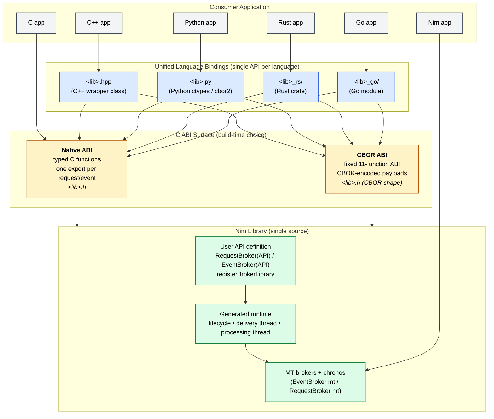
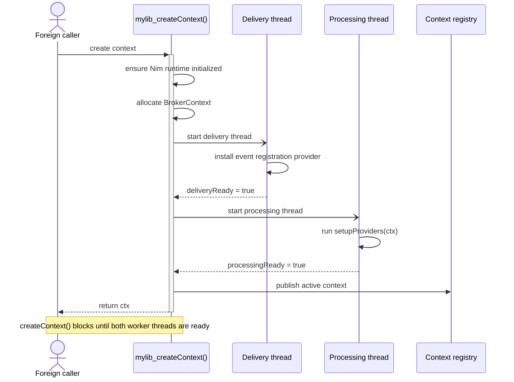
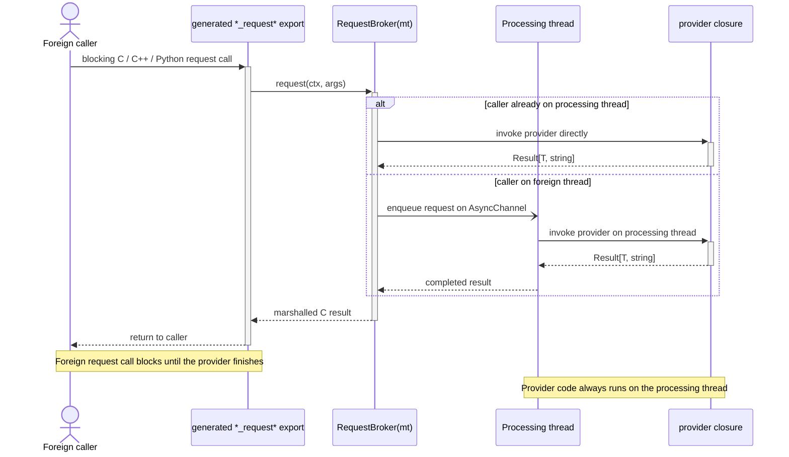

# Broker FFI API

Single Pure Nim library interface to be used from other Nim apps/modules or from foreign languages through a C ABI.

> ⚠️ **Status — Phase 2 retirement of native FFI codegen.**
>
> The native per-type C-export FFI codegen surface (the `mfNative` mode
> driven by `-d:BrokerFfiApiNative`, and its accompanying typed `.h` /
> `.hpp` headers plus per-language `.py` / Rust / Go wrappers) was
> retired. CBOR (`-d:BrokerFfiApiCBOR`, also the default whenever
> `-d:BrokerFfiApi` is set) is the only FFI mode going forward.
>
> Passing `-d:BrokerFfiApiNative` now fails with a hard compile error
> pointing at `doc/CBOR_Refactoring.md`. Every section below that refers
> to the native codegen, the typed C header, per-type C export functions,
> CItem structs, or the native vs. CBOR mode selector should be read as
> historical / archived material describing the pre-retirement state.
>
> Authoritative references for the surviving CBOR surface:
> - `doc/CBOR_Refactoring.md` — the Phase 1 + 2 plan and current shape
>   of the `_call` path (including the buffer-courier rework that
>   eliminates the typed marshal round-trip and the momentary chronos
>   loop on foreign threads).
> - `doc/TYPESUPPORT.md` — type-support matrix for the four language
>   wrappers (Python, C++, Rust, Go) in CBOR-only form.
> - `doc/TYPE_SURFACE.md` — Nim → wrapper type mapping cheat-sheet.
> - `doc/MT_vs_CBOR_Marshalling.md` — companion analysis comparing the
>   MT broker's typed marshalling to the CBOR transport.
>
> Pure-C consumers temporarily have only the raw 11-function CBOR ABI
> (`<lib>_initialize`, `_createContext`, `_call`, `_subscribe`, etc.) —
> the typed C wrapper is the deferred "CBOR-derived typed C functional
> interface" tracked in `CBOR_Refactoring.md` §10.

## Table of Contents

- [Broker FFI API](#broker-ffi-api)
  - [Table of Contents](#table-of-contents)
  - [Overview](#overview)
    - [Layered Architecture](#layered-architecture)
  - [Code Structure](#code-structure)
    - [Source Layout](#source-layout)
    - [Module Dependency Graph](#module-dependency-graph)
    - [Codegen Module Responsibilities](#codegen-module-responsibilities)
      - [Native-mode language outputs](#native-mode-language-outputs)
      - [CBOR-mode language outputs](#cbor-mode-language-outputs)
    - [Compile-Time Data Flow](#compile-time-data-flow)
  - [Type Auto-Resolution](#type-auto-resolution)
    - [Usage](#usage)
    - [How It Works](#how-it-works)
    - [What Is Auto-Discovered](#what-is-auto-discovered)
    - [Constraints](#constraints)
  - [Building Blocks](#building-blocks)
    - [1. `RequestBroker(API)`](#1-requestbrokerapi)
    - [2. `EventBroker(API)`](#2-eventbrokerapi)
    - [3. `registerBrokerLibrary`](#3-registerbrokerlibrary)
    - [4. How to build with it](#4-how-to-build-with-it)
      - [Required Nim flags](#required-nim-flags)
      - [ABI strategy flags](#abi-strategy-flags)
      - [Optional language wrapper flags](#optional-language-wrapper-flags)
      - [Diagnostic flags](#diagnostic-flags)
      - [Worked examples](#worked-examples)
      - [Why `--nimMainPrefix` matters (POSIX)](#why---nimmainprefix-matters-posix)
      - [External dependencies for CBOR-mode wrappers](#external-dependencies-for-cbor-mode-wrappers)
      - [Convenience nimble tasks](#convenience-nimble-tasks)
  - [Lifecycle Model](#lifecycle-model)
    - [Per-context creation](#per-context-creation)
    - [Post-create configuration](#post-create-configuration)
      - [Dynamic provider registration via `InitializeRequest`](#dynamic-provider-registration-via-initializerequest)
    - [Shutdown](#shutdown)
  - [Threading Architecture](#threading-architecture)
    - [Processing thread](#processing-thread)
    - [Delivery thread](#delivery-thread)
    - [Why there are two threads](#why-there-are-two-threads)
    - [Startup ordering](#startup-ordering)
    - [Event behavior](#event-behavior)
    - [Request behavior](#request-behavior)
  - [Requirements on `InitializeRequest` and `ShutdownRequest`](#requirements-on-initializerequest-and-shutdownrequest)
  - [Authoring a Broker FFI Library](#authoring-a-broker-ffi-library)
    - [Minimal structure](#minimal-structure)
    - [`setupProviders(ctx)` convention](#setupprovidersctx-convention)
    - [Batch request inputs](#batch-request-inputs)
    - [Event callback ABI](#event-callback-abi)
    - [Data ownership for request results](#data-ownership-for-request-results)
  - [Generated Foreign Surfaces](#generated-foreign-surfaces)
    - [C API](#c-api)
    - [C++ wrapper](#c-wrapper)
    - [Python wrapper](#python-wrapper)
  - [Operational Expectations](#operational-expectations)
    - [What `mylib_createContext()` guarantees](#what-mylib_createcontext-guarantees)
    - [What it does not guarantee](#what-it-does-not-guarantee)
    - [Callback behavior](#callback-behavior)
    - [Provider behavior](#provider-behavior)
  - [Future Phases](#future-phases)
    - [Phase 3: CBOR Tunnel Surface](#phase-3-cbor-tunnel-surface)
    - [Phase 4: Rust / Go Codegen](#phase-4-rust--go-codegen)
    - [Adding a New Language Surface](#adding-a-new-language-surface)
  - [Type Mapping Reference](#type-mapping-reference)
    - [Legend](#legend)
    - [Primitive scalars](#primitive-scalars)
    - [String types](#string-types)
    - [Object types](#object-types)
    - [`seq[T]` — dynamic arrays](#seqt--dynamic-arrays)
      - [`seq[object]` — sequence of a custom struct](#seqobject--sequence-of-a-custom-struct)
      - [`seq[string]` — sequence of strings](#seqstring--sequence-of-strings)
      - [`seq[primitive]` — sequence of a primitive type (e.g. `seq[byte]`)](#seqprimitive--sequence-of-a-primitive-type-eg-seqbyte)
    - [`array[N, T]` — fixed-size arrays](#arrayn-t--fixed-size-arrays)
    - [Enum types](#enum-types)
    - [Distinct types](#distinct-types)
    - [Composite example: full struct](#composite-example-full-struct)
    - [Event callback signatures](#event-callback-signatures)
  - [Related Documents](#related-documents)

## Overview

The Broker FFI API is the shared-library integration layer built on top of
`RequestBroker(API)`, `EventBroker(API)`, and `registerBrokerLibrary`.

It is intended for cases where a Nim component should be consumed from foreign
languages while still using nim-brokers internally for typed request/response
and event delivery.

Typical consumers are:

- plain C applications
- C++ applications through the generated wrapper class
- Python applications through the generated ctypes wrapper

The FFI API solution provides:

- C-callable request functions for API request brokers - for `native` ABI only
- C-callable event registration functions for API event brokers - for `native` ABI only
- a generated library lifecycle API
- a generated C header (`<lib>.h`)
- a generated C++ wrapper header (`<lib>.hpp`) that includes the C header
- an optional generated Python wrapper module (`<lib>.py`)
- an optional generated Rust wrapper module (`<lib>_rs/<lib>.rs`)
- an optional generated Go wrapper module (`<lib>_go/<lib>.go`)


The FFI API is designed around a per-library-context runtime model. Each call to
`<lib>_createContext()` creates one independent broker context with its own worker
threads and broker registrations.

### Layered Architecture

A single Nim API definition — one library or module written once with
`RequestBroker(API)`, `EventBroker(API)`, and `registerBrokerLibrary` — can be
compiled into either of two C ABI flavors. Each flavor produces its own,
ABI-specific C header, but every supported language binding above sits behind
**one unified, idiomatic interface** so consumers never have to know which ABI
their library was built against.



**Key invariants of the layering:**

| Layer | Per-library count | What changes per ABI mode | What stays identical |
|-------|-------------------|----------------------------|-----------------------|
| Nim source | 1 | nothing — same source compiles both modes | the user API definition |
| C ABI / `<lib>.h` | 1 (per build) | function shape (typed exports vs. fixed 11-fn CBOR ABI) | header filename |
| Language wrapper | 1 per language | internal marshaling (direct cgo/ctypes vs. CBOR encode/decode) | the public class/struct, method names, signatures |
| Consumer code | 1 | nothing | source compiles unchanged against either build |

The CBOR ABI exists for environments where a stable, narrow C surface and
self-describing wire format are preferable to a typed-but-wide native ABI
(e.g. for plug-in distribution, language runtimes without good cgo/ctypes
ergonomics, or schema-evolution requirements). The native ABI exists for
zero-overhead in-process embedding. The wrapper layer is the abstraction that
makes this choice invisible to application code.

---

## Code Structure

The FFI API system is split into focused modules, each owning one concern.

### Source Layout

The FFI API codegen lives under `brokers/internal/`. It is split into a
mode-agnostic core (schema, type resolution, lifecycle), a **native**-mode
codegen layer (one module per output language), and a parallel **CBOR**-mode
codegen layer (one module per output language plus shared codec helpers).

```
brokers/
  api_library.nim                  registerBrokerLibrary — lifecycle, runtime
                                   threads, mode dispatch, file orchestration
  internal/
    api_ffi_mode.nim               BrokerFfiMode enum + brokerFfiMode flag
                                   (Native vs CBOR — driven by -d: flags)
    api_schema.nim                 Compile-time type registry
                                   (ApiTypeEntry, gApiTypeRegistry)
    api_type_resolver.nim          Two-phase external-type auto-resolution
    api_type.nim                   Deprecated ApiType shim (warns; use plain
                                   Nim types)
    api_common.nim                 Re-export hub + legacy bridge + runtime
                                   memory helpers (alloc/free across ABI)

    # Native-mode brokers
    api_request_broker.nim         RequestBroker(API) macro + deferred codegen
    api_event_broker.nim           EventBroker(API) macro + deferred codegen

    # Native-mode language codegen (one file per language surface)
    api_codegen_nim.nim            Nim->C ABI type mapping (toCFieldType ...)
    api_codegen_c.nim              C type mapping + .h generation
    api_codegen_cpp.nim            C++ type mapping + .hpp generation
    api_codegen_python.nim         Python type mapping + .py generation
    api_codegen_rust.nim           Rust type mapping + Cargo crate generation
                                   (<lib>_rs/Cargo.toml + src/lib.rs)
    api_codegen_go.nim             Go type mapping + cgo module generation
                                   (<lib>_go/go.mod + <lib>.go +
                                   <lib>_callbacks.c)
    api_codegen_cmake.nim          <lib>Config.cmake package emission for
                                   find_package(<lib> CONFIG REQUIRED)

    # CBOR-mode brokers
    api_request_broker_cbor.nim    CBOR RequestBroker(API) codegen + per-method
                                   adapter (envelope encode/decode)
    api_event_broker_cbor.nim      CBOR EventBroker(API) codegen + per-event
                                   entry registration

    # CBOR-mode shared runtime + language codegen
    api_cbor_codec.nim             BrokerCbor flavor, encode/decode helpers,
                                   distinct/enum bindings
    api_cbor_descriptor.nim        Stable runtime descriptor types for the
                                   discovery API
    api_cbor_subs_registry.nim     Per-context CBOR event subscriber registry
    api_codegen_cbor_h.nim         Fixed 11-function CBOR C header
    api_codegen_cbor_hpp.nim       jsoncons-backed C++ wrapper
    api_codegen_cbor_py.nim        cbor2-backed Python wrapper
    api_codegen_cbor_rust.nim      ciborium+serde-backed Rust crate
    api_codegen_cbor_go.nim        fxamacker/cbor-backed Go module
    api_codegen_cbor_cddl.nim      <lib>.cddl schema emission

    # Multi-thread broker runtime (the FFI API runtime builds on these)
    mt_broker_common.nim           Shared MT runtime (thread id/gen, dispatch
                                   loop, signal helpers)
    mt_event_broker.nim            EventBroker(mt) macro
    mt_request_broker.nim          RequestBroker(mt) macro

    helper/
      broker_utils.nim             Shared AST parsing (parseSingleTypeDef,
                                   parseTypeDefs)
```

### Module Dependency Graph

```
helper/broker_utils.nim       (no API deps)
        |
api_ffi_mode.nim -- api_schema.nim -- api_type_resolver.nim
        |                  |
        |                  +--> native codegen
        |                  |      api_codegen_nim/c/cpp/python/rust/go.nim
        |                  |      api_codegen_cmake.nim
        |                  |
        |                  +--> cbor codegen
        |                         api_cbor_codec.nim
        |                         api_cbor_descriptor.nim
        |                         api_cbor_subs_registry.nim
        |                         api_codegen_cbor_{h,hpp,py,rust,go,cddl}.nim
        |
api_common.nim   (re-exports all codegen modules + legacy bridge + runtime
                  memory helpers)
        |
        +--> api_request_broker.nim       | native-mode brokers
        +--> api_event_broker.nim         |
        +--> api_request_broker_cbor.nim  | cbor-mode brokers
        +--> api_event_broker_cbor.nim    |
        |
api_library.nim   (lifecycle, runtime threads, mode dispatch,
                   file orchestration via generate*File procs)
```

**Key rules:**

- Native and CBOR codegen are independent of each other. The active set is
  selected at compile time by `brokerFfiMode`, which is driven by
  `-d:BrokerFfiApiNative` / `-d:BrokerFfiApiCBOR` (or bare `-d:BrokerFfiApi`,
  which defaults to CBOR).
- Within a mode, language codegen modules (C, C++, Python, Rust, Go, ...)
  have no dependencies on each other. Each owns its accumulators and type
  mapping procs. 
  - Adding a new language surface means adding one new module  with no changes to the existing ones.
- `api_library.nim` is the only module that knows about every output and
  drives file emission at the end of macro expansion.

### Codegen Module Responsibilities

Each language codegen module owns:

1. **Type mapping procs** — convert Nim types to the target language
   (`nimTypeToCOutput`, `nimTypeToCpp`, `nimTypeToCtypes`,
   `nimTypeToRust`, `nimTypeToGo`, `toCFieldType`, ...).
2. **Compile-time accumulators** — `{.compileTime.}` `seq[string]` buffers
   that collect code fragments during macro expansion.
3. **File generator** — reads accumulators and writes the output file
   (`generateCHeaderFile`, `generateCppHeaderFile`, `generatePythonFile`,
   `generateRustCrate`, `generateGoModule`, ...).

#### Native-mode language outputs

| Module | Output file(s) | Notes |
|--------|----------------|-------|
| `api_codegen_nim.nim` | (AST only) | Nim->C ABI mapping for `{.exportc.}` structs; no file written. |
| `api_codegen_c.nim` | `<lib>.h` | Always emitted. Per-request typed structs + free helpers + event typedefs. |
| `api_codegen_cpp.nim` | `<lib>.hpp` | Always emitted. Owner-aware `EventDispatcher<>` template; non-copyable wrapper class. |
| `api_codegen_python.nim` | `<lib>.py` | Opt-in via `-d:BrokerFfiApiGenPy`. ctypes wrapper + dataclasses + IntEnum typedefs. |
| `api_codegen_rust.nim` | `<lib>_rs/Cargo.toml`, `src/lib.rs` | Opt-in via `-d:BrokerFfiApiGenRust`. Hand-written `extern "C"` (no bindgen). |
| `api_codegen_go.nim` | `<lib>_go/go.mod`, `<lib>.go`, `<lib>_callbacks.c` | Opt-in via `-d:BrokerFfiApiGenGo`. cgo with companion `.c` for typed trampolines. |
| `api_codegen_cmake.nim` | `<lib>Config.cmake` | CMake package config exposing `mylib::mylib` (C) and `mylib::mylib_cpp` (C++) IMPORTED targets. |

#### CBOR-mode language outputs

| Module | Output file(s) | Notes |
|--------|----------------|-------|
| `api_codegen_cbor_h.nim` | `<lib>.h` | Fixed 11-function C ABI + one event-callback typedef. |
| `api_codegen_cbor_hpp.nim` | `<lib>.hpp` | C++ wrapper backed by jsoncons; same public surface as native. |
| `api_codegen_cbor_py.nim` | `<lib>.py` | Python wrapper backed by `cbor2`. |
| `api_codegen_cbor_rust.nim` | `<lib>_rs/Cargo.toml`, `src/lib.rs` | Rust crate using `ciborium` + `serde` (per-method `__Env<T>` envelope). |
| `api_codegen_cbor_go.nim` | `<lib>_go/<lib>_cbor.go` | Go file using `github.com/fxamacker/cbor/v2` (build tag `cbor`). |
| `api_codegen_cbor_cddl.nim` | `<lib>.cddl` | CDDL schema for the CBOR surface; also returned by `<lib>_getSchema()` at runtime. |

The shared CBOR runtime helpers (`api_cbor_codec.nim`,
`api_cbor_descriptor.nim`, `api_cbor_subs_registry.nim`) are imported by the
broker codegen modules (`api_request_broker_cbor.nim`,
`api_event_broker_cbor.nim`) but not by the language-specific codegen
modules — those only read from the schema registry.

### Compile-Time Data Flow

```
1. User defines plain Nim types (DeviceInfo, AddDeviceSpec)

2. Broker macros expand:
   a. discoverExternalTypes() scans AST for non-primitive types
   b. emitAutoRegistrations() emits autoRegisterApiType(T) calls
   c. Deferred codegen macro emitted (runs after registrations)

3. autoRegisterApiType(T) typed macro expands (runs first):
   a. getTypeImpl() extracts fields
   b. Recursion for nested object types
   c. Registers in gApiTypeRegistry
   d. Generates CItem type + encode proc
   e. Appends to all language accumulators (C, C++, Python)

4. Deferred broker codegen expands (runs after step 3):
   a. lookupFfiStruct() succeeds — registry populated
   b. Generates CResult struct, encode proc, exported C functions
   c. Appends to all language accumulators

5. registerBrokerLibrary macro:
   a. Generates lifecycle code (createContext, shutdown, threads)
   b. Calls file generators:
      - generateCHeaderFile()   → <libName>.h
      - generateCppHeaderFile() → <libName>.hpp
      - generatePythonFile()    → <libName>.py
```

---

## Type Auto-Resolution

External types referenced in broker macros are automatically discovered and
registered at compile time. No separate `ApiType` registration macro is needed.

### Usage

Define types as plain Nim objects before the broker macro:

```nim
type DeviceInfo* = object
  deviceId*: int64
  name*: string
  online*: bool

RequestBroker(API):
  type ListDevices = object
    devices*: seq[DeviceInfo]
  proc signature*(): Future[Result[ListDevices, string]] {.async.}
```

`DeviceInfo` is auto-discovered from the `seq[DeviceInfo]` field and
auto-registered. The CItem struct, encode proc, C header struct, C++ struct, and
Python dataclass are all generated automatically.

### How It Works

The auto-resolution uses a two-phase approach to work within Nim's macro system
constraints:

**Phase 1 — Discovery (untyped context)**:
`discoverExternalTypes(body)` scans the raw AST for non-primitive type
references in type fields, proc parameters, and type aliases.

**Phase 2 — Resolution (typed macro)**:
`autoRegisterApiType(T: typed)` receives a resolved type symbol, introspects its
fields via `getTypeImpl()`, recursively resolves nested object types, and
registers everything in the compile-time type registry.

The **deferred codegen pattern** ensures proper ordering: auto-registration macro
calls are emitted before the broker codegen macro, so the type registry is
populated when the codegen needs to look up fields.

### What Is Auto-Discovered

- `seq[T]` in type fields: `devices: seq[DeviceInfo]` → discovers `DeviceInfo`
- `seq[T]` in proc parameters: `proc signature*(items: seq[AddDeviceSpec])` → discovers `AddDeviceSpec`
- Plain custom type fields: `info: DeviceInfo` → discovers `DeviceInfo`
- Type aliases: `type MyEvent = ExternalType` → discovers `ExternalType`
- Nested objects: if `DeviceInfo` has `address: Address`, `Address` is recursively resolved

### Constraints

- External types must be defined **before** the broker macro call site (standard
  Nim compilation order)
- All `API` broker must be known and imported where the `registerBrokerLibrary` macro is used!
- Only `object` types can be fully introspected. Enums, distinct types, etc.
  pass through without field registration.

---

## Building Blocks

The FFI API layer is composed from three parts.

### 1. `RequestBroker(API)`

Defines a request type that is exported as a C ABI function.

Example:

```nim
RequestBroker(API):
  type GetDevice = object
    deviceId*: int64
    name*: string

  proc signature*(deviceId: int64): Future[Result[GetDevice, string]] {.async.}
```

This generates:

- in `native` ABI mode:
  - a C result struct - in `native` ABI mode.
  - a C-exported request function such as `mylib_get_device(...)` once the broker is registered into a library
  - a library-prefixed `mylib_free_*_result(...)` function for result-owned memory
- in `cbor` ABI mode:
  - a C-exported ABI is just a tunelling interface that must be used with known semantics.
  - The actual CBOR ABI is discoverable by '*_listApis' and '*_getApiSchema'.
  
- C++ wrapper that shares same public interface across ABI modes. Python/Rust/Go wrapper methods built from the same declaration

### 2. `EventBroker(API)`

Defines an event type that can be subscribed to from foreign code.

Example:

```nim
EventBroker(API):
  type DeviceDiscovered = object
    deviceId*: int64
    name*: string
```

This generates:

- a C callback typedef
- `on<EventType>(ctx, callback, userData)`
- `off<EventType>(ctx, handle)`
- generated wrapper registration methods in C++ and Python

### 3. `registerBrokerLibrary`

This macro ties the API request and event brokers into a complete shared
library surface.

Example:

```nim
registerBrokerLibrary:
  name: "mylib"
  version: "0.1.0"
  initializeRequest: InitializeRequest
  shutdownRequest: ShutdownRequest
```

This generates:

- `mylib_createContext()`
- `mylib_shutdown(ctx)`
- memory management interface
- the library context registry
- the delivery and processing threads
- aggregate event registration routing
- generated C and C++ headers

### 4. How to build with it

This subsection collects, in one place, every compile-time switch and runtime
toolchain requirement for producing a Broker FFI library. Most projects only
need a handful of these flags; the rest are wrapper opt-ins or diagnostic
toggles.

#### Required Nim flags

| Flag | Purpose |
|------|---------|
| `--threads:on` | The FFI API runtime spawns a delivery and a processing thread per context. |
| `--app:lib` | Produce a shared library (`.so` / `.dylib` / `.dll`) instead of an executable. |
| `--mm:orc` *or* `--mm:refc` | Both are supported. ORC is recommended; refc has documented carve-outs (see [LIMITATION.md](LIMITATION.md)). |
| `--nimMainPrefix:<libname>` | POSIX only. Must match the `name:` field of `registerBrokerLibrary` (see "Why it matters" below). On Windows the flag is intentionally **omitted** — using it triggers a Nim codegen bug under the LLVM toolchain. |
| `--path:.` | Make the project root visible so `import brokers/...` resolves. |
| `--outdir:build` | Keep `.so` and generated wrapper artifacts out of the source tree. |

#### ABI strategy flags

Pick exactly one. If none is set, `-d:BrokerFfiApi` defaults to CBOR.

| Flag | Selects | Generated C ABI shape | Wire format |
|------|---------|-----------------------|-------------|
| `-d:BrokerFfiApiNative` | Native ABI | One typed C export per request/event + per-result free helpers. | Native C structs. |
| `-d:BrokerFfiApiCBOR` | CBOR ABI | Fixed 11-function ABI + one event-callback typedef. | CBOR-encoded payloads. |
| `-d:BrokerFfiApi` | CBOR (default) | Same as `-d:BrokerFfiApiCBOR`. | CBOR. |

Setting *both* native and CBOR flags is a compile-time error.

#### Optional language wrapper flags

C and C++ headers are always emitted. The remaining language wrappers are
opt-in and can be combined freely with either ABI mode.

| Flag | Generates | Output relative to `--outdir` |
|------|-----------|-------------------------------|
| `-d:BrokerFfiApiGenPy` | `<lib>.py` (ctypes / cbor2) | `<lib>.py` |
| `-d:BrokerFfiApiGenRust` | `<lib>_rs/` Cargo crate | `<lib>_rs/Cargo.toml`, `src/lib.rs` |
| `-d:BrokerFfiApiGenGo` | `<lib>_go/` Go module | `<lib>_go/go.mod`, `<lib>.go`, `<lib>_callbacks.c` (native), `<lib>_cbor.go` (CBOR) |

The CMake package config (`<lib>Config.cmake`) and, in CBOR mode, the
`<lib>.cddl` schema are emitted unconditionally next to the `.h`/`.hpp`.

#### Diagnostic flags

| Flag | Effect |
|------|--------|
| `-d:brokerDebug` | Dump every macro-generated AST to stdout during compilation. Useful when investigating codegen output. |
| `-d:release` | Standard Nim release build. The repository's CI matrix exercises the FFI API under both debug and release. |

#### Worked examples

Minimal native build of `examples/ffiapi/nimlib/mylib.nim`:

```sh
nim c \
  -d:BrokerFfiApiNative \
  --threads:on --app:lib --mm:orc \
  --path:. --outdir:examples/ffiapi/nimlib/build \
  --nimMainPrefix:mylib \
  examples/ffiapi/nimlib/mylib.nim
```

Same source compiled in CBOR mode with all four wrapper languages:

```sh
nim c \
  -d:BrokerFfiApiCBOR \
  -d:BrokerFfiApiGenPy -d:BrokerFfiApiGenRust -d:BrokerFfiApiGenGo \
  --threads:on --app:lib --mm:orc \
  --path:. --outdir:examples/ffiapi/nimlib/build_cbor \
  --nimMainPrefix:mylib \
  examples/ffiapi/nimlib/mylib.nim
```

Inspect the AST that the macros produce:

```sh
nim c -d:brokerDebug -d:BrokerFfiApiCBOR \
      --threads:on --app:lib --path:. --outdir:build \
      --nimMainPrefix:mylib examples/ffiapi/nimlib/mylib.nim
```

#### Why `--nimMainPrefix` matters (POSIX)

The code emitted by `registerBrokerLibrary` imports `<libname>NimMain` and
calls it from the once-per-process initialization path. That symbol is only
produced when Nim is invoked with `--nimMainPrefix:<libname>`. If the prefix
does not match the `name:` field of `registerBrokerLibrary`, the library
fails to link.

On Windows the flag is omitted intentionally (see `nimMainPrefixFlag` in
[brokers.nimble](../brokers.nimble) and [LIMITATION.md](LIMITATION.md) §2.1).

#### External dependencies for CBOR-mode wrappers

| Wrapper | Dependency | How to get it |
|---------|------------|---------------|
| C++ | `jsoncons` headers under `vendor/jsoncons/include` | `nimble fetchVendor` (or `git submodule update --init --recursive`) |
| Python | `cbor2` package | `pip install --user cbor2` |
| Rust | `ciborium` + `serde` + `serde_json` + `serde_bytes` | Cargo fetches them automatically when `--features cbor` is used. Native-mode Rust needs only the toolchain. |
| Go | `github.com/fxamacker/cbor/v2` | `go mod tidy` fetches it during the CBOR build. Native-mode Go needs only the toolchain. |

Native-mode wrappers have no third-party dependencies beyond the language
toolchain itself.

#### Convenience nimble tasks

The repository ships ready-made tasks that already pass every flag above. They
are the easiest way to reproduce a working build.

- `nimble buildFfiExample` — native shared library only
- `nimble buildFfiExamplePy` / `buildFfiExampleRust` / `buildFfiExampleGo` — same plus the named wrapper
- `nimble buildFfiExampleCbor` — CBOR shared library
- `nimble runFfiExampleC` / `runFfiExampleCpp` / `runFfiExamplePy` / `runFfiExampleRust` / `runFfiExampleGo` — rebuild + run the matching consumer
- `nimble runFfiExampleCborCpp` / `runFfiExampleCborRust` / `runFfiExampleCborGo` — CBOR-mode counterparts
- `nimble testApi` / `testApiCbor` / `testFfiApi` / `testFfiApiCpp` / `testFfiApiCmake` — unit and integration tests

---

## Lifecycle Model

The FFI API exposes a single public creation entry point.

### Per-context creation

`<lib>_createContext()` creates one independent library instance.

Responsibilities:

- ensure the Nim runtime is initialized once per process
- allocate a fresh `BrokerContext`
- start the delivery thread
- start the processing thread
- wait until both threads report readiness
- publish the context in the library registry

The startup handshake is synchronous from the caller point of view. When
`<lib>_createContext()` returns a context, the delivery side and processing side
are already ready for use.

This is why the examples do not need a post-create sleep.

The generated C API returns a small result struct with:

- `ctx`
- `error_message`

When startup fails, `ctx` is zero and `error_message` contains a descriptive
message that must be released with `free_<lib>_create_context_result(...)`.

Sequence overview:



### Post-create configuration

`InitializeRequest` is the request broker type used for configuration after the
context exists.

Typical responsibilities:

- load configuration files
- initialize thread-local provider state
- register additional providers lazily
- validate environment or external dependencies

#### Dynamic provider registration via `InitializeRequest`

In `setupProviders(ctx)`, the `InitializeRequest` provider and `ShutdownRequest` provider must be registered directly on the context so the generated `mylib_initialize(...)` and `mylib_shutdown(...)` exports are immediately usable.

However, `InitializeRequest` can also be used as a dynamic registration point for other providers.
This enables configuration-driven provider registration and use different implementations for the same API surface.


### Shutdown

`ShutdownRequest` is the broker request type for orderly application-level
teardown.

`<lib>_shutdown(ctx)` first invokes `ShutdownRequest` on the processing thread,
then stops the delivery and processing threads and marks the context inactive in
the registry.

Foreign callers only need to call `<lib>_shutdown(ctx)`.

---

## Threading Architecture

Each created library context owns two threads.

### Processing thread

Purpose:

- hosts API request providers
- runs `setupProviders(ctx)` during startup
- serves requests for `RequestBroker(API)` types

This is the thread on which provider closures execute.

### Delivery thread

Purpose:

- consumes the per-context **event courier ring**
- invokes foreign callback trampolines for API event delivery
- isolates foreign callback runtime from request providers — a slow or
  reentrant callback blocks the delivery thread, never the processing
  thread

This is the thread that invokes C callbacks and the callback trampolines used by
the generated C++ and Python wrappers.

### Why there are two threads

The split keeps foreign-callback fan-out off the provider thread. A
foreign callback that sleeps 100 ms would block any request providers
sharing the same thread (and would deadlock if the callback re-entered
the library via `<lib>_call`). Running fan-out on a dedicated delivery
thread eliminates both hazards.

Benefits:

- event callback dispatch is isolated from request execution
- request providers can keep request-local state on the processing thread
- a reentrant `<lib>_call` from inside a foreign callback is serviced on
  the processing thread (no self-deadlock)
- shutdown ordering is predictable

See `doc/CBOR_Round2_PartD_EventCourier.md` for the design rationale and
`doc/bench_baseline.md` § "Event dispatch — Part D-6" for per-emit cost
numbers across the three dispatch lanes.

### Startup ordering

The generated create function starts the threads in this order:

1. delivery thread
2. processing thread

The delivery thread is started first so its event-courier signal handle
is published before any provider can emit an event. The create function
waits for:

- delivery thread readiness after its broker dispatch loop is running
  and the event-courier poller is registered
- processing thread readiness after `setupProviders(ctx)` completes
  and the per-event listeners are installed

The sequence above is the reason `create()` behaves synchronously even
though the implementation starts two background threads internally.

### Event behavior

Foreign subscribe / unsubscribe — `<lib>_subscribe(ctx, eventName, cb,
userData)` / `<lib>_unsubscribe(ctx, eventName, handle)` — write
directly into a shared-heap subscription registry from the foreign
caller's thread. No request broker is involved on the registration
path. Each successful subscribe bumps a per-event atomic counter that
the emit-side uses as a fast-path discriminator.

When the Nim side emits an API event:

- the per-event listener (registered on the **processing** thread by
  `installAllListenersIdent`) fires via the MT EventBroker's same-thread
  direct `asyncSpawn` fast path
- the listener loads the per-event `foreignSubsCount` atomic. **If
  zero (the 90 % production case), the listener returns immediately**
  — no CBOR encode, no allocation, no courier touch.
- otherwise the listener CBOR-encodes the payload once into a
  shared-heap buffer, enqueues an `EventMsg(eventName, ctx, buf,
  bufLen)` into the per-context event-courier ring, and fires the
  delivery thread's broker dispatch signal
- the delivery thread polls the courier ring, snapshots the foreign
  subscriber list for `(ctx, eventName)`, invokes each callback
  synchronously, then `deallocShared`s the buffer
- Nim listeners (registered via `<Event>.listen(...)` from Nim code
  inside the library) keep going through the standard MT EventBroker
  paths unchanged — same-thread direct `asyncSpawn` or cross-thread
  typed-slab marshalling

```mermaid
sequenceDiagram
  participant P as Processing thread
  participant L as Per-event handler
  participant R as Event courier ring
  participant D as Delivery thread
  actor F as Foreign callback
  P->>L: emit(event) — same-thread asyncSpawn
  alt foreignSubsCount == 0
    L-)P: return (fast path; no encode, no courier)
  else foreignSubsCount > 0
    L->>L: cborEncodeShared(payload) → shared-heap buf
    L->>R: tryEnqueue(EventMsg)
    L-)D: fireBrokerSignal
    D->>R: tryDequeue
    D->>D: snapshot SubsRegistry[(ctx, eventName)]
    D->>F: callback(ctx, name, buf, len, userData)  × N subscribers
    D->>D: deallocShared(buf)
  end
  Note over D,F: Foreign callbacks execute on the delivery thread
  Note over D,F: A slow callback blocks the delivery thread, not the processing thread
```

`<EventType>.dropAllListeners(ctx)` from Nim code fires a companion
hook (registered by the per-event installer) that also clears the
foreign-subscriber registry for `(ctx, eventName)` and resets the
`foreignSubsCount` atomic, so foreign subs cannot orphan when user Nim
code drops listeners.

### Request behavior

API request brokers use the same multi-thread request broker runtime as
`RequestBroker(mt)`.

That means:

- same-thread requests call the provider directly
- cross-thread requests are routed through an `AsyncChannel`
- the provider thread owns the provider closure
- one provider exists per broker type per broker context



See [Multi-Thread RequestBroker](MultiThread_RequestBroker.md) for the lower
level request-routing behavior that the FFI API builds on.

---

## Requirements on `InitializeRequest` and `ShutdownRequest`

`registerBrokerLibrary` requires that the types named in `initializeRequest:` and
`shutdownRequest:` exist at compile time. The legacy `destroyRequest:` alias is
still accepted for compatibility.
You can name you Initialized and Shutdown brokers as you like. The macro just registers them.

It does not itself force those providers to be registered.

In practice:

- `InitializeRequest.setProvider(ctx, ...)` and `ShutdownRequest.setProvider(ctx, ...)`should be installed in `setupProviders`:exclamation:
  - These are stands for constrtuctor and destructor of the library context, so they should be registered on the processing thread during startup :exclamation:

For other API request brokers, lazy registration is allowed.

For example, a library may:

- register `InitializeRequest` and `ShutdownRequest` during startup
- use `InitializeRequest.request(...)` to install additional API broker providers

This works because `InitializeRequest` executes on the processing thread, which is
the correct owner thread for `setProvider` on API request brokers.

The main limitation is that a provider can only be registered once per broker
type per context unless it is cleared first.

---

## Authoring a Broker FFI Library

### Minimal structure

```nim
import brokers/[event_broker, request_broker, broker_context, api_library]

RequestBroker(API):
  type InitializeRequest = object
    initialized*: bool

  proc signature*(configPath: string): Future[Result[InitializeRequest, string]] {.async.}

RequestBroker(API):
  type ShutdownRequest = object
    status*: int32

  proc signature*(): Future[Result[ShutdownRequest, string]] {.async.}

EventBroker(API):
  type StatusChanged = object
    label*: string

var gProviderCtx {.threadvar.}: BrokerContext

proc setupProviders(ctx: BrokerContext) =
  gProviderCtx = ctx

  discard InitializeRequest.setProvider(
    ctx,
    proc(configPath: string): Future[Result[InitializeRequest, string]] {.closure, async.} =
      return ok(InitializeRequest(initialized: true))
  )

  discard ShutdownRequest.setProvider(
    ctx,
    proc(): Future[Result[ShutdownRequest, string]] {.closure, async.} =
      return ok(ShutdownRequest(status: 0))
  )

registerBrokerLibrary:
  name: "mylib"
  initializeRequest: InitializeRequest
  shutdownRequest: ShutdownRequest
```

### `setupProviders(ctx)` convention

If a proc named `setupProviders(ctx: BrokerContext)` exists, the generated
library startup calls it automatically on the processing thread.

That proc is the main hook for:

- registering request providers
- capturing thread-local state
- remembering the active provider context
- installing lazily created providers if desired

### Batch request inputs

For request parameters that need to cross the foreign-function boundary as a
collection, prefer `seq[T]` where `T` is a plain Nim object type defined before
the broker macro.

Example:

```nim
type AddDeviceSpec* = object
  name*: string
  deviceType*: string
  address*: string

RequestBroker(API):
  type AddDevice = object
    devices*: seq[DeviceInfo]
    success*: bool

  proc signature*(devices: seq[AddDeviceSpec]):
    Future[Result[AddDevice, string]] {.async.}
```

Why this shape is preferred:

- The type auto-resolution system discovers `AddDeviceSpec` from the proc
  parameter and generates a stable foreign representation for each item:
  a C `*CItem` struct, a C++ value type, and a Python dataclass plus
  `ctypes.Structure`
- the generated request export can pass the batch as pointer plus count at the
  C ABI boundary and reconstruct `seq[AddDeviceSpec]` on the Nim side
- the same declaration maps cleanly into the generated C++, Python, and C
  surfaces without handwritten marshalling

In contrast, literal tuple sequences are not a good fit for the current FFI
generator because tuple items do not participate in the type registry that
drives foreign struct generation.

Current limitation:

- `RequestBroker(API)` supports at most two signature categories for a broker
  type: one zero-argument signature and one argument-bearing signature
- the zero-argument form is optional; it is auto-generated only when no
  signatures are declared at all
- if you need to add a batch form such as `AddDevice(devices: seq[AddDeviceSpec])`,
  and the broker already has another argument-bearing signature, replace that
  signature or model the variants as separate request broker types

### Event callback ABI

The generated C event ABI now includes two identity parameters ahead of the
event payload:

- `ctx`, the library context that emitted the event
- `userData`, an opaque pointer supplied by the foreign caller during
  registration

For an event such as `DeviceDiscovered`, the generated C typedef looks like:

```c
typedef void (*DeviceDiscoveredCCallback)(
  uint32_t ctx,
  void* userData,
  int64_t deviceId,
  const char* name,
  const char* deviceType,
  const char* address
);
```

The matching registration export is:

```c
uint64_t mylib_onDeviceDiscovered(
  uint32_t ctx,
  DeviceDiscoveredCCallback callback,
  void* userData
);
```

This shape has two purposes:

- `ctx` tells the callback which library instance emitted the event
- `userData` lets the foreign caller carry its own ownership or routing token
  through the C ABI unchanged

The Nim runtime does not interpret `userData`; it only stores it and passes it
back to the callback.

### Data ownership for request results

The generated C request exports return C structs that may own allocated strings
or arrays.

Foreign code must free them using the generated `free_*_result(...)` function.
For registered libraries these functions are library-prefixed, for example
`mylib_free_initialize_result(...)`.

The generated C++ and Python wrappers hide that cleanup automatically.

---

## Generated Foreign Surfaces

### C API

The generated C surface contains:

- lifecycle functions
- one exported request function per API request broker signature
- one free function per request result type
- event callback typedefs and `on/off` registration functions

Example:

```c
typedef struct {
  uint32_t ctx;
  const char* error_message;
} mylibCreateContextResult;

mylibCreateContextResult mylib_createContext(void);
void free_mylib_create_context_result(mylibCreateContextResult* r);
void mylib_shutdown(uint32_t ctx);

InitializeRequestCResult mylib_initialize(uint32_t ctx, const char* configPath);
void mylib_free_initialize_result(InitializeRequestCResult* r);

uint64_t mylib_onDeviceDiscovered(
  uint32_t ctx,
  DeviceDiscoveredCCallback callback,
  void* userData
);
void mylib_offDeviceDiscovered(uint32_t ctx, uint64_t handle);
```

### C++ wrapper

The C++ wrapper is generated as a separate `.hpp` file that includes the C
header via `#pragma once` and `#include "<libName>.h"`. This keeps the pure C
declarations separate from the C++ layer.

Current lifecycle shape:

- inert `Mylib lib;`
- `lib.createContext()` for per-context creation
- `lib.shutdown()` for shutdown
- request wrapper methods such as `initializeRequest(...)`, `listDevices()`, and
  `getDevice(...)`
- event wrapper methods such as `onDeviceDiscovered(...)` and
  `offDeviceDiscovered(...)`

The generated header now includes a compact comment block directly above the
wrapper class so users can scan the public surface without reading the full
implementation.

Example extract from the generated `mylib.hpp`:

```cpp
// Quick C++ wrapper interface summary (names only)
// class Mylib {
// public:
//   createContext();
//   validContext() const;
//   operator bool() const;
//   shutdown();
//   ctx() const;
//   initializeRequest(configPath);
//   addDevice(devices);
//   removeDevice(deviceId);
//   getDevice(deviceId);
//   listDevices();
//   DeviceStatusChangedCallback(owner, deviceId, name, online, timestampMs);
//   onDeviceStatusChanged(fn);
//   offDeviceStatusChanged(handle = 0);
//   DeviceDiscoveredCallback(owner, deviceId, name, deviceType, address);
//   onDeviceDiscovered(fn);
//   offDeviceDiscovered(handle = 0);
// };
```

The generated event machinery no longer uses class-static callback registries.
Instead it emits:

- a reusable `EventDispatcher<Owner, Traits, ...>` template
- one traits struct per API event type
- one dispatcher instance per event type inside each generated wrapper object

This design keeps event callback ownership attached to a single wrapper
instance, which avoids the cross-instance callback corruption that a shared
static callback registry would cause.

Public C++ event callbacks are owner-aware. The first callback argument is a
reference to the wrapper instance that owns the context.

Example:

```cpp
uint64_t handle = lib.onDeviceDiscovered(
    [](Mylib& owner,
       int64_t deviceId,
       std::string_view name,
       std::string_view deviceType,
       std::string_view address) {
        std::printf("ctx=%u name=%.*s\n",
                    owner.ctx(),
                    (int)name.size(),
                    name.data());
    }
);
```

The generated dispatcher catches and swallows exceptions from user callbacks so
that no exception crosses the C callback boundary.

The generated wrapper is intentionally non-copyable and non-movable. The event
dispatcher passes its own address through the C ABI as `userData`, so wrapper
and dispatcher addresses must remain stable for the lifetime of the
registration.

If a foreign application needs many library instances in a container, the
recommended pattern is `std::unique_ptr<Mylib>` in a standard container rather
than storing `Mylib` values directly.

Example:

```cpp
Mylib lib;
auto created = lib.createContext();
if (!created.ok()) {
    return 1;
}

auto res = lib.initializeRequest("/opt/devices.yaml");
if (!res.ok()) {
    std::fprintf(stderr, "%s\n", res.error().c_str());
}
```

### Python wrapper

When Python generation is enabled, a ctypes wrapper module is emitted.

The Python wrapper mirrors the C++ lifecycle shape closely:

- `Mylib()` loads the library but starts without a context
- `createContext()` performs per-context creation explicitly
- `validContext()` and truthiness reflect whether a live context exists
- `shutdown()` is exposed for explicit teardown

The generated Python module now also includes a compact comment summary above
the wrapper class so the available methods and callback shapes are visible at a
glance.

Example extract from the generated `mylib.py`:

```python
# Quick Python wrapper interface summary (names only)
# class Mylib:
#   __enter__()
#   __exit__()
#   createContext()
#   create_context()
#   validContext()
#   valid_context()
#   __bool__()
#   shutdown()
#   ctx
#   initializeRequest(configPath)
#   initialize_request(configPath)
#   addDevice(devices)
#   add_device(devices)
#   removeDevice(deviceId)
#   remove_device(deviceId)
#   getDevice(deviceId)
#   get_device(deviceId)
#   listDevices()
#   list_devices()
#   DeviceStatusChangedCallback(owner, device_id, name, online, timestamp_ms)
#   onDeviceStatusChanged(callback)
#   on_device_status_changed(callback)
#   offDeviceStatusChanged(handle = 0)
#   off_device_status_changed(handle = 0)
#   DeviceDiscoveredCallback(owner, device_id, name, device_type, address)
#   onDeviceDiscovered(callback)
#   on_device_discovered(callback)
#   offDeviceDiscovered(handle = 0)
#   off_device_discovered(handle = 0)
```

For events, the generated Python wrapper still hides the low-level `ctx` and
`userData` ABI parameters, but it now exposes ownership at the wrapper level:
Python callbacks receive the owning `Mylib` instance as their first argument,
followed by decoded event payload values. The wrapper keeps the underlying
ctypes trampoline alive internally until shutdown.

Example:

```python
from mylib import Mylib

with Mylib() as lib:
  lib.createContext()

  res = lib.initializeRequest("/opt/devices.yaml")
  print(res.configPath)

  handle = lib.onDeviceDiscovered(
      lambda owner, deviceId, name, deviceType, address:
          print(owner.ctx, deviceId, name, deviceType, address)
  )
  lib.offDeviceDiscovered(handle)
```

---

## Operational Expectations

### What `mylib_createContext()` guarantees

When `mylib_createContext()` succeeds:

- the event registration provider is already installed
- the processing thread already ran `setupProviders(ctx)`
- API requests and event listener registration can be used immediately

### What it does not guarantee

It does not guarantee that every API broker has a provider unless your
`setupProviders(ctx)` registered them.

If a generated request export is called before its broker has a provider, it
returns a normal broker error result rather than crashing.

### Callback behavior

Foreign event callbacks should be treated as non-blocking callback code.

Recommended practice:

- do lightweight work in the callback
- hand off expensive processing to your own queue or thread
- avoid blocking the delivery thread for long periods
- treat `userData` lifetime as owned by the foreign side; unregister the
  listener before destroying the object referenced by that pointer

For generated C++ wrappers, `userData` is managed internally by the dispatcher.
For generated Python wrappers, the ownership signal is surfaced as the first
callback argument (`owner: Mylib`) while raw `userData` remains hidden. For
direct C consumers, `userData` is the natural place to store callback state or
an owning object pointer.

### Provider behavior

Request providers run on the processing thread and may be async. That means:

- multiple requests can be interleaved across await points
- provider code should protect mutable shared state if reentrancy matters
- shutting down external resources should account for in-flight work

---

## Future Phases

The modular codegen architecture is designed to support additional transport and
language surfaces without changing existing modules.

### Phase 3: CBOR Tunnel Surface

A buffer-based transport layer for languages that prefer buffer FFI over
per-field C ABI interop.

**Design:**

- New `api_codegen_cbor.nim` module — follows the same pattern as existing
  codegen modules (type mapping, accumulators, file generator)
- Adds `appendCborRequest(entry)` / `appendCborEvent(entry)` accumulator
  helpers called during broker macro expansion
- Generates CBOR encode/decode logic per schema entry using the compile-time
  type registry (`gApiTypeRegistry`)
- Only 3 generic C exports instead of per-type exports:
  - `<lib>_invoke(ctx, requestId, cborBuffer, len)` → CBOR-encoded result
  - `<lib>_subscribe(ctx, eventId, callback, userData)` → handle
  - `<lib>_free_buffer(buffer)`
- Generates a schema manifest file (`<libName>.schema.json`) describing all
  request/event types, field names, and CBOR tags — consumed by external
  tooling and language-specific code generators

**Advantages over C ABI for some consumers:**

- Single stable FFI surface (3 functions) regardless of how many broker types
  exist
- Schema-driven — external tools can generate bindings without reading Nim
  source
- Natural fit for languages with strong serialization support (Rust serde,
  Go encoding)

### Phase 4: Rust / Go Codegen

Language-specific binding generators that consume the CBOR tunnel rather than
the C ABI directly.

**Rust (`api_codegen_rust.nim`):**

- Generates a `.rs` file with `#[derive(Deserialize)]` structs matching the
  schema
- Thin invoke wrappers that serialize arguments to CBOR, call the tunnel, and
  deserialize results
- Event subscription wrappers with idiomatic Rust callback signatures


**Go (`api_codegen_go.nim`):**

- Generates a `.go` file with CBOR-tagged structs
- Thin CGo wrapper around the 3 tunnel exports
- Idiomatic Go error returns instead of result structs

**Both modules:**

- Follow the same codegen module pattern: type mapping, accumulators, file
  generator
- Read from the same compile-time type registry (`gApiTypeRegistry`)
- No changes needed to existing C, C++, or Python codegen modules


### Adding a New Language Surface

The codegen architecture makes adding a new language straightforward:

1. Create `api_codegen_<lang>.nim` with:
   - Type mapping procs (Nim types → target language types)
   - Compile-time accumulators (`{.compileTime.}` string sequences)
   - A file generator proc that reads accumulators and writes the output file
2. Import and export from `api_codegen_c.nim` for shared helpers
3. Call the accumulator helpers from existing sites in `api_type.nim`,
   `api_request_broker.nim`, and `api_event_broker.nim`
4. Call the file generator from `api_library.nim`

No existing codegen modules need modification. The compile-time accumulator
pattern ensures each module is independently testable and the generated output
is deterministic.

---

## Type Mapping Reference

This section shows exactly how every Nim type that can appear in a broker
declaration is translated through each layer of the FFI stack.

### Legend

The pipeline has four named representations for each type:

| Representation | Description |
|---|---|
| **Nim source** | The type as written in the broker macro body |
| **C ABI struct field** | The field type inside a `CItem` / `CResult` `{.exportc.}` struct |
| **C header** | The type as written in the generated `.h` file |
| **C++ wrapper** | The type used in the generated `.hpp` struct and method signatures |
| **Python ctypes** | The field type in the generated `ctypes.Structure._fields_` list |
| **Python dataclass** | The type annotation in the generated `@dataclass` |

Result structs always carry an additional `char* error_message` / `cstring`
field not shown in the per-type rows below. Count fields for `seq[T]`
(`int32_t foo_count`) are also omitted from individual rows but are noted in
the seq section.

---

### Primitive scalars

| Nim | C ABI (`cint` etc.) | C header | C++ wrapper | Python ctypes | Python annotation |
|---|---|---|---|---|---|
| `int` / `int32` | `cint` | `int32_t` | `int32_t` | `ctypes.c_int32` | `int` |
| `int8` | `int8` | `int8_t` | `int8_t` | `ctypes.c_int8` | `int` |
| `int16` | `int16` | `int16_t` | `int16_t` | `ctypes.c_int16` | `int` |
| `int64` | `int64` | `int64_t` | `int64_t` | `ctypes.c_int64` | `int` |
| `uint` / `uint32` | `cuint` | `uint32_t` | `uint32_t` | `ctypes.c_uint32` | `int` |
| `uint8` / `byte` | `uint8` | `uint8_t` | `uint8_t` | `ctypes.c_uint8` | `int` |
| `uint16` | `uint16` | `uint16_t` | `uint16_t` | `ctypes.c_uint16` | `int` |
| `uint64` | `uint64` | `uint64_t` | `uint64_t` | `ctypes.c_uint64` | `int` |
| `float` / `float64` | `cdouble` | `double` | `double` | `ctypes.c_double` | `float` |
| `float32` | `cfloat` | `float` | `float` | `ctypes.c_float` | `float` |
| `bool` | `bool` | `bool` | `bool` | `ctypes.c_bool` | `bool` |
| `pointer` | `pointer` | `void*` | `void*` | `ctypes.c_void_p` | `object` |
| `BrokerContext` | `uint32` | `uint32_t` | `uint32_t` | `ctypes.c_uint32` | `int` |

---

### String types

| Nim | C ABI | C struct field | C++ struct / param | Python ctypes | Python annotation |
|---|---|---|---|---|---|
| `string` (result field) | `cstring` | `char*` | `std::string` | `ctypes.c_char_p` | `str` |
| `string` (input param) | `cstring` | `const char*` | `const std::string&` | `ctypes.c_char_p` | `str` |
| `cstring` | `cstring` | `const char*` | `const std::string&` | `ctypes.c_char_p` | `str` |

In Python, string result fields are decoded from `bytes` to `str` with
`.decode("utf-8")` in the generated extraction code. Input string parameters
are encoded with `.encode("utf-8")` before the `ctypes` call.

---

### Object types

Plain Nim `object` types are the primary unit of structured data at the FFI
boundary. The type auto-resolver generates a parallel `CItem` struct for each
one.

| Nim | C ABI (internal) | C header | C++ wrapper struct | Python ctypes | Python annotation |
|---|---|---|---|---|---|
| `type Foo* = object` | `FooCItem {.exportc.}` | `typedef struct { … } FooCItem;` | `struct Foo { … };` | `class FooCItem(ctypes.Structure)` | `Foo` (dataclass) |

Field types within the struct follow the primitive, string, and nested rules
from the other sections.

When an object type is used as a result field (`result: Foo`) it appears
directly as a nested struct field. When it is the element type of a `seq[Foo]`
it appears as a pointer `FooCItem*` (C) / `std::vector<Foo>` (C++) / decoded
list of `Foo` dataclass instances (Python).

---

### `seq[T]` — dynamic arrays

`seq[T]` is split into a pointer field plus a count field at the C ABI
boundary. The naming convention is `fieldName` + `fieldName_count`.

#### `seq[object]` — sequence of a custom struct

| Layer | Representation |
|---|---|
| Nim | `devices: seq[DeviceInfo]` |
| C ABI struct | `pointer devices; int32 devices_count` |
| C struct field | `DeviceInfoCItem* devices; int32_t devices_count;` |
| C++ struct field | `std::vector<DeviceInfo> devices` |
| C++ input param | `const std::vector<DeviceInfo>& devices` |
| Python ctypes | `("devices", ctypes.c_void_p), ("devices_count", ctypes.c_int32)` |
| Python dataclass | `devices: list[DeviceInfo] = field(default_factory=list)` |
| Python extraction | cast `c_void_p` to `ctypes.POINTER(DeviceInfoCItem)`, loop and reconstruct `DeviceInfo` dataclasses |
| Python input | build `DeviceInfoCItem` array, pass pointer + `len()` |

#### `seq[string]` — sequence of strings

| Layer | Representation |
|---|---|
| Nim | `tags: seq[string]` |
| C ABI struct | `pointer tags; int32 tags_count` |
| C struct field | `char** tags; int32_t tags_count;` |
| C++ struct field | `std::vector<std::string> tags` |
| Python ctypes | `("tags", ctypes.c_void_p), ("tags_count", ctypes.c_int32)` |
| Python dataclass | `tags: list[str] = field(default_factory=list)` |
| Python extraction | cast to `ctypes.POINTER(ctypes.c_char_p)`, decode each element |
| Python input | encode each string, build `c_char_p` array, pass pointer + `len()` |

#### `seq[primitive]` — sequence of a primitive type (e.g. `seq[byte]`)

| Layer | Representation |
|---|---|
| Nim | `rawData: seq[byte]` |
| C ABI struct | `pointer rawData; int32 rawData_count` |
| C struct field | `uint8_t* rawData; int32_t rawData_count;` |
| C++ struct field | `std::vector<uint8_t> rawData` |
| Python ctypes | `("rawData", ctypes.c_void_p), ("rawData_count", ctypes.c_int32)` |
| Python dataclass | `rawData: list[int] = field(default_factory=list)` |
| Python extraction | cast to `ctypes.POINTER(ctypes.c_uint8)`, append each element |
| Python input | build `(ctypes.c_uint8 * len(...))`, pass pointer + `len()` |

The primitive element type follows the scalar mapping table. `seq[int32]`
produces `int32_t*` / `ctypes.c_int32`, `seq[float32]` produces `float*` /
`ctypes.c_float`, and so on.

---

### `array[N, T]` — fixed-size arrays

Fixed-size arrays stay inline (no pointer or count field) at every layer.

| Layer | Representation (example: `array[4, int32]`) |
|---|---|
| Nim | `capabilities: array[4, int32]` |
| C ABI struct | `array[4, cint] capabilities` |
| C struct field | `int32_t capabilities[4];` |
| C++ struct field | `std::array<int32_t, 4> capabilities` |
| C++ input param | `const std::array<int32_t, 4>& capabilities` |
| Python ctypes | `("capabilities", ctypes.c_int32 * 4)` |
| Python dataclass | `capabilities: list[int] = field(default_factory=list)` |
| Python extraction | `list(c.capabilities)` |
| Python input | build `(ctypes.c_int32 * 4)(*capabilities)`, pass pointer |

The element type follows the scalar mapping. `array[N, float32]` produces
`float32 capabilities[N]` in C and `ctypes.c_float * N` in Python.

---

### Enum types

Nim enums are exported as C `typedef enum` with integer values, and as Python
`IntEnum` subclasses.

| Layer | Representation (example: `DeviceStatus`) |
|---|---|
| Nim declaration | `type DeviceStatus* = enum dsUnknown = 0, dsOnline = 1, …` |
| C ABI struct field | `cint status` |
| C header typedef | `typedef enum { DEVICE_STATUS_DS_UNKNOWN = 0, … } DeviceStatus;` |
| C struct field | `DeviceStatus status;` |
| C++ struct / param | `DeviceStatus status` (same enum typedef via `#include`) |
| Python ctypes | `("status", ctypes.c_int32)` |
| Python typedef | `class DeviceStatus(enum.IntEnum): …` (emitted before structs) |
| Python dataclass | `status: DeviceStatus = 0` |
| Python extraction | `DeviceStatus(c.status)` — wraps raw int in the IntEnum |
| Python callback arg | `DeviceStatus(status)` — forwarded as IntEnum to Python callback |

Enum value names are rendered as `SNAKE_CASE_OF_TYPE_SNAKE_CASE_OF_VALUE` in
C (e.g. `DEVICE_STATUS_DS_ONLINE`). The Python IntEnum uses the same naming.

---

### Distinct types

Nim `distinct` types generate a C typedef to their underlying primitive type
and a Python type alias.

| Layer | Representation (example: `SensorId = distinct int32`) |
|---|---|
| Nim declaration | `type SensorId* = distinct int32` |
| C ABI struct field | `cint sensorId` (resolved to underlying `cint`) |
| C header typedef | `typedef int32_t SensorId;` |
| C struct field | `SensorId sensorId;` (typedef'd name) |
| C++ struct / param | resolves to underlying type (`int32_t`) |
| Python ctypes | `("sensorId", ctypes.c_int32)` (resolved to underlying ctypes type) |
| Python typedef | `SensorId = int  # distinct int32` |
| Python dataclass | `sensorId: SensorId = 0` |
| Python extraction | `c.sensorId` (raw scalar; `SensorId` is just `int`) |

For `Timestamp = distinct int64`, the C typedef is `int64_t`, the Python alias
is `Timestamp = int`.

> **Note:** Plain type aliases (`type Foo = Bar`) are transparent in Nim's
> type system and cannot be preserved through `typed` macro parameters. Use
> `distinct` when a named C typedef is required.

---

### Composite example: full struct

The following shows how `GetSensorData` — which uses all four non-trivial type
forms — maps through every layer:

```nim
type GetSensorData = object
  sensorId*: SensorId      # distinct int32
  rawData*:  seq[byte]     # seq[primitive]
  status*:   DeviceStatus  # enum
```

**C struct** (`GetSensorDataCResult` in `mylib.h`):

```c
typedef struct {
    char*        error_message;
    int32_t      sensorId;
    uint8_t*     rawData;
    int32_t      rawData_count;
    DeviceStatus status;
} GetSensorDataCResult;
```

**C++ struct** (inside `mylib.hpp`):

```cpp
struct GetSensorData {
    std::string             errorMessage;
    int32_t                 sensorId{};
    std::vector<uint8_t>    rawData;
    DeviceStatus            status{};
};
```

**Python ctypes structure** (inside `mylib.py`):

```python
class GetSensorDataCResult(ctypes.Structure):
    _fields_ = [
        ("error_message", ctypes.c_char_p),
        ("sensorId",      ctypes.c_int32),
        ("rawData",       ctypes.c_void_p),
        ("rawData_count", ctypes.c_int32),
        ("status",        ctypes.c_int32),
    ]
```

**Python dataclass**:

```python
@dataclass
class GetSensorData:
    sensorId: SensorId            = 0
    rawData:  list[int]           = field(default_factory=list)
    status:   DeviceStatus        = 0
```

---

### Event callback signatures

For events, types appear in the generated callback typedef and in the C++/Python
wrapper callback signatures.

| Nim field type | C callback param | C++ callback param | Python callback param |
|---|---|---|---|
| `int64` | `int64_t` | `int64_t` | `int` |
| `string` | `const char*` | `const std::string_view` | `str` (decoded) |
| `bool` | `bool` | `bool` | `bool` |
| `enum E` | `E` (typedef enum) | `E` | `E` (IntEnum, wrapped) |
| `distinct T` | resolved C type | resolved C++ type | `int` / `float` (alias) |
| `seq[T]` | `void*, int32_t count` | `std::span<const T>` | `list[T]` (decoded in trampoline) |
| `array[N,T]` | `const elemType* ptr, int32_t count` | `std::span<const T>` | `list[T]` (decoded from pointer+count in trampoline) |

C++ and Python event callbacks receive an owner parameter before the payload
fields: `Mylib& owner` in C++, `owner: Mylib` in Python. The C ABI callback
receives `uint32_t ctx, void* userData` as the first two arguments instead.

---

## Related Documents

- [Multi-Thread RequestBroker](MultiThread_RequestBroker.md)
- [Multi-Thread EventBroker](MultiThread_EventBroker.md)
