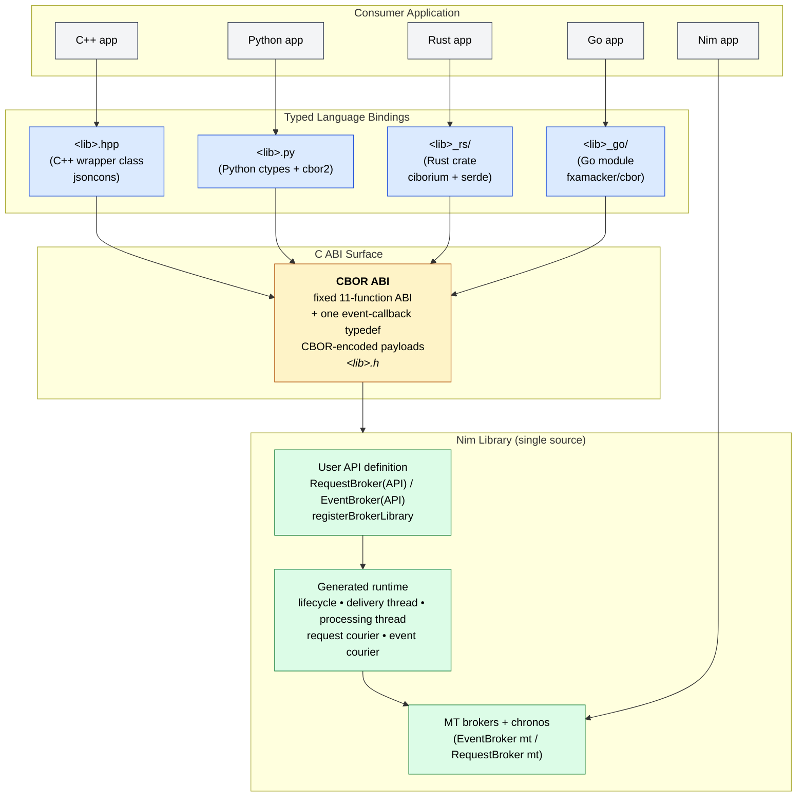
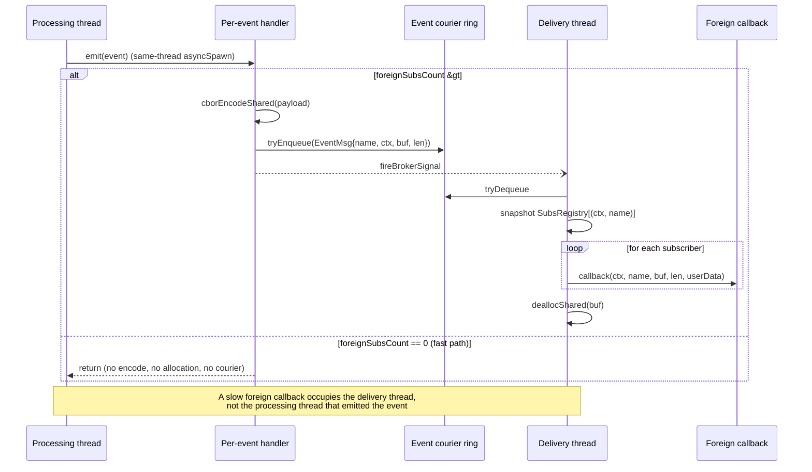
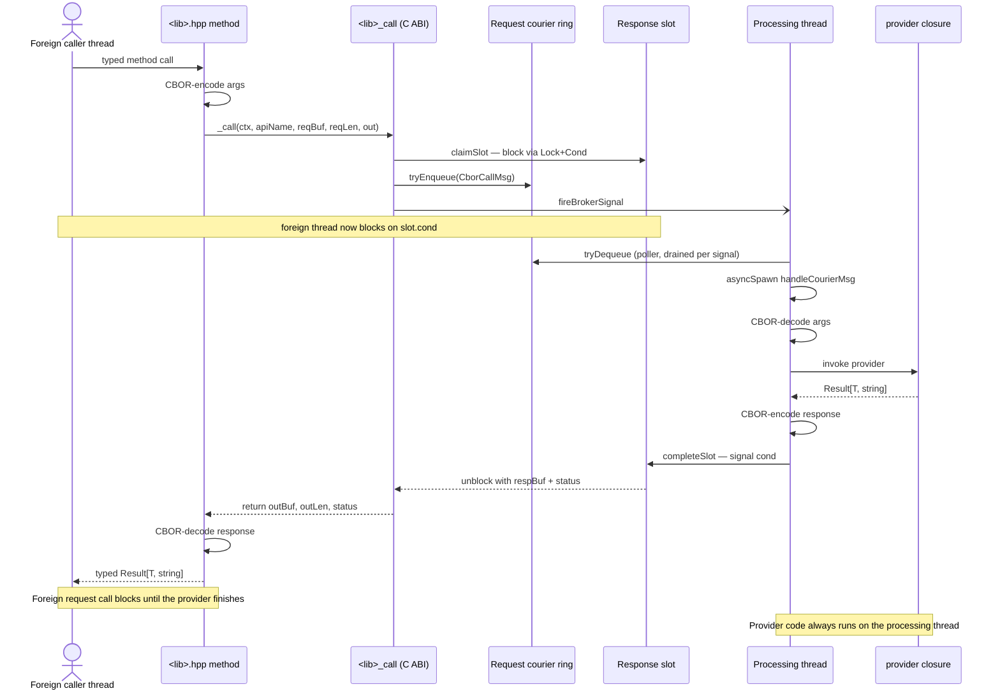

# Broker FFI API

Single Pure Nim library interface to be used from other Nim apps/modules or from foreign languages through a C ABI.

## Table of Contents

- [Broker FFI API](#broker-ffi-api)
  - [Table of Contents](#table-of-contents)
  - [Overview](#overview)
    - [Layered Architecture](#layered-architecture)
  - [Code Structure](#code-structure)
    - [Source Layout](#source-layout)
    - [Module Dependency Graph](#module-dependency-graph)
    - [Codegen Module Responsibilities](#codegen-module-responsibilities)
      - [Language outputs](#language-outputs)
    - [Compile-Time Data Flow](#compile-time-data-flow)
  - [Type Auto-Resolution](#type-auto-resolution)
    - [Usage](#usage)
    - [How It Works](#how-it-works)
    - [What Is Auto-Discovered](#what-is-auto-discovered)
    - [Constraints](#constraints)
  - [Building Blocks](#building-blocks)
    - [1. `RequestBroker(API)`](#1-requestbrokerapi)
    - [2. `EventBroker(API)`](#2-eventbrokerapi)
    - [3. `registerBrokerLibrary`](#3-registerbrokerlibrary)
    - [4. How to build with it](#4-how-to-build-with-it)
      - [Required Nim flags](#required-nim-flags)
      - [ABI strategy flag](#abi-strategy-flag)
      - [Optional language wrapper flags](#optional-language-wrapper-flags)
      - [Diagnostic flags](#diagnostic-flags)
      - [Worked examples](#worked-examples)
      - [Why `--nimMainPrefix` matters (POSIX)](#why---nimmainprefix-matters-posix)
      - [External dependencies for wrappers](#external-dependencies-for-wrappers)
      - [Convenience nimble tasks](#convenience-nimble-tasks)
  - [Lifecycle Model](#lifecycle-model)
    - [Per-context creation](#per-context-creation)
    - [Post-create configuration](#post-create-configuration)
      - [Dynamic provider registration via `InitializeRequest`](#dynamic-provider-registration-via-initializerequest)
    - [Shutdown](#shutdown)
  - [Threading Architecture](#threading-architecture)
    - [Processing thread](#processing-thread)
    - [Delivery thread](#delivery-thread)
    - [Why there are two threads](#why-there-are-two-threads)
    - [Startup ordering](#startup-ordering)
    - [Event behavior](#event-behavior)
    - [Request behavior](#request-behavior)
  - [Requirements on `InitializeRequest` and `ShutdownRequest`](#requirements-on-initializerequest-and-shutdownrequest)
  - [Authoring a Broker FFI Library](#authoring-a-broker-ffi-library)
    - [Minimal structure](#minimal-structure)
    - [`setupProviders(ctx)` convention](#setupprovidersctx-convention)
    - [Batch request inputs](#batch-request-inputs)
    - [Event callback ABI](#event-callback-abi)
    - [Data ownership for request results](#data-ownership-for-request-results)
  - [Generated Foreign Surfaces](#generated-foreign-surfaces)
    - [C API](#c-api)
      - [Async requests (`<lib>_callAsync`)](#async-requests-lib_callasync)
    - [C++ wrapper](#c-wrapper)
    - [Python wrapper](#python-wrapper)
  - [Operational Expectations](#operational-expectations)
    - [What `mylib_createContext()` guarantees](#what-mylib_createcontext-guarantees)
    - [What it does not guarantee](#what-it-does-not-guarantee)
    - [Callback behavior](#callback-behavior)
    - [Provider behavior](#provider-behavior)
  - [Future Work](#future-work)
    - [Typed C surface](#typed-c-surface)
    - [Adding a new language surface](#adding-a-new-language-surface)
  - [Type Mapping Reference](#type-mapping-reference)
    - [The two layers that matter](#the-two-layers-that-matter)
    - [Cheat-sheet (high level)](#cheat-sheet-high-level)
    - [Composite example](#composite-example)
    - [Event callback signatures](#event-callback-signatures)
  - [Related Documents](#related-documents)

## Overview

The Broker FFI API is the shared-library integration layer built on top of
`RequestBroker(API)`, `EventBroker(API)`, and `registerBrokerLibrary`.

It is intended for cases where a Nim component should be consumed from foreign
languages while still using nim-brokers internally for typed request/response
and event delivery.

Foreign interface generation is activated with __-d:BrokerFfiApi__ at compile time.
> __In abscence of that flag__, the broker macros still work but Event/RequestBroker definitions just fall back to MultiThread brokers without emitting any FFI codegen or C exports.
> __Still usable from Nim.__

Typical consumers are:

- C++/Rust/Go applications through the generated wrapper class
- Python applications through the generated ctypes wrapper

The FFI API solution provides:

- a fixed CBOR C ABI — 11 core functions plus the async `<lib>_callAsync`
  gate (see `## C API` below) — that every
  library exports identically — same shape regardless of how many
  request / event brokers are declared
- a generated library lifecycle API (`<lib>_initialize`,
  `<lib>_createContext`, `<lib>_shutdown`, `<lib>_version`)
- a generated C header (`<lib>.h`) declaring the CBOR ABI + the
  per-library event-callback typedef
- a generated C++ wrapper header (`<lib>.hpp`) with typed methods that
  CBOR-encode / decode internally (always emitted)
- an optional generated Python wrapper module (`<lib>.py`)
- an optional generated Rust wrapper crate (`<lib>_rs/`)
- an optional generated Go wrapper module (`<lib>_go/`)


The FFI API is designed around a per-library-context runtime model. Each call to
`<lib>_createContext()` creates one independent broker context with its own worker
threads and broker registrations.

### Layered Architecture

A single Nim API definition — one library or module written once with
`RequestBroker(API)`, `EventBroker(API)`, and `registerBrokerLibrary` —
compiles into a fixed CBOR C ABI plus an idiomatic typed wrapper for
each supported language. Consumer code talks to the typed wrapper; the
CBOR encode / decode is contained inside the wrapper.



**Key invariants of the layering:**

| Layer | Per-library count | What it does |
|-------|-------------------|--------------|
| Nim source | 1 | declares brokers + providers; mode-agnostic |
| C ABI / `<lib>.h` | 1 | fixed 11-function CBOR ABI + event-callback typedef |
| Language wrapper | 1 per language | typed methods; CBOR encode / decode internally |
| Consumer code | 1 | uses the typed wrapper; sees no CBOR |

The CBOR ABI offers a stable, narrow C surface and a self-describing
wire format. The typed wrapper layer hides the CBOR encode / decode
from application code, so consumers work against an idiomatic
language-native interface.

---

## Code Structure

The FFI API system is split into focused modules, each owning one concern.

### Source Layout

The FFI API codegen lives under `brokers/internal/`. It is split into a
mode-agnostic core (schema, type resolution, lifecycle) and the
CBOR-mode codegen layer (one module per output language plus shared
codec helpers).

```
brokers/
  api_library.nim                  registerBrokerLibrary — lifecycle,
                                   processing + delivery threads,
                                   request courier wiring, event courier
                                   wiring, file orchestration
  internal/
    api_schema.nim                 Compile-time type registry
                                   (ApiTypeEntry, gApiTypeRegistry)
    api_type_resolver.nim          Two-phase external-type auto-resolution
    api_type.nim                   Deprecated ApiType shim (warns; use
                                   plain Nim types)
    api_common.nim                 Re-export hub + runtime memory helpers
                                   (alloc/free across the ABI)

    # CBOR-mode broker codegen
    api_request_broker_cbor.nim    CBOR RequestBroker(API) codegen +
                                   per-method adapter (envelope
                                   encode / decode)
    api_event_broker_cbor.nim      CBOR EventBroker(API) codegen +
                                   per-event entry registration

    # CBOR runtime helpers
    api_cbor_codec.nim             BrokerCbor flavor, encode / decode
                                   helpers, distinct / enum bindings
    api_cbor_descriptor.nim        Stable runtime descriptor types for
                                   the discovery API
    api_cbor_subs_registry.nim     Shared-heap registry of foreign event
                                   subscribers (lock-protected; safe
                                   under --mm:refc)
    api_cbor_courier.nim           Request-side courier ring + per-call
                                   response slots (foreign _call →
                                   processing thread)
    api_cbor_event_courier.nim     Event-side courier ring
                                   (fire-and-forget; processing thread →
                                   delivery thread)

    # CBOR language codegen (one module per output surface)
    api_codegen_cbor_h.nim         Fixed 11-function CBOR C header
    api_codegen_cbor_hpp.nim       jsoncons-backed C++ wrapper
    api_codegen_cbor_py.nim        cbor2-backed Python wrapper
    api_codegen_cbor_rust.nim      ciborium + serde-backed Rust crate
    api_codegen_cbor_go.nim        fxamacker/cbor-backed Go module
    api_codegen_cbor_cddl.nim      <lib>.cddl schema emission
    api_codegen_cmake.nim          <lib>Config.cmake package emission

    # Multi-thread broker runtime (the FFI API runtime builds on these)
    mt_broker_common.nim           Shared MT runtime (thread id/gen,
                                   dispatch loop, signal helpers)
    mt_event_broker.nim            EventBroker(mt) macro
    mt_request_broker.nim          RequestBroker(mt) macro

    helper/
      broker_utils.nim             Shared AST parsing
                                   (parseSingleTypeDef, parseTypeDefs)
```

### Module Dependency Graph

```
helper/broker_utils.nim       (no API deps)
        |
api_schema.nim -- api_type_resolver.nim
        |
        +--> CBOR codegen
                api_cbor_codec.nim
                api_cbor_descriptor.nim
                api_cbor_subs_registry.nim
                api_cbor_courier.nim
                api_cbor_event_courier.nim
                api_codegen_cbor_{h,hpp,py,rust,go,cddl}.nim
                api_codegen_cmake.nim
        |
api_common.nim   (re-exports schema + type resolver +
                  runtime memory helpers)
        |
        +--> api_request_broker_cbor.nim
        +--> api_event_broker_cbor.nim
        |
api_library.nim   (lifecycle, two threads per context,
                   request + event courier wiring,
                   file orchestration via generate*File procs)
```

**Key rules:**

- CBOR is the only FFI codegen surface; activate it with
  `-d:BrokerFfiApi`. The historical native-codegen path was retired
  along with the `BrokerFfiMode` selector.
- Language codegen modules (C, C++, Python, Rust, Go, ...) have no
  dependencies on each other. Each owns its accumulators and type
  mapping procs. 
  - Adding a new language surface means adding one new module  with no changes to the existing ones.
- `api_library.nim` is the only module that knows about every output and
  drives file emission at the end of macro expansion.

### Codegen Module Responsibilities

Each language codegen module owns:

1. **Type mapping procs** — convert Nim types to the target language
   (`nimTypeToCOutput`, `nimTypeToCpp`, `nimTypeToCtypes`,
   `nimTypeToRust`, `nimTypeToGo`, `toCFieldType`, ...).
2. **Compile-time accumulators** — `{.compileTime.}` `seq[string]` buffers
   that collect code fragments during macro expansion.
3. **File generator** — reads accumulators and writes the output file
   (`generateCHeaderFile`, `generateCppHeaderFile`, `generatePythonFile`,
   `generateRustCrate`, `generateGoModule`, ...).

#### Language outputs

| Module | Output file(s) | Notes |
|--------|----------------|-------|
| `api_codegen_cbor_h.nim` | `<lib>.h` | Fixed 11-function C ABI + one event-callback typedef. Always emitted. |
| `api_codegen_cbor_hpp.nim` | `<lib>.hpp` | C++ wrapper backed by jsoncons. Always emitted. |
| `api_codegen_cbor_py.nim` | `<lib>.py` | Python wrapper backed by `cbor2`. Opt-in via `-d:BrokerFfiApiGenPy`. |
| `api_codegen_cbor_rust.nim` | `<lib>_rs/Cargo.toml`, `src/lib.rs` | Rust crate using `ciborium` + `serde` (per-method `__Env<T>` envelope). Opt-in via `-d:BrokerFfiApiGenRust`. |
| `api_codegen_cbor_go.nim` | `<lib>_go/go.mod`, `<lib>.go`, `<lib>_cbor.go` | Go module using `github.com/fxamacker/cbor/v2`. Opt-in via `-d:BrokerFfiApiGenGo`. |
| `api_codegen_cbor_cddl.nim` | `<lib>.cddl` | CDDL schema for the CBOR surface; also returned by `<lib>_getSchema()` at runtime. Always emitted. |
| `api_codegen_cmake.nim` | `<lib>Config.cmake` | CMake package config exposing `mylib::mylib` (C) and `mylib::mylib_cpp` (C++) IMPORTED targets. Always emitted. |

The shared CBOR runtime helpers (`api_cbor_codec.nim`,
`api_cbor_descriptor.nim`, `api_cbor_subs_registry.nim`,
`api_cbor_courier.nim`, `api_cbor_event_courier.nim`) are imported by
the broker codegen modules (`api_request_broker_cbor.nim`,
`api_event_broker_cbor.nim`) and by `api_library.nim`'s lifecycle
codegen, but not by the language-specific codegen modules — those
only read from the schema registry.

### Compile-Time Data Flow

```
1. User defines plain Nim types (DeviceInfo, AddDeviceSpec)

2. Broker macros expand:
   a. discoverExternalTypes() scans AST for non-primitive types
   b. emitAutoRegistrations() emits autoRegisterApiType(T) calls
   c. Deferred codegen macro emitted (runs after registrations)

3. autoRegisterApiType(T) typed macro expands (runs first):
   a. getTypeImpl() extracts fields
   b. Recursion for nested object types
   c. Registers in gApiTypeRegistry
   d. Appends to per-language CBOR codegen accumulators (C, C++, Python,
      Rust, Go, CDDL)

4. Deferred broker codegen (api_request_broker_cbor /
   api_event_broker_cbor) expands after step 3:
   a. lookupFfiStruct() succeeds — registry populated
   b. Generates the per-method / per-event adapter that
      CBOR-encodes / decodes the typed Nim payload at the ABI edge
   c. Registers the entry in gApiCborRequestEntries /
      gApiCborEventEntries for api_library.nim to wire later

5. registerBrokerLibrary macro:
   a. Generates lifecycle code (createContext, shutdown,
      processing + delivery threads, request courier + event courier
      allocation / shutdown, per-event listener installers including the
      atomic-counter fast path and dropAllListeners cleanup hook)
   b. Generates _call dispatch case statement, _subscribe / _unsubscribe
      C exports, _listApis / _getSchema discovery exports
   c. Calls file generators:
      - generateCborHeaderFile()  → <libName>.h
      - generateCborHppFile()     → <libName>.hpp
      - generateCborPyFile()      → <libName>.py        (opt-in)
      - generateCborRustCrate()   → <libName>_rs/...    (opt-in)
      - generateCborGoModule()    → <libName>_go/...    (opt-in)
      - generateCborCddlFile()    → <libName>.cddl
      - generateCmakeConfigFile() → <libName>Config.cmake
```

---

## Type Auto-Resolution

External types referenced in broker macros are automatically discovered and
registered at compile time. No separate `ApiType` registration macro is needed.

### Usage

Define types as plain Nim objects before the broker macro:

```nim
type DeviceInfo* = object
  deviceId*: int64
  name*: string
  online*: bool

RequestBroker(API):
  type ListDevices = object
    devices*: seq[DeviceInfo]
  proc signature*(): Future[Result[ListDevices, string]] {.async.}
```

`DeviceInfo` is auto-discovered from the `seq[DeviceInfo]` field and
auto-registered. The C++ struct + jsoncons traits, the Python
`@dataclass`, the Rust `#[derive(Serialize, Deserialize)]` struct, the
Go struct with `cbor` tags, and the CDDL schema entry are all
generated automatically.

### How It Works

The auto-resolution uses a two-phase approach to work within Nim's macro system
constraints:

**Phase 1 — Discovery (untyped context)**:
`discoverExternalTypes(body)` scans the raw AST for non-primitive type
references in type fields, proc parameters, and type aliases.

**Phase 2 — Resolution (typed macro)**:
`autoRegisterApiType(T: typed)` receives a resolved type symbol, introspects its
fields via `getTypeImpl()`, recursively resolves nested object types, and
registers everything in the compile-time type registry.

The **deferred codegen pattern** ensures proper ordering: auto-registration macro
calls are emitted before the broker codegen macro, so the type registry is
populated when the codegen needs to look up fields.

### What Is Auto-Discovered

- `seq[T]` in type fields: `devices: seq[DeviceInfo]` → discovers `DeviceInfo`
- `seq[T]` in proc parameters: `proc signature*(items: seq[AddDeviceSpec])` → discovers `AddDeviceSpec`
- Plain custom type fields: `info: DeviceInfo` → discovers `DeviceInfo`
- Type aliases: `type MyEvent = ExternalType` → discovers `ExternalType`
- Nested objects: if `DeviceInfo` has `address: Address`, `Address` is recursively resolved

### Constraints

- External types must be defined **before** the broker macro call site (standard
  Nim compilation order)
- All `API` broker must be known and imported where the `registerBrokerLibrary` macro is used!
- Only `object` types can be fully introspected. Enums, distinct types, etc.
  pass through without field registration.

---

## Building Blocks

The FFI API layer is composed from three parts.

### 1. `RequestBroker(API)`

Defines a request type that is exported as a C ABI function.

Example:

```nim
RequestBroker(API):
  type GetDevice = object
    deviceId*: int64
    name*: string

  proc signature*(deviceId: int64): Future[Result[GetDevice, string]] {.async.}
```

This generates:

- a per-method adapter on the Nim side that CBOR-decodes the args,
  invokes the provider closure, and CBOR-encodes the response — wired
  into the per-library `<lib>_call` dispatch case statement
- a typed wrapper method on every emitted language surface (C++ /
  Python / Rust / Go) that CBOR-encodes the args, calls `<lib>_call`,
  and CBOR-decodes the response into the typed `Result<T, String>`
- a runtime entry in `<lib>_listApis()` / `<lib>_getSchema()` so the
  CBOR ABI is discoverable from foreign code without prior knowledge

The C ABI itself stays fixed at 11 functions regardless of how many
request brokers a library declares — the per-method routing lives
inside `<lib>_call(apiName, ...)`.

### 2. `EventBroker(API)`

Defines an event type that can be subscribed to from foreign code.

Example:

```nim
EventBroker(API):
  type DeviceDiscovered = object
    deviceId*: int64
    name*: string
```

This generates:

- a C callback typedef
- `on<EventType>(ctx, callback, userData)`
- `off<EventType>(ctx, handle)`
- generated wrapper registration methods in C++ and Python

### 3. `registerBrokerLibrary`

This macro ties the API request and event brokers into a complete shared
library surface.

Example:

```nim
registerBrokerLibrary:
  name: "mylib"
  version: "0.1.0"
  initializeRequest: InitializeRequest
  shutdownRequest: ShutdownRequest
```

This generates:

- `mylib_createContext()`
- `mylib_shutdown(ctx)`
- memory management interface
- the library context registry
- the delivery and processing threads
- aggregate event registration routing
- generated C and C++ headers

### 4. How to build with it

This subsection collects, in one place, every compile-time switch and runtime
toolchain requirement for producing a Broker FFI library. Most projects only
need a handful of these flags; the rest are wrapper opt-ins or diagnostic
toggles.

#### Required Nim flags

| Flag | Purpose |
|------|---------|
| `--threads:on` | The FFI API runtime spawns a delivery and a processing thread per context. |
| `--app:lib` | Produce a shared library (`.so` / `.dylib` / `.dll`) instead of an executable. |
| `--mm:orc` *or* `--mm:refc` | Both are supported on every platform. ORC is the recommended default; refc is CI-green across Linux / macOS / Windows with one Windows-specific caveat documented in [LIMITATION.md](LIMITATION.md) §2.2 (don't allocate from `RegisterWaitForSingleObject` callbacks). |
| `--nimMainPrefix:<libname>` | POSIX only. Must match the `name:` field of `registerBrokerLibrary` (see "Why it matters" below). On Windows the flag is intentionally **omitted** — using it triggers a Nim codegen bug under the LLVM toolchain. |
| `--path:.` | Make the project root visible so `import brokers/...` resolves. |
| `--outdir:build` | Keep `.so` and generated wrapper artifacts out of the source tree. |

#### ABI strategy flag

CBOR is the only supported FFI mode; activate the codegen with
`-d:BrokerFfiApi`.

| Flag | Selects | Generated C ABI shape | Wire format |
|------|---------|-----------------------|-------------|
| `-d:BrokerFfiApi` | CBOR ABI | Fixed 11-function ABI + one event-callback typedef. | CBOR-encoded payloads. |

The historical `-d:BrokerFfiApiNative` (native typed-C export ABI) and
the transitional `-d:BrokerFfiApiCBOR` alias have been removed.

#### Optional language wrapper flags

C and C++ headers are always emitted. The remaining language wrappers
are opt-in.

| Flag | Generates | Output relative to `--outdir` |
|------|-----------|-------------------------------|
| `-d:BrokerFfiApiGenPy` | `<lib>.py` (ctypes + cbor2) | `<lib>.py` |
| `-d:BrokerFfiApiGenRust` | `<lib>_rs/` Cargo crate (ciborium + serde) | `<lib>_rs/Cargo.toml`, `src/lib.rs` |
| `-d:BrokerFfiApiGenGo` | `<lib>_go/` Go module (fxamacker/cbor) | `<lib>_go/go.mod`, `<lib>.go`, `<lib>_cbor.go` |

The CMake package config (`<lib>Config.cmake`) and, in CBOR mode, the
`<lib>.cddl` schema are emitted unconditionally next to the `.h`/`.hpp`.

#### Diagnostic flags

| Flag | Effect |
|------|--------|
| `-d:brokerDebug` | Dump every macro-generated AST to stdout during compilation. Useful when investigating codegen output. |
| `-d:release` | Standard Nim release build. The repository's CI matrix exercises the FFI API under both debug and release. |

#### Worked examples

Minimal build of `examples/ffiapi/nimlib/mylib.nim` (CBOR is the only mode):

```sh
nim c \
  -d:BrokerFfiApi \
  --threads:on --app:lib --mm:orc \
  --path:. --outdir:examples/ffiapi/nimlib/build_cbor \
  --nimMainPrefix:mylib \
  examples/ffiapi/nimlib/mylib.nim
```

Same source compiled with all four wrapper languages emitted:

```sh
nim c \
  -d:BrokerFfiApi \
  -d:BrokerFfiApiGenPy -d:BrokerFfiApiGenRust -d:BrokerFfiApiGenGo \
  --threads:on --app:lib --mm:orc \
  --path:. --outdir:examples/ffiapi/nimlib/build_cbor \
  --nimMainPrefix:mylib \
  examples/ffiapi/nimlib/mylib.nim
```

Inspect the AST that the macros produce:

```sh
nim c -d:brokerDebug -d:BrokerFfiApi \
      --threads:on --app:lib --path:. --outdir:build \
      --nimMainPrefix:mylib examples/ffiapi/nimlib/mylib.nim
```

#### Why `--nimMainPrefix` matters (POSIX)

The code emitted by `registerBrokerLibrary` imports `<libname>NimMain` and
calls it from the once-per-process initialization path. That symbol is only
produced when Nim is invoked with `--nimMainPrefix:<libname>`. If the prefix
does not match the `name:` field of `registerBrokerLibrary`, the library
fails to link.

On Windows the flag is omitted intentionally (see `nimMainPrefixFlag` in
[brokers.nimble](../brokers.nimble) and [LIMITATION.md](LIMITATION.md) §3.1).

#### External dependencies for wrappers

| Wrapper | Dependency | How to get it |
|---------|------------|---------------|
| C++ | `jsoncons` headers under `vendor/jsoncons/include` | `nimble fetchVendor` (or `git submodule update --init --recursive`) |
| Python | `cbor2` package | `pip install --user cbor2` |
| Rust | `ciborium` + `serde` + `serde_json` + `serde_bytes` | Cargo fetches them automatically. |
| Go | `github.com/fxamacker/cbor/v2` | `go mod tidy` fetches it during the build. |

#### Convenience nimble tasks

The repository ships ready-made tasks that already pass every flag above.
They are the easiest way to reproduce a working build.

- `nimble buildFfiExampleCbor` — build the CBOR shared library
- `nimble runFfiExampleCborCpp` / `runFfiExampleCborPy` /
  `runFfiExampleCborRust` / `runFfiExampleCborGo` — rebuild + run the
  matching consumer against the CBOR library
- `nimble testApiCbor` — CBOR codec round-trips, library lifecycle,
  event subscribe, discovery API, and the typemappingtestlib parity
  matrix across `--mm:orc` / `--mm:refc` × debug / release
- `nimble runTypeMapTestLibCborCpp` / `…Py` / `…Rust` / `…Go` —
  per-language parity matrices
- `nimble runFfiBenchEventStress` — Part D-4/D-5 event dispatch stress
  drivers (mixed audience / no-foreign / no-nim / shutdown drain /
  slow-callback non-blocking proof)
- `nimble runFfiBenchEvent` — Part D-6 event-dispatch microbenchmark

---

## Lifecycle Model

The FFI API exposes a single public creation entry point.

### Per-context creation

`<lib>_createContext()` creates one independent library instance.

Responsibilities:

- ensure the Nim runtime is initialized once per process
- allocate a fresh `BrokerContext`
- start the delivery thread
- start the processing thread
- wait until both threads report readiness
- publish the context in the library registry

The startup handshake is synchronous from the caller point of view. When
`<lib>_createContext()` returns a context, the delivery side and processing side
are already ready for use.

This is why the examples do not need a post-create sleep.

The C ABI surface for context creation is:

```c
uint32_t <lib>_createContext(const char** errOut);
```

On success it returns a non-zero context id and leaves `*errOut`
untouched. On failure it returns 0 and writes a heap-allocated
diagnostic cstring to `*errOut` — the caller MUST release it with
`<lib>_freeBuffer(errOut)` (cstrings emitted by the runtime live in
the same shared-heap arena as response buffers). The C++ / Python /
Rust / Go wrappers wrap this into their idiomatic `Result` /
exception / `Result<T, String>` surface and free the error string
automatically.

Sequence overview:

```mermaid
sequenceDiagram
  actor F as Foreign caller
  participant C as <lib>_createContext
  participant D as Delivery thread
  participant P as Processing thread
  participant R as Context registry
  F->>+C: createContext(&errOut)
  C->>C: ensure Nim runtime initialized
  C->>C: allocate BrokerContext + per-ctx couriers
  C-)D: start delivery thread
  D->>D: register event-courier poller, start dispatch loop
  D-->>C: deliveryReady = true
  C-)P: start processing thread
  P->>P: setupProviders(ctx) + installAllListeners
  P->>P: register request-courier poller, start dispatch loop
  P-->>C: processingReady = true
  C->>R: publish active context
  C-->>-F: return ctx
  Note over F,C: createContext returns only after BOTH threads are ready
```



### Post-create configuration

`InitializeRequest` is the request broker type used for configuration
after the context exists.

Typical responsibilities:

- load configuration files
- initialize thread-local provider state
- register additional providers lazily
- validate environment or external dependencies

#### Dynamic provider registration via `InitializeRequest`

In `setupProviders(ctx)`, the `InitializeRequest` and `ShutdownRequest`
providers must be registered on the context so they are immediately
callable through the typed wrapper (`lib.initializeRequest(...)` /
`lib.shutdownRequest()`) — which under the hood dispatches via
`<lib>_call(ctx, "initialize_request", ...)` /
`<lib>_call(ctx, "shutdown_request", ...)`.

`InitializeRequest` can also be used as a dynamic registration point
for additional providers — call `setProvider` on the other broker
types from inside the `InitializeRequest` provider closure. This
enables configuration-driven provider registration without baking the
choice into `setupProviders`.


### Shutdown

`ShutdownRequest` is the broker request type for orderly application-level
teardown.

`<lib>_shutdown(ctx)` first invokes `ShutdownRequest` on the processing thread,
then stops the delivery and processing threads and marks the context inactive in
the registry.

Foreign callers only need to call `<lib>_shutdown(ctx)`.

---

## Threading Architecture

Each created library context owns two threads.

### Processing thread

Purpose:

- hosts API request providers
- runs `setupProviders(ctx)` during startup
- serves requests for `RequestBroker(API)` types

This is the thread on which provider closures execute.

### Delivery thread

Purpose:

- consumes the per-context **event courier ring**
- invokes foreign callback trampolines for API event delivery
- isolates foreign callback runtime from request providers — a slow or
  reentrant callback blocks the delivery thread, never the processing
  thread

This is the thread that invokes C callbacks and the callback trampolines used by
the generated C++ and Python wrappers.

### Why there are two threads

The split keeps foreign-callback fan-out off the provider thread. A
foreign callback that sleeps 100 ms would block any request providers
sharing the same thread (and would deadlock if the callback re-entered
the library via `<lib>_call`). Running fan-out on a dedicated delivery
thread eliminates both hazards.

Benefits:

- event callback dispatch is isolated from request execution
- request providers can keep request-local state on the processing thread
- a reentrant `<lib>_call` from inside a foreign callback is serviced on
  the processing thread (no self-deadlock)
- shutdown ordering is predictable

See `doc/CBOR_Round2_PartD_EventCourier.md` for the design rationale and
`doc/bench_baseline.md` § "Event dispatch — Part D-6" for per-emit cost
numbers across the three dispatch lanes.

### Startup ordering

The generated create function starts the threads in this order:

1. delivery thread
2. processing thread

The delivery thread is started first so its event-courier signal handle
is published before any provider can emit an event. The create function
waits for:

- delivery thread readiness after its broker dispatch loop is running
  and the event-courier poller is registered
- processing thread readiness after `setupProviders(ctx)` completes
  and the per-event listeners are installed

The sequence above is the reason `create()` behaves synchronously even
though the implementation starts two background threads internally.

### Event behavior

Foreign subscribe / unsubscribe — `<lib>_subscribe(ctx, eventName, cb,
userData)` / `<lib>_unsubscribe(ctx, eventName, handle)` — write
directly into a shared-heap subscription registry from the foreign
caller's thread. No request broker is involved on the registration
path. Each successful subscribe bumps a per-event atomic counter that
the emit-side uses as a fast-path discriminator.

When the Nim side emits an API event:

- the per-event listener (registered on the **processing** thread by
  `installAllListenersIdent`) fires via the MT EventBroker's same-thread
  direct `asyncSpawn` fast path
- the listener loads the per-event `foreignSubsCount` atomic. **If
  zero (the 90 % production case), the listener returns immediately**
  — no CBOR encode, no allocation, no courier touch.
- otherwise the listener CBOR-encodes the payload once into a
  shared-heap buffer, enqueues an `EventMsg(eventName, ctx, buf,
  bufLen)` into the per-context event-courier ring, and fires the
  delivery thread's broker dispatch signal
- the delivery thread polls the courier ring, snapshots the foreign
  subscriber list for `(ctx, eventName)`, invokes each callback
  synchronously, then `deallocShared`s the buffer
- Nim listeners (registered via `<Event>.listen(...)` from Nim code
  inside the library) keep going through the standard MT EventBroker
  paths unchanged — same-thread direct `asyncSpawn` or cross-thread
  typed-slab marshalling



`<EventType>.dropAllListeners(ctx)` from Nim code fires a companion
hook (registered by the per-event installer) that also clears the
foreign-subscriber registry for `(ctx, eventName)` and resets the
`foreignSubsCount` atomic, so foreign subs cannot orphan when user Nim
code drops listeners.

### Request behavior

API request brokers route every `<lib>_call(...)` from a foreign thread
through the per-context **request courier** (`api_cbor_courier.nim`).
Properties:

- Single C ABI entry point: `<lib>_call(ctx, apiName, reqBuf, reqLen,
  outBuf, outLen, outStatus)`. The typed wrapper methods (per-request
  in `<lib>.hpp` / `<lib>.py` / Rust / Go) CBOR-encode their args, call
  `_call`, then CBOR-decode the response.
- The foreign thread claims one of N response slots (lock + cond),
  enqueues a POD `CborCallMsg{apiName, reqBuf, reqLen, slotIdx}` into
  the shared-heap MPSC ring, fires the processing thread's broker
  dispatch signal, then blocks on the slot's condvar.
- The processing thread's `brokerDispatchLoop` coroutine wakes on the
  signal, drains the ring, dispatches each message on a chronos
  `asyncSpawn`. The async handler CBOR-decodes, calls the typed
  provider closure, CBOR-encodes the result, and writes it into the
  slot — which signals the cond and unblocks the caller.
- One provider exists per request broker type per broker context.
- Buffer ownership: every shared-heap buffer crossing the ABI is
  allocated by Nim (`<lib>_allocBuffer` on the foreign side, or
  `allocShared0` on the processing thread for responses) and freed by
  Nim (`<lib>_freeBuffer` on the foreign side after the wrapper
  decodes the response).



See [Multi-Thread RequestBroker](MultiThread_RequestBroker.md) for the lower
level request-routing behavior that the FFI API builds on.

---

## Requirements on `InitializeRequest` and `ShutdownRequest`

`registerBrokerLibrary` requires that the types named in `initializeRequest:` and
`shutdownRequest:` exist at compile time. The legacy `destroyRequest:` alias is
still accepted for compatibility.
You can name you Initialized and Shutdown brokers as you like. The macro just registers them.

It does not itself force those providers to be registered.

In practice:

- `InitializeRequest.setProvider(ctx, ...)` and `ShutdownRequest.setProvider(ctx, ...)`should be installed in `setupProviders`:exclamation:
  - These are stands for constrtuctor and destructor of the library context, so they should be registered on the processing thread during startup :exclamation:

For other API request brokers, lazy registration is allowed.

For example, a library may:

- register `InitializeRequest` and `ShutdownRequest` during startup
- use `InitializeRequest.request(...)` to install additional API broker providers

This works because `InitializeRequest` executes on the processing thread, which is
the correct owner thread for `setProvider` on API request brokers.

The main limitation is that a provider can only be registered once per broker
type per context unless it is cleared first.

---

## Authoring a Broker FFI Library

### Minimal structure

```nim
import brokers/[event_broker, request_broker, broker_context, api_library]

RequestBroker(API):
  type InitializeRequest = object
    initialized*: bool

  proc signature*(configPath: string): Future[Result[InitializeRequest, string]] {.async.}

RequestBroker(API):
  type ShutdownRequest = object
    status*: int32

  proc signature*(): Future[Result[ShutdownRequest, string]] {.async.}

EventBroker(API):
  type StatusChanged = object
    label*: string

var gProviderCtx {.threadvar.}: BrokerContext

proc setupProviders(ctx: BrokerContext) =
  gProviderCtx = ctx

  discard InitializeRequest.setProvider(
    ctx,
    proc(configPath: string): Future[Result[InitializeRequest, string]] {.closure, async.} =
      return ok(InitializeRequest(initialized: true))
  )

  discard ShutdownRequest.setProvider(
    ctx,
    proc(): Future[Result[ShutdownRequest, string]] {.closure, async.} =
      return ok(ShutdownRequest(status: 0))
  )

registerBrokerLibrary:
  name: "mylib"
  initializeRequest: InitializeRequest
  shutdownRequest: ShutdownRequest
```

### `setupProviders(ctx)` convention

If a proc named `setupProviders(ctx: BrokerContext)` exists, the generated
library startup calls it automatically on the processing thread.

That proc is the main hook for:

- registering request providers
- capturing thread-local state
- remembering the active provider context
- installing lazily created providers if desired

### Batch request inputs

For request parameters that need to cross the foreign-function boundary
as a collection, prefer `seq[T]` where `T` is a plain Nim object type
defined before the broker macro.

Example:

```nim
type AddDeviceSpec* = object
  name*: string
  deviceType*: string
  address*: string

RequestBroker(API):
  type AddDevice = object
    devices*: seq[DeviceInfo]
    success*: bool

  proc signature*(devices: seq[AddDeviceSpec]):
    Future[Result[AddDevice, string]] {.async.}
```

Why this shape is preferred:

- The type auto-resolution system discovers `AddDeviceSpec` from the
  proc parameter and registers it in `gApiTypeRegistry`. Each language
  wrapper then emits a typed representation of the item — a C++ struct
  with `JSONCONS_ALL_MEMBER_TRAITS`, a Python `@dataclass`, a Rust
  `#[derive(Serialize, Deserialize)]` struct, a Go struct with cbor
  tags — so consumer code passes a `vector<AddDeviceSpec>` /
  `list[AddDeviceSpec]` / `Vec<AddDeviceSpec>` / `[]AddDeviceSpec`
  directly without touching CBOR by hand.
- On the wire the batch becomes a single CBOR array nested inside the
  request envelope; the Nim adapter CBOR-decodes the whole batch into
  `seq[AddDeviceSpec]` before invoking the provider. No per-item C
  ABI crossing.

In contrast, literal tuple sequences are not a good fit for the
codegen because tuple items do not participate in the type registry
that drives the per-language typed representations.

Current limitation:

- `RequestBroker(API)` supports at most two signature categories for a
  broker type: one zero-argument signature and one argument-bearing
  signature. When both exist they get distinct apiNames (the
  zero-arg variant gets a `_query` / `_default` suffix; the
  arg-bearing variant gets a `_with_args` suffix — see
  `api_request_broker_cbor.nim` `zeroApiSuffix` / `argApiSuffix`).
- The zero-argument form is auto-generated only when no signatures
  are declared at all.
- If you need to add a batch form such as
  `AddDevice(devices: seq[AddDeviceSpec])`, and the broker already
  has another argument-bearing signature, replace that signature or
  model the variants as separate request broker types.

### Event callback ABI

Every event in a library shares the **same** C-level callback typedef
— the typed event signature lives only in the language wrappers, not
at the C ABI. The C-level shape is:

```c
typedef void (*<lib>EventCallback)(
    uint32_t ctx,
    const char* eventName,
    const void* payloadBuf,
    int32_t payloadLen,
    void* userData);
```

Registration is one shared C export, parameterized by `eventName`:

```c
uint64_t <lib>_subscribe(
    uint32_t ctx,
    const char* eventName,
    <lib>EventCallback cb,
    void* userData);

int32_t  <lib>_unsubscribe(
    uint32_t ctx,
    const char* eventName,
    uint64_t handle);
```

The parameters:

- `ctx` tells the callback which library instance emitted the event.
- `eventName` is the snake_case wire name of the broker (e.g.
  `device_discovered`); the receiver dispatches on it to find the
  right typed decoder.
- `payloadBuf` / `payloadLen` carry the CBOR-encoded payload. The
  buffer is owned by the Nim runtime and is valid only for the
  duration of the callback — copy if you need to keep it.
- `userData` is an opaque pointer the foreign caller supplied during
  `_subscribe`; the Nim runtime stores it and passes it back
  unchanged. It is the standard hook for per-subscription routing /
  ownership tokens.

The language wrappers (C++/Python/Rust/Go) generate per-event typed
handler signatures on top of this shared C callback. For
`DeviceDiscovered { deviceId: int64; name, deviceType, address:
string }` the C++ wrapper exposes:

```cpp
lib.onDeviceDiscovered([](Mylib& self,
                          int64_t deviceId,
                          std::string_view name,
                          std::string_view deviceType,
                          std::string_view address) {
    // ...
});
```

Under the hood the wrapper registers a single C trampoline whose body
CBOR-decodes `payloadBuf` into a `DeviceDiscovered` POD struct, then
unpacks the fields and forwards to the user lambda. Python / Rust /
Go follow the same pattern with their respective idioms.

### Data ownership for request results

Every `void*` crossing the C ABI is allocated by Nim and freed by Nim:

- **Request buffer** (`reqBuf` in `<lib>_call`): allocated by the
  caller via `<lib>_allocBuffer(size)`, ownership transfers into the
  call; the Nim processing thread frees it after copying the bytes
  off.
- **Response buffer** (`outBuf` returned from `<lib>_call`): allocated
  by the Nim processing thread (`allocShared0`); ownership transfers
  to the foreign caller. The caller MUST call `<lib>_freeBuffer(buf)`
  after decoding the response.
- **Event payload buffer** (`payloadBuf` in the event callback):
  allocated by the Nim processing thread; valid only inside the
  callback. The runtime frees it after the synchronous fan-out
  completes — do NOT call `_freeBuffer` on it.

The generated C++, Python, Rust, and Go wrappers hide all of this
automatically: they call `_freeBuffer` after CBOR-decoding the
response, and the event-callback trampoline keeps `payloadBuf` alive
only for the duration of the user closure. Pure-C consumers calling
the raw ABI must follow the rules above explicitly.

---

## Generated Foreign Surfaces

### C API

Every library exposes the **same fixed CBOR ABI**, plus per-library
callback typedefs. The core is **11 synchronous functions**; a **12th**,
`<lib>_callAsync`, adds a fire-and-forget request gate whose response is
delivered later via a foreign callback (see
[Async requests](#async-requests-lib_callasync) below). The C ABI is
intentionally narrow — typed methods live in the language wrappers
above. Pure-C consumers see only the raw CBOR ABI; the typed-C surface
is on the deferred work list (see `doc/CBOR_Refactoring.md` §10).

```c
// Fixed across all libraries:
const char*   <lib>_version(void);                                   // owned by Nim; do not free
int32_t       <lib>_initialize(void);                                // once-per-process Nim init
uint32_t      <lib>_createContext(const char** errOut);              // returns ctx id, 0 on error
int32_t       <lib>_shutdown(uint32_t ctx);                          // tear down ctx + threads
void*         <lib>_allocBuffer(int32_t size);                       // Nim-side allocShared0
void          <lib>_freeBuffer(void* buf);                           // Nim-side deallocShared
int32_t       <lib>_call(                                            // request dispatch
                  uint32_t ctx,
                  const char* apiName,
                  void* reqBuf, int32_t reqLen,
                  void** outBuf, int32_t* outLen);
uint64_t      <lib>_subscribe(                                       // event subscribe
                  uint32_t ctx,
                  const char* eventName,
                  <lib>EventCallback cb,
                  void* userData);
int32_t       <lib>_unsubscribe(                                     // event unsubscribe
                  uint32_t ctx,
                  const char* eventName,
                  uint64_t handle);
int32_t       <lib>_listApis(void** outBuf, int32_t* outLen);        // discovery: CBOR list of methods
int32_t       <lib>_getSchema(void** outBuf, int32_t* outLen);       // discovery: CDDL schema bytes

// 12th function — fire-and-forget async request (response via callback):
int32_t       <lib>_callAsync(
                  uint32_t ctx,
                  const char* apiName,
                  void* reqBuf, int32_t reqLen,
                  uint64_t reqId,                                    // echoed back; logging/cancel id
                  uint32_t timeoutMs,                                // 0 = infinite; N = ms
                  <lib>_response_cb_t cb,
                  void* userData);                                   // opaque; passed back verbatim

// Per-library typedefs (one declaration per library, generated):
typedef void (*<lib>EventCallback)(
    uint32_t ctx,
    const char* eventName,
    const void* payloadBuf, int32_t payloadLen,
    void* userData);

typedef void (*<lib>_response_cb_t)(
    void* userData,
    uint64_t reqId,
    int32_t status,
    const void* respBuf, int32_t respLen);

// Generated policy default for the async timeout (ms):
#define <LIB>_DEFAULT_ASYNC_TIMEOUT_MS 30000u
```

Wire format: every payload buffer is CBOR. `apiName` and `eventName`
are NUL-terminated ASCII strings selected from the discovery API. The
typed wrapper layer (`<lib>.hpp` / `.py` / Rust / Go) is what most
consumers actually use.

### Async requests (`<lib>_callAsync`)

`<lib>_call` is **synchronous**: it posts the request to the processing
thread and **blocks the calling foreign thread** on a condition variable
until the response is ready. That is simple and gives the lowest single-
request latency, but it parks one OS thread per in-flight request — so
throughput is capped by how many threads the caller is willing to block.

`<lib>_callAsync` is the **fire-and-forget** sibling. It enqueues the
request and **returns immediately** (`0` on success); the response is
delivered later by invoking `cb` on the library's **event delivery
thread** — the *same* thread that fans out event callbacks, never the
processing thread that runs providers. A single caller thread can issue
many async requests back-to-back and let the callbacks land as results
arrive (pipelining), without a thread blocked per request.

```c
// Issue (returns 0 immediately on success):
int32_t rc = mylib_callAsync(ctx, "get_device", reqBuf, reqLen,
                             /*reqId=*/42, /*timeoutMs=*/0,
                             on_response, my_corr_ptr);

// Delivered later, on the delivery thread:
void on_response(void* userData, uint64_t reqId, int32_t status,
                 const void* respBuf, int32_t respLen) {
    // userData == my_corr_ptr (verbatim); decode respBuf if status == 0
}
```

**Correlation — `userData`.** `userData` is an opaque `void*` the library
**never interprets**; it is handed back verbatim in the callback. This is
how the caller matches a response to its originating request (e.g. a heap-
boxed continuation / promise / closure handle), so the library keeps no
`reqId → continuation` map. `reqId` is carried only for the caller's
logging / cancellation / idempotency.

**Threading & reentrancy.** Because `cb` runs on the delivery thread (not
the processing thread), it is safe to call back into the library from
inside `cb` — including `<lib>_callAsync` again — without deadlock.
Calling the **synchronous** `<lib>_call` from inside `cb` is also safe but
blocks the delivery thread (head-of-line stalls other callbacks); prefer
`<lib>_callAsync` from within a callback. Callbacks for one context are
serialized (one delivery thread per context).

**Buffer ownership.** `reqBuf` follows the same rule as `<lib>_call`:
allocate it with `<lib>_allocBuffer`; ownership transfers into the library
on a successful (`0`) return, and the library frees it. On any negative
return the library frees `reqBuf` and the callback does **not** fire.
`respBuf` is **library-owned and valid only for the duration of the
callback** — copy out anything you need; do **not** free it (this differs
from `<lib>_call`, where the caller frees the response via
`<lib>_freeBuffer`).

**Back-pressure.** In-flight async requests are bounded **per context** at a
fixed window — `<LIB>_ASYNC_QUEUE_DEPTH` (default 64, set via
`asyncTimeoutMs`'s sibling `asyncQueueDepth:` in `registerBrokerLibrary`). The
async window is independent of the synchronous `<lib>_call` slot pool, so an
async flood cannot starve blocking callers. When the window is full
`<lib>_callAsync` returns `-6` (EAGAIN) and the **callback does not fire** —
slow down and retry, or drop. A slot is held from a successful issue until its
callback returns (success, `-4`, `-10`, `-11`, **or** `-12`), so a client can
size a bounded send window to `<LIB>_ASYNC_QUEUE_DEPTH`, increment an
outstanding counter on a `0` return, and decrement it in the callback
regardless of status.

**Timeout — exactly-once delivery.** `timeoutMs` is **dispatch-scoped**:
`0` = infinite (no timeout); `N` = `N` milliseconds. If the provider
exceeds the budget, the callback fires **exactly once** with `status ==
-12` and a `NULL` `respBuf`, the in-flight slot is released, and the
provider is best-effort-cancelled. A late provider result is discarded —
**the callback never fires twice, and never after a timeout**. The policy
default is `<LIB>_DEFAULT_ASYNC_TIMEOUT_MS` (30 s), configurable per
library via `asyncTimeoutMs:` in `registerBrokerLibrary`; the raw ABI
itself stays pure mechanism (`0` = infinite). Caveat: a provider stuck in
a *blocking* (non-chronos) call cannot be cancelled — `-12` still fires
once, but that provider keeps running until shutdown.

**Status codes** (passed to `cb` as `status`, or returned by
`<lib>_callAsync` as a negative `rc` when the callback will not fire):

| Value | Meaning | Callback fires? |
|------:|---------|-----------------|
| `0`   | success; `respBuf` holds the CBOR response envelope | yes |
| `-2`  | `apiName` NULL or too long | no (rc) |
| `-3`  | `reqLen` negative or > 64 MiB | no (rc) |
| `-4`  | unknown `apiName`; `respBuf` holds a UTF-8 message | yes |
| `-5`  | unknown / torn-down `ctx` | no (rc) |
| `-6`  | EAGAIN — too many async calls in flight | no (rc) |
| `-7`  | `cb` is NULL | no (rc) |
| `-10` | internal dispatch failure | yes |
| `-11` | library shut down before the response was delivered | yes |
| `-12` | request timed out (provider exceeded `timeoutMs`) | yes |

The typed wrappers expose this as a per-method async sibling — e.g. C++
`int32_t lib.getDeviceAsync(id, cb, reqId = 0, timeoutMs = <default>)` where
`cb` receives a decoded `Result<GetDevice>`. The wrapper mirrors the raw ABI
contract: the method **returns `int32_t`** — `0` = queued (`cb` fires exactly
once later; runtime statuses `-4/-10/-11/-12` surface as `Result::err(...)`),
and any **negative** return means NOT queued and `cb` does **not** fire
(`asyncAgain` = `-6` EAGAIN → retry; `asyncBadContext` = `-5`; `asyncNoCallback`
= `-7`; `asyncEncodeFailed` = `-1`). The class also exposes
`static constexpr uint32_t asyncQueueDepth` so a client can size its bounded
window without hardcoding the value. This keeps a transient `-6` cheap (no
allocation consumed, no error callback) so backpressure is a simple retry loop:

```cpp
int32_t rc;
do {
    rc = lib.getDeviceAsync(id, on_done, reqId, timeoutMs);
    if (rc == Lib::asyncAgain) std::this_thread::sleep_for(1ms);  // window full
} while (rc == Lib::asyncAgain);
if (rc == 0) ++outstanding;   // accepted — on_done fires once; --outstanding there
```

The Python, Rust, and Go wrappers expose the same response through each
language's native async machinery instead of a raw callback (the underlying
ABI is identical):

| Wrapper | Async surface | Backpressure (`-6`) | Bridge |
|---------|---------------|---------------------|--------|
| **Rust** | `async fn <m>_async(&self,…) -> Result<T,String>` (`.await`) | `Err("EAGAIN: async window full")` | `tokio::sync::oneshot` (tokio is a hard dep of the CBOR crate) |
| **Go** | `<M>Async(args) (<-chan <M>Result, error)` | returns `ErrAsyncAgain` | buffered channel + per-call goroutine via `cgo.Handle` |
| **Python** | `async def <m>_async(self,…) -> Result[T]` (`await`) | raises `AsyncAgainError` | `asyncio.Future` + `loop.call_soon_threadsafe` |

`-12`/`-11` and provider errors surface as the language's error
(`Result::err` / channel `Err` / `Result.err`). Each wrapper exposes the
window size as a constant (`ASYNC_QUEUE_DEPTH` / `AsyncQueueDepth` /
`ASYNC_QUEUE_DEPTH`) and the default timeout (`DEFAULT_ASYNC_TIMEOUT_MS` /
`DefaultAsyncTimeoutMs` / `DEFAULT_ASYNC_TIMEOUT_MS`). See the worked async
sections in `rust_example`, `go_example`, and `python_example`.

### C++ wrapper

The C++ wrapper is generated as a separate `.hpp` file that includes the C
header via `#pragma once` and `#include "<libName>.h"`. This keeps the pure C
declarations separate from the C++ layer.

Current lifecycle shape:

- inert `Mylib lib;`
- `lib.createContext()` for per-context creation
- `lib.shutdown()` for shutdown
- request wrapper methods such as `initializeRequest(...)`, `listDevices()`, and
  `getDevice(...)`
- event wrapper methods such as `onDeviceDiscovered(...)` and
  `offDeviceDiscovered(...)`

The generated header now includes a compact comment block directly above the
wrapper class so users can scan the public surface without reading the full
implementation.

Example extract from the generated `mylib.hpp`:

```cpp
// Quick C++ wrapper interface summary (names only)
// class Mylib {
// public:
//   createContext();
//   validContext() const;
//   operator bool() const;
//   shutdown();
//   ctx() const;
//   initializeRequest(configPath);
//   addDevice(devices);
//   removeDevice(deviceId);
//   getDevice(deviceId);
//   listDevices();
//   DeviceStatusChangedCallback(owner, deviceId, name, online, timestampMs);
//   onDeviceStatusChanged(fn);
//   offDeviceStatusChanged(handle = 0);
//   DeviceDiscoveredCallback(owner, deviceId, name, deviceType, address);
//   onDeviceDiscovered(fn);
//   offDeviceDiscovered(handle = 0);
// };
```

The generated event machinery no longer uses class-static callback registries.
Instead it emits:

- a reusable `EventDispatcher<Owner, Traits, ...>` template
- one traits struct per API event type
- one dispatcher instance per event type inside each generated wrapper object

This design keeps event callback ownership attached to a single wrapper
instance, which avoids the cross-instance callback corruption that a shared
static callback registry would cause.

Public C++ event callbacks are owner-aware. The first callback argument is a
reference to the wrapper instance that owns the context.

Example:

```cpp
uint64_t handle = lib.onDeviceDiscovered(
    [](Mylib& owner,
       int64_t deviceId,
       std::string_view name,
       std::string_view deviceType,
       std::string_view address) {
        std::printf("ctx=%u name=%.*s\n",
                    owner.ctx(),
                    (int)name.size(),
                    name.data());
    }
);
```

The generated dispatcher catches and swallows exceptions from user callbacks so
that no exception crosses the C callback boundary.

The generated wrapper is intentionally non-copyable and non-movable. The event
dispatcher passes its own address through the C ABI as `userData`, so wrapper
and dispatcher addresses must remain stable for the lifetime of the
registration.

If a foreign application needs many library instances in a container, the
recommended pattern is `std::unique_ptr<Mylib>` in a standard container rather
than storing `Mylib` values directly.

Example:

```cpp
Mylib lib;
auto created = lib.createContext();
if (!created.ok()) {
    return 1;
}

auto res = lib.initializeRequest("/opt/devices.yaml");
if (!res.ok()) {
    std::fprintf(stderr, "%s\n", res.error().c_str());
}
```

### Python wrapper

When Python generation is enabled, a ctypes wrapper module is emitted.

The Python wrapper mirrors the C++ lifecycle shape closely:

- `Mylib()` loads the library but starts without a context
- `createContext()` performs per-context creation explicitly
- `validContext()` and truthiness reflect whether a live context exists
- `shutdown()` is exposed for explicit teardown

The generated Python module now also includes a compact comment summary above
the wrapper class so the available methods and callback shapes are visible at a
glance.

Example extract from the generated `mylib.py`:

```python
# Quick Python wrapper interface summary (names only)
# class Mylib:
#   __enter__()
#   __exit__()
#   createContext()
#   create_context()
#   validContext()
#   valid_context()
#   __bool__()
#   shutdown()
#   ctx
#   initializeRequest(configPath)
#   initialize_request(configPath)
#   addDevice(devices)
#   add_device(devices)
#   removeDevice(deviceId)
#   remove_device(deviceId)
#   getDevice(deviceId)
#   get_device(deviceId)
#   listDevices()
#   list_devices()
#   DeviceStatusChangedCallback(owner, device_id, name, online, timestamp_ms)
#   onDeviceStatusChanged(callback)
#   on_device_status_changed(callback)
#   offDeviceStatusChanged(handle = 0)
#   off_device_status_changed(handle = 0)
#   DeviceDiscoveredCallback(owner, device_id, name, device_type, address)
#   onDeviceDiscovered(callback)
#   on_device_discovered(callback)
#   offDeviceDiscovered(handle = 0)
#   off_device_discovered(handle = 0)
```

For events, the generated Python wrapper still hides the low-level `ctx` and
`userData` ABI parameters, but it now exposes ownership at the wrapper level:
Python callbacks receive the owning `Mylib` instance as their first argument,
followed by decoded event payload values. The wrapper keeps the underlying
ctypes trampoline alive internally until shutdown.

Example:

```python
from mylib import Mylib

with Mylib() as lib:
  lib.createContext()

  res = lib.initializeRequest("/opt/devices.yaml")
  print(res.configPath)

  handle = lib.onDeviceDiscovered(
      lambda owner, deviceId, name, deviceType, address:
          print(owner.ctx, deviceId, name, deviceType, address)
  )
  lib.offDeviceDiscovered(handle)
```

---

## Operational Expectations

### What `mylib_createContext()` guarantees

When `mylib_createContext()` succeeds:

- the event registration provider is already installed
- the processing thread already ran `setupProviders(ctx)`
- API requests and event listener registration can be used immediately

### What it does not guarantee

It does not guarantee that every API broker has a provider unless your
`setupProviders(ctx)` registered them.

If a generated request export is called before its broker has a provider, it
returns a normal broker error result rather than crashing.

### Callback behavior

Foreign event callbacks should be treated as non-blocking callback code.

Recommended practice:

- do lightweight work in the callback
- hand off expensive processing to your own queue or thread
- avoid blocking the delivery thread for long periods
- treat `userData` lifetime as owned by the foreign side; unregister the
  listener before destroying the object referenced by that pointer

For generated C++ wrappers, `userData` is managed internally by the dispatcher.
For generated Python wrappers, the ownership signal is surfaced as the first
callback argument (`owner: Mylib`) while raw `userData` remains hidden. For
direct C consumers, `userData` is the natural place to store callback state or
an owning object pointer.

### Provider behavior

Request providers run on the processing thread and may be async. That means:

- multiple requests can be interleaved across await points
- provider code should protect mutable shared state if reentrancy matters
- shutting down external resources should account for in-flight work

---

## Future Work

### Typed C surface

Pure-C consumers currently see only the raw 11-function CBOR ABI;
typed accessors for C are tracked in `doc/CBOR_Refactoring.md` §10 and
will use the same compile-time schema registry the C++ wrapper
already consumes. The other four wrapper languages (C++, Python,
Rust, Go) already expose fully typed surfaces.

### Adding a new language surface

The codegen architecture makes adding a new language straightforward:

1. Create `brokers/internal/api_codegen_cbor_<lang>.nim` with:
   - Type mapping procs (Nim types → target language types)
   - Compile-time accumulators (`{.compileTime.}` string sequences)
   - A file generator proc that reads the accumulators and writes the
     output file(s)
2. Append to the accumulators from `autoRegisterApiType` and the per-
   broker codegen modules (`api_request_broker_cbor`,
   `api_event_broker_cbor`)
3. Call the file generator from `api_library.nim`'s
   `registerBrokerLibraryCborImpl`
4. Gate the whole thing behind an opt-in flag
   (`-d:BrokerFfiApiGen<Lang>`) so the new wrapper does not become a
   mandatory dependency

No existing codegen modules need modification. The compile-time
accumulator pattern keeps each module independently testable and the
generated output deterministic.

---

## Type Mapping Reference

> The authoritative per-wrapper type-mapping reference lives in
> [`doc/TYPE_SURFACE.md`](TYPE_SURFACE.md) (Nim → wrapper cheat-sheet)
> and [`doc/TYPESUPPORT.md`](TYPESUPPORT.md) (support matrix with
> footnoted defects). This section is the orientation summary; for the
> full per-language table go to those docs.

### The two layers that matter

Every Nim type in a broker declaration goes through two layers:

1. **CBOR wire encoding** — uniform across all consumers. Nim
   primitives map to standard CBOR major types; `string` → text
   string (major 3); `seq[byte]` → byte string (major 2); `seq[T]` →
   array (major 4); `object` → map (major 5) with string keys;
   `distinct T` is transparent on the wire (encoded as its underlying
   type); enums are encoded as their integer value.
2. **Typed language wrapper** — each wrapper emits an idiomatic typed
   representation that the consumer sees. The wrapper internally
   CBOR-encodes / decodes against the same wire form, so any
   `seq[Foo]` in Nim arrives as `std::vector<Foo>` in C++,
   `list[Foo]` in Python, `Vec<Foo>` in Rust, `[]Foo` in Go — without
   the consumer touching CBOR.

The C ABI itself stays the fixed 11 functions documented in [C
API](#c-api); it has no per-type structs.

### Cheat-sheet (high level)

| Nim source | C++ wrapper | Python wrapper | Rust wrapper | Go wrapper |
|---|---|---|---|---|
| primitive scalar (`int32`, `uint64`, `float`, `bool`, …) | matching fixed-width type | `int` / `float` / `bool` | matching fixed-width type | matching fixed-width type |
| `string` | `std::string` / `std::string_view` (event args) | `str` | `String` / `&str` (event args) | `string` |
| `seq[byte]` | `std::vector<uint8_t>` | `bytes` | `Vec<u8>` (CBOR byte string) | `[]byte` |
| `seq[T]` (other element types) | `std::vector<T>` | `list[T]` | `Vec<T>` | `[]T` |
| `array[N, T]` | `std::array<T, N>` | `list[T]` | `Vec<T>` | `[]T` |
| `object` | `struct` with `JSONCONS_ALL_MEMBER_TRAITS` | `@dataclass` | `#[derive(Serialize, Deserialize)] struct` | struct with `cbor:"name"` tags |
| `type E = enum …` | `enum class E : int32_t` | `class E(enum.IntEnum)` | `#[repr(i32)] enum E` + `From<i32>` | `type E int32` + `const` group |
| `type Foo = distinct T` | `using Foo = T;` typed alias | `Foo = T  # distinct T` | `pub type Foo = T;` | `type Foo T` |

Plain Nim type aliases (`type Foo = Bar`, no `distinct`) are
transparent — they don't survive Nim's typed-macro phase, so the
wrapper sees the underlying type. Use `distinct` when you need the
named alias to appear in the wrapper surface.

### Composite example

```nim
type GetSensorData = object
  sensorId*: SensorId      # distinct int32
  rawData*:  seq[byte]     # CBOR byte string
  status*:   DeviceStatus  # enum
```

becomes (decoded by each wrapper from the same CBOR payload):

```cpp
// C++
struct GetSensorData {
  SensorId             sensorId{};   // using SensorId = int32_t;
  std::vector<uint8_t> rawData;
  DeviceStatus         status{};     // enum class DeviceStatus : int32_t
};
```

```python
# Python
@dataclass
class GetSensorData:
    sensorId: SensorId = 0       # SensorId = int
    rawData: bytes = b""
    status: DeviceStatus = DeviceStatus(0)
```

```rust
// Rust
#[derive(Debug, Serialize, Deserialize)]
struct GetSensorData {
    #[serde(rename = "sensorId")]
    sensor_id: SensorId,        // pub type SensorId = i32;
    #[serde(rename = "rawData", with = "serde_bytes")]
    raw_data: Vec<u8>,
    status: DeviceStatus,       // #[repr(i32)] enum DeviceStatus { … }
}
```

```go
// Go
type GetSensorData struct {
    SensorId SensorId `cbor:"sensorId"` // type SensorId int32
    RawData  []byte   `cbor:"rawData"`
    Status   DeviceStatus `cbor:"status"` // type DeviceStatus int32
}
```

All four decode from the **same** CBOR bytes — there is no per-wrapper
ABI struct. The wrapper layer is the only place a typed representation
exists.

---

### Event callback signatures

Recall that the C ABI is uniform: every event in a library shares one
`<lib>EventCallback(ctx, eventName, payloadBuf, payloadLen, userData)`
typedef and the single `<lib>_subscribe` export (see [Event callback
ABI](#event-callback-abi)). The per-event typed signature is a
**wrapper-layer** construct: each wrapper emits a per-event subscribe
method that registers a single shared C trampoline whose body
CBOR-decodes `payloadBuf` into the event's struct, unpacks the
fields, and forwards to the user closure.

For an event such as
`DeviceDiscovered { deviceId: int64; name, deviceType, address: string }`
the wrappers expose:

```cpp
// C++ — first arg is the library handle for re-entrant calls
lib.onDeviceDiscovered([](Mylib& owner,
                          int64_t deviceId,
                          std::string_view name,
                          std::string_view deviceType,
                          std::string_view address) { /* … */ });
```

```python
# Python — first arg is the library handle
def on_device_discovered(owner, device_id, name, device_type, address):
    ...
lib.onDeviceDiscovered(on_device_discovered)
```

```rust
// Rust — first arg is provided by the dispatcher
lib.on_device_discovered(|owner: &Mylib,
                          device_id: i64,
                          name: String,
                          device_type: String,
                          address: String| { /* … */ });
```

```go
// Go — handler takes only the typed payload fields; the dispatcher
// keeps the library handle out of the function signature for
// idiomatic Go closure capture
lib.OnDeviceDiscovered(func(deviceId int64,
                            name, deviceType, address string) { /* … */ })
```

`seq[T]` event fields decode to `std::vector<T>` / `list[T]` /
`Vec<T>` / `[]T` respectively — same as the request mapping above.

See `doc/TYPE_SURFACE.md` for the full per-wrapper event signature
table including `seq[Object]`, `array[N, T]`, and the
ergonomic divergences in the Go wrapper (no `&self` capture, explicit
`Off<Event>(handle)`).

---

## Related Documents

- [Multi-Thread RequestBroker](MultiThread_RequestBroker.md)
- [Multi-Thread EventBroker](MultiThread_EventBroker.md)
