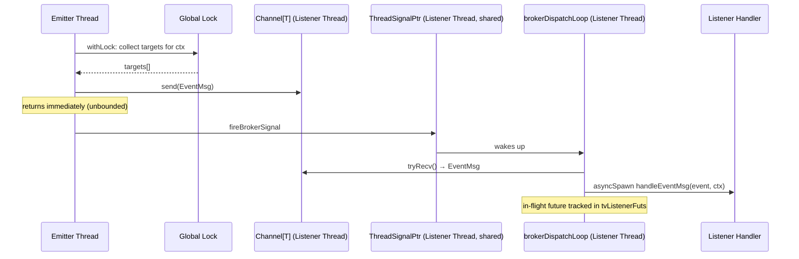
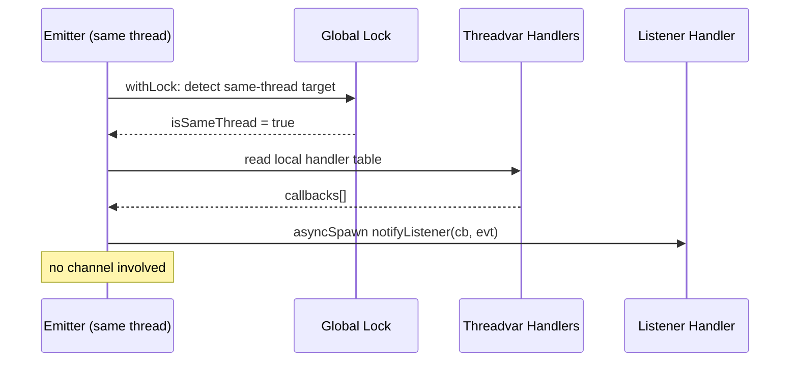
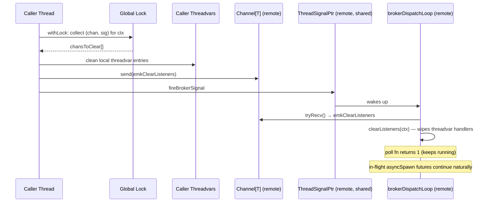

# Multi-Thread EventBroker

## Overview

`EventBroker(mt):` generates a **multi-thread capable** pub/sub event broker.
Listeners can be registered on **any** thread; events emitted from **any** thread
are broadcast to all registered listeners (fire-and-forget). Same-thread delivery
bypasses channels entirely and dispatches directly via `asyncSpawn`.

The broker **does not own or spawn threads**. Thread management is your responsibility.

```nim
import brokers/event_broker

EventBroker(mt):
  type Alert = object
    level*: int
    message*: string
```

This generates:

| Proc | Description |
|------|-------------|
| `Alert.listen(handler)` | Register a listener on the current thread (default context) |
| `Alert.listen(ctx, handler)` | Register a listener on the current thread (keyed context) |
| `Alert.emit(event)` | Broadcast an event to all listeners (default context) |
| `Alert.emit(ctx, event)` | Broadcast an event to all listeners (keyed context) |
| `Alert.emit(level=1, message="hi")` | Field-constructor emit (inline object types only) |
| `await Alert.dropListener(handle)` | Remove a listener and drain in-flight futures (must be on registering thread, 5 s timeout) |
| `Alert.dropAllListeners()` | Remove all listeners for default context, drain in-flight (any thread) |
| `Alert.dropAllListeners(ctx)` | Remove all listeners for keyed context, drain in-flight (any thread) |

---

## Quick Start

### Cross-thread emit to main-thread listener

```nim
import std/atomics
import chronos
import brokers/event_broker

EventBroker(mt):
  type ChatMsg = object
    user*: string
    text*: string

proc main() {.async.} =
  var received: Atomic[int]
  received.store(0)

  discard ChatMsg.listen(
    proc(evt: ChatMsg): Future[void] {.async: (raises: []).} =
      echo evt.user, ": ", evt.text
      discard received.fetchAdd(1)
  )

  proc worker() {.thread.} =
    waitFor ChatMsg.emit(ChatMsg(user: "Alice", text: "Hello from worker!"))

  var t: Thread[void]
  t.createThread(worker)
  while received.load() < 1:
    await sleepAsync(chronos.milliseconds(1))
  t.joinThread()
  ChatMsg.dropAllListeners()

waitFor main()
```

Compile with `--threads:on`.

---

## Important Notices

### `emit()` is async

The multi-thread `emit()` is an **async** proc (`{.async: (raises: []).}`):

- In async contexts (e.g. inside `{.async.}` procs): use `await emit(...)`.
- In `{.thread.}` procs with no event loop: use `waitFor emit(...)` — this creates
  a temporary event loop for the duration of the call.
- **Same-thread listeners**: dispatched via `asyncSpawn` (fire-and-forget).
- **Cross-thread listeners**: delivered via `Channel[T].send` + `fireBrokerSignal` (near-instant, no OS fds consumed).

### Thread procs cannot be closures

Nim `{.thread.}` procs cannot capture GC-managed variables from outer scopes. Use
module-level globals (with `Atomic` for synchronization) for communication between
threads. However, **listener callbacks** passed to `listen()` can freely capture
variables from the registering thread's scope — they are stored in threadvars and
called locally on that thread.

### `dropListener` is thread-local

`dropListener(handle)` must be called from the **same thread** that registered the
listener. The handle carries a `threadId` field that is validated at runtime.
Calling from the wrong thread logs an error and returns without action.

`dropListener` is **synchronous**: it removes the handler from the thread-local
table and returns immediately. Already-dispatched `asyncSpawn` futures from a
prior `emit` cycle continue to run until they complete — `dropListener` does not
wait for them. If you are releasing resources that in-flight callbacks may still
reference, wait for pending work to finish before dropping:

```nim
# Safe pattern: let the event loop drain before releasing resources.
await sleepAsync(0)          # yield so in-flight asyncSpawns can finish
MyEvent.dropListener(handle)
connection.close()           # now safe
```

### `dropAllListeners` works from any thread

`dropAllListeners()` can be called from any thread. It:

1. Removes all buckets for the context under a global lock.
2. Cleans up local threadvar entries if the caller owns any for this context.
3. Sends `emkClearListeners` to each remote thread's `Channel[T]` and fires the shared signal.
4. Each remote thread's `brokerDispatchLoop` poll fn receives the message, clears its own threadvar handler table for the context, and continues running (returns 1 — stays registered for future events from other contexts).

Handler removal on remote threads is **asynchronous** — it happens when the
remote thread's event loop processes the `emkClearListeners` message. In-flight
`asyncSpawn` futures that were already dispatched before the message arrives
complete naturally on the remote thread.

### Shutdown safety: in-flight listener futures

The three operations have distinct in-flight guarantees:

| Operation | Stops new dispatches? | Waits for in-flight? |
|-----------|----------------------|----------------------|
| `dropListener` (sync) | Yes — handler removed from table | **No** — in-flight continues |
| `dropAllListeners` (any thread) | Yes — sends `emkClearListeners` | **No** — in-flight continues |
| Context shutdown (`shutdownProcessLoopsForCtx`) | Yes — sends `emkShutdown`, poll fn exits | **Yes** — awaits `tvListenerFuts` (5 s timeout) |

**Context shutdown** is the safe teardown path. It sends `emkShutdown` to each
listener thread's channel, which causes the poll fn to complete a shutdown
`Future[void]` and remove itself from the dispatcher (returns 2). The caller
then awaits each shutdown future (up to 5 seconds), and finally drains any
remaining in-flight listener futures tracked in `tvListenerFuts` before
returning. This guarantees no callbacks are running after the call returns.

The FFI API library lifecycle (`registerBrokerLibrary`) calls
`shutdownProcessLoopsForCtx` automatically on `mylib_shutdown(ctx)`.

---

## Architecture

### Per-Listener-Thread Channel Model

Each thread that registers listeners for a `BrokerContext` gets its own `Channel[T]`.
All broker types on a thread share one `ThreadSignalPtr` and one `brokerDispatchLoop`.
This enables broadcast fan-out with zero extra OS file descriptors per broker type:

```
Emitter Thread                 Listener Thread A                 Listener Thread B
┌──────────────┐              ┌─────────────────────────────┐   ┌─────────────────────────────┐
│   emit(evt)  │──send+sig───▶│  Channel[T] A               │   │  Channel[T] B               │
│              │──send+sig────│                             │──▶│                             │
└──────────────┘              │  brokerDispatchLoop (shared)│   │  brokerDispatchLoop (shared)│
                              │    ↓ poll fn tryRecv        │   │    ↓ poll fn tryRecv        │
                              │  asyncSpawn handleEventMsg  │   │  asyncSpawn handleEventMsg  │
                              │    ↓                        │   │    ↓                        │
                              │  listener1(evt)             │   │  listener3(evt)             │
                              │  listener2(evt)             │   │                             │
                              └─────────────────────────────┘   └─────────────────────────────┘

fd count: 2 per thread (one shared ThreadSignalPtr) regardless of broker type count.
```

### Call Sequence: Cross-Thread Emit



### Call Sequence: Same-Thread Emit



### Call Sequence: dropAllListeners (Cross-Thread)



---

## Memory Layout

### Shared State (createShared)

```
gTMtBuckets ─────────┐
                      ▼
  ┌───────────────────────────────────────────────────────────┐
  │ Bucket[0]         │ Bucket[1]         │ Bucket[2]  ...    │
  │ brokerCtx: Default│ brokerCtx: Default│ brokerCtx: ctxA   │
  │ threadId:  0x1000 │ threadId:  0x2000 │ threadId:  0x1000 │
  │ threadGen: 0      │ threadGen: 1      │ threadGen: 0      │
  │ eventChan: ──────►│ eventChan: ──────►│ eventChan: ──────►│
  │ active:    true   │ active:    true   │ active:    true   │
  │ hasListeners: true│ hasListeners: true│ hasListeners: true│
  └───────────────────────────────────────────────────────────┘
  gTMtBucketCount = 3
  gTMtLock = Lock (protects all shared arrays)
```

Multiple buckets can share the same `BrokerContext` — one per listener thread.
This is the key structural difference from `RequestBroker(mt)` (which has one
bucket per context).

### Thread-Local State (threadvars)

```
Thread 0x1000:
  gTTvListenerCtxs    = [Default, ctxA]
  gTTvListenerHandlers = [Table{1: cb1, 2: cb2}, Table{1: cb3}]
  gTTvNextIds          = [3, 2]

Thread 0x2000:
  gTTvListenerCtxs    = [Default]
  gTTvListenerHandlers = [Table{1: cb4}]
  gTTvNextIds          = [2]
```

Parallel sequences: index `i` maps a `BrokerContext` to its handler table and
next-ID counter for this thread.

---

## Performance

Benchmark results from `nimble perftest` (5 emitter threads × 500 events, 512B payload):

| Metric | Cross-Thread (debug) | Same-Thread (debug) |
|--------|---------------------|---------------------|
| Throughput | ~50K evt/s | ~29K evt/s |
| Avg latency | ~23 ms* | ~34 µs |
| Min latency | ~160 µs | ~20 µs |

*Cross-thread average latency is high in debug builds due to sequential channel processing
under load from 5 concurrent emitters. Release builds with `--mm:orc` see significantly
lower latencies.*

**Optimization notes:**

- Use `--mm:orc -d:release` for production — avoids deep-copy overhead on `Channel[T].send`.
- Same-thread delivery is essentially free (direct `asyncSpawn`, no locking on the hot path).
- Each listener thread has its own `Channel[T]` and shared `brokerDispatchLoop` — listener throughput scales with the number of listener threads.
- `emit()` holds the global lock only long enough to copy the target list (snapshot pattern).
- **Zero OS fds per broker type** — `Channel[T]` is pure mutex+condvar. Adding more broker types never increases fd count.

---

## Comparison with Single-Thread EventBroker

| Feature | `EventBroker:` | `EventBroker(mt):` |
|---------|---------------|-------------------|
| Cross-thread emit | ✗ | ✓ |
| Cross-thread listen | ✗ | ✓ |
| `emit()` return type | void (asyncSpawn) | Future[void] (async) |
| Channel overhead | None | Per listener-thread |
| `dropListener` scope | Any (thread-local broker) | Must be from registering thread |
| `dropListener` in-flight drain | No — in-flight continues | No — in-flight continues (sync, immediate) |
| `dropAllListeners` scope | Any (thread-local broker) | Any thread (sends `emkClearListeners`, no drain) |
| BrokerContext support | ✓ | ✓ |
| Field-constructor emit | ✓ | ✓ |

---

## Compile Flags

```
nim c --threads:on --mm:orc your_app.nim    # recommended
nim c --threads:on --mm:refc your_app.nim   # also supported
```

Debug macro output:
```
nim c -d:brokerDebug --threads:on ...
```
