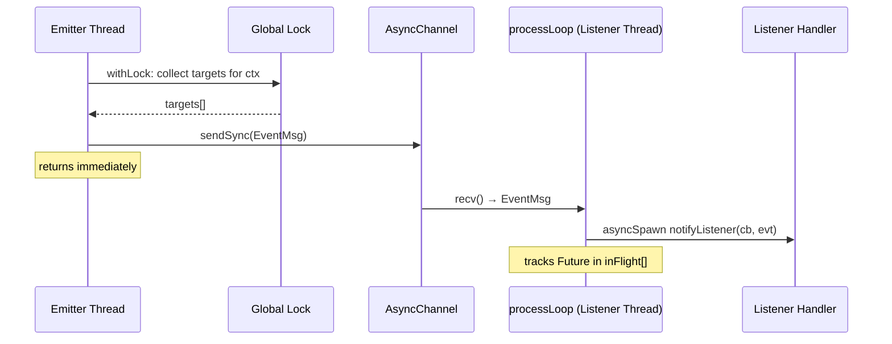
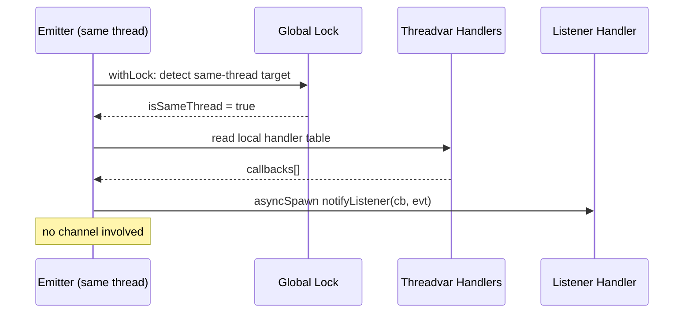
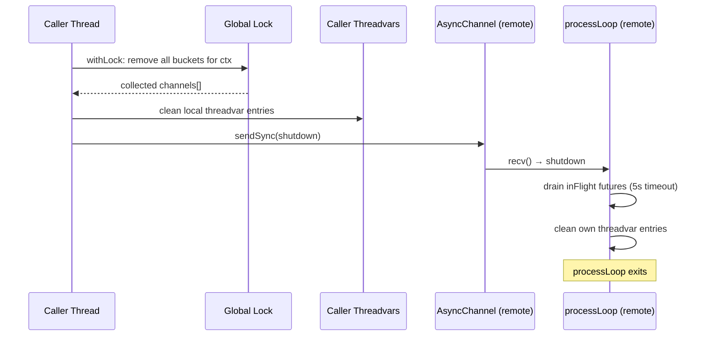

# Multi-Thread EventBroker

## Overview

`EventBroker(mt):` generates a **multi-thread capable** pub/sub event broker.
Listeners can be registered on **any** thread; events emitted from **any** thread
are broadcast to all registered listeners (fire-and-forget). Same-thread delivery
bypasses channels entirely and dispatches directly via `asyncSpawn`.

The broker **does not own or spawn threads**. Thread management is your responsibility.

```nim
import brokers/event_broker

EventBroker(mt):
  type Alert = object
    level*: int
    message*: string
```

This generates:

| Proc | Description |
|------|-------------|
| `Alert.listen(handler)` | Register a listener on the current thread (default context) |
| `Alert.listen(ctx, handler)` | Register a listener on the current thread (keyed context) |
| `Alert.emit(event)` | Broadcast an event to all listeners (default context) |
| `Alert.emit(ctx, event)` | Broadcast an event to all listeners (keyed context) |
| `Alert.emit(level=1, message="hi")` | Field-constructor emit (inline object types only) |
| `await Alert.dropListener(handle)` | Remove a listener and drain in-flight futures (must be on registering thread, 5 s timeout) |
| `Alert.dropAllListeners()` | Remove all listeners for default context, drain in-flight (any thread) |
| `Alert.dropAllListeners(ctx)` | Remove all listeners for keyed context, drain in-flight (any thread) |

---

## Quick Start

### Cross-thread emit to main-thread listener

```nim
import std/atomics
import chronos
import brokers/event_broker

EventBroker(mt):
  type ChatMsg = object
    user*: string
    text*: string

proc main() {.async.} =
  var received: Atomic[int]
  received.store(0)

  discard ChatMsg.listen(
    proc(evt: ChatMsg): Future[void] {.async: (raises: []).} =
      echo evt.user, ": ", evt.text
      discard received.fetchAdd(1)
  )

  proc worker() {.thread.} =
    waitFor ChatMsg.emit(ChatMsg(user: "Alice", text: "Hello from worker!"))

  var t: Thread[void]
  t.createThread(worker)
  while received.load() < 1:
    await sleepAsync(chronos.milliseconds(1))
  t.joinThread()
  ChatMsg.dropAllListeners()

waitFor main()
```

Compile with `--threads:on`.

---

## Important Notices

### `emit()` is async

The multi-thread `emit()` is an **async** proc (`{.async: (raises: []).}`):

- In async contexts (e.g. inside `{.async.}` procs): use `await emit(...)`.
- In `{.thread.}` procs with no event loop: use `waitFor emit(...)` — this creates
  a temporary event loop for the duration of the call.
- **Same-thread listeners**: dispatched via `asyncSpawn` (fire-and-forget).
- **Cross-thread listeners**: delivered via `sendSync` (brief blocking channel send).

### Thread procs cannot be closures

Nim `{.thread.}` procs cannot capture GC-managed variables from outer scopes. Use
module-level globals (with `Atomic` for synchronization) for communication between
threads. However, **listener callbacks** passed to `listen()` can freely capture
variables from the registering thread's scope — they are stored in threadvars and
called locally on that thread.

### `dropListener` is thread-local

`dropListener(handle)` must be called from the **same thread** that registered the
listener. The handle carries a `threadId` field that is validated at runtime.
Calling from the wrong thread logs an error and returns without action.

> **Planned change (in-flight drain):** `dropListener` will become an async proc
> that cancels and awaits any in-flight futures spawned for the dropped listener
> before returning. This ensures that after `dropListener` completes, no
> already-spawned callback can touch resources the caller is about to release
> (e.g. closed connections, deallocated buffers). A 5-second timeout guards
> against deadlock in self-removal scenarios (a listener dropping its own handle
> from inside its handler). Currently `dropListener` is sync and returns
> immediately — in-flight callbacks from a prior `emit` may still be running.

### `dropAllListeners` works from any thread

`dropAllListeners()` can be called from any thread. It:

1. Removes all buckets for the context under a global lock.
2. Cleans up local threadvar entries (if the caller has any).
3. Sends a shutdown message to each collected channel.
4. Each `processLoop` (on its respective listener thread) drains in-flight listener
   tasks with a 5-second timeout, cleans its own threadvars, then exits.

### Shutdown safety: in-flight listener futures

When `dropListener` or `dropAllListeners` is called while listeners are still
executing (i.e. futures were spawned by a recent `emit` and haven't completed),
the following applies:

**Current behavior (single-thread EventBroker):**
- `dropListener` removes the listener from the table immediately (sync).
- Already-spawned `asyncSpawn` futures **continue to run** — they hold a direct
  closure reference, not a table entry.
- If the caller releases resources after `dropListener` returns, in-flight
  callbacks may access invalid state.

**Current behavior (MT EventBroker):**
- `dropAllListeners` sends a shutdown message. The remote `processLoop` drains
  its `inFlight` seq with `cancelAndWait` (5 s timeout per future) before exiting.
- `dropListener` is thread-local and sync — same in-flight risk as single-thread.

**Planned behavior (both ST and MT):**
- `dropListener(handle)` becomes `async: (raises: [])`.
- On drop, all tracked in-flight futures for that listener are cancelled via
  `cancelAndWait`, guarded by a 5-second timeout.
- After `dropListener` returns, no callbacks for that handle are running.
- Safe shutdown pattern:

```nim
await MyEvent.dropListener(handle)  # waits for in-flight to finish/cancel
connection.close()                  # NOW safe — no callbacks can touch this
dealloc(buffer)                     # NOW safe
```

- Self-removal (a listener dropping its own handle from inside its handler) hits
  the timeout rather than deadlocking, since the future being awaited is the one
  currently executing.

---

## Architecture

### Per-Listener-Thread Channel Model

Each thread that registers listeners for a `BrokerContext` gets its own `AsyncChannel`
and `processLoop`. This enables broadcast fan-out:

```
Emitter Thread                 Listener Thread A           Listener Thread B
┌──────────────┐              ┌──────────────────┐        ┌──────────────────┐
│   emit(evt)  │──sendSync───▶│  AsyncChannel A  │        │  AsyncChannel B  │
│              │──sendSync────│                  │───────▶│                  │
└──────────────┘              │  processLoop A   │        │  processLoop B   │
                              │    ↓ recv        │        │    ↓ recv        │
                              │  listener1(evt)  │        │  listener3(evt)  │
                              │  listener2(evt)  │        │                  │
                              └──────────────────┘        └──────────────────┘
```

### Call Sequence: Cross-Thread Emit



### Call Sequence: Same-Thread Emit



### Call Sequence: dropAllListeners (Cross-Thread)



---

## Memory Layout

### Shared State (createShared)

```
gTMtBuckets ─────────┐
                      ▼
  ┌───────────────────────────────────────────────────────────┐
  │ Bucket[0]         │ Bucket[1]         │ Bucket[2]  ...    │
  │ brokerCtx: Default│ brokerCtx: Default│ brokerCtx: ctxA   │
  │ threadId:  0x1000 │ threadId:  0x2000 │ threadId:  0x1000 │
  │ threadGen: 0      │ threadGen: 1      │ threadGen: 0      │
  │ eventChan: ──────►│ eventChan: ──────►│ eventChan: ──────►│
  │ active:    true   │ active:    true   │ active:    true   │
  │ hasListeners: true│ hasListeners: true│ hasListeners: true│
  └───────────────────────────────────────────────────────────┘
  gTMtBucketCount = 3
  gTMtLock = Lock (protects all shared arrays)
```

Multiple buckets can share the same `BrokerContext` — one per listener thread.
This is the key structural difference from `RequestBroker(mt)` (which has one
bucket per context).

### Thread-Local State (threadvars)

```
Thread 0x1000:
  gTTvListenerCtxs    = [Default, ctxA]
  gTTvListenerHandlers = [Table{1: cb1, 2: cb2}, Table{1: cb3}]
  gTTvNextIds          = [3, 2]

Thread 0x2000:
  gTTvListenerCtxs    = [Default]
  gTTvListenerHandlers = [Table{1: cb4}]
  gTTvNextIds          = [2]
```

Parallel sequences: index `i` maps a `BrokerContext` to its handler table and
next-ID counter for this thread.

---

## Performance

Benchmark results from `nimble perftest` (5 emitter threads × 500 events, 512B payload):

| Metric | Cross-Thread (debug) | Same-Thread (debug) |
|--------|---------------------|---------------------|
| Throughput | ~50K evt/s | ~29K evt/s |
| Avg latency | ~23 ms* | ~34 µs |
| Min latency | ~160 µs | ~20 µs |

*Cross-thread average latency is high in debug builds due to sequential channel processing
under load from 5 concurrent emitters. Release builds with `--mm:orc` see significantly
lower latencies.*

**Optimization notes:**

- Use `--mm:orc -d:release` for production — avoids deep-copy overhead on channel sends.
- Same-thread delivery is essentially free (direct `asyncSpawn`, no locking on the hot path).
- Each listener thread has its own channel, so listener throughput scales with the number
  of listener threads.
- `emit()` holds the global lock only long enough to copy the target list (snapshot pattern).

---

## Comparison with Single-Thread EventBroker

| Feature | `EventBroker:` | `EventBroker(mt):` |
|---------|---------------|-------------------|
| Cross-thread emit | ✗ | ✓ |
| Cross-thread listen | ✗ | ✓ |
| `emit()` return type | void (asyncSpawn) | Future[void] (async) |
| Channel overhead | None | Per listener-thread |
| `dropListener` scope | Any (thread-local broker) | Must be from registering thread |
| `dropListener` in-flight drain | Planned: async with 5 s timeout | Planned: async with 5 s timeout |
| `dropAllListeners` scope | Any (thread-local broker) | Any thread (sends shutdown + drain) |
| BrokerContext support | ✓ | ✓ |
| Field-constructor emit | ✓ | ✓ |

---

## Compile Flags

```
nim c --threads:on --mm:orc your_app.nim    # recommended
nim c --threads:on --mm:refc your_app.nim   # also supported
```

Debug macro output:
```
nim c -d:brokerDebug --threads:on ...
```
