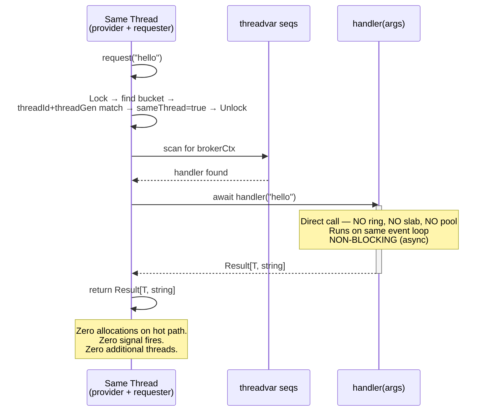
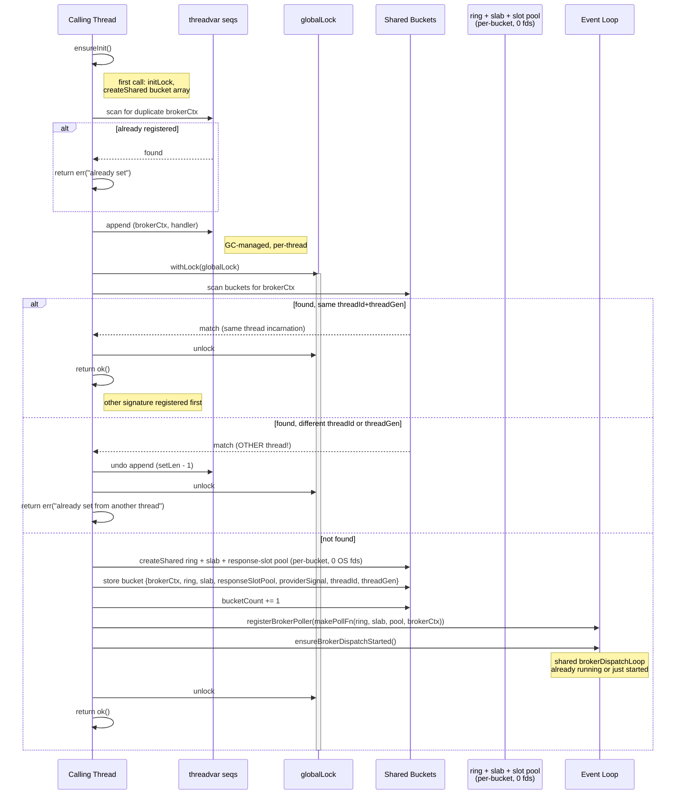
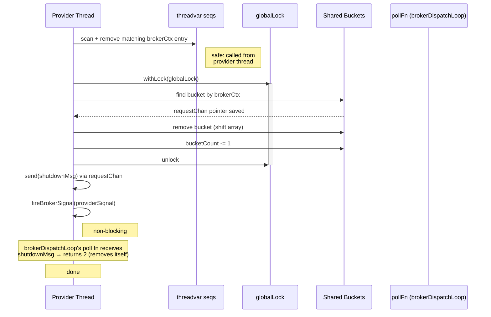
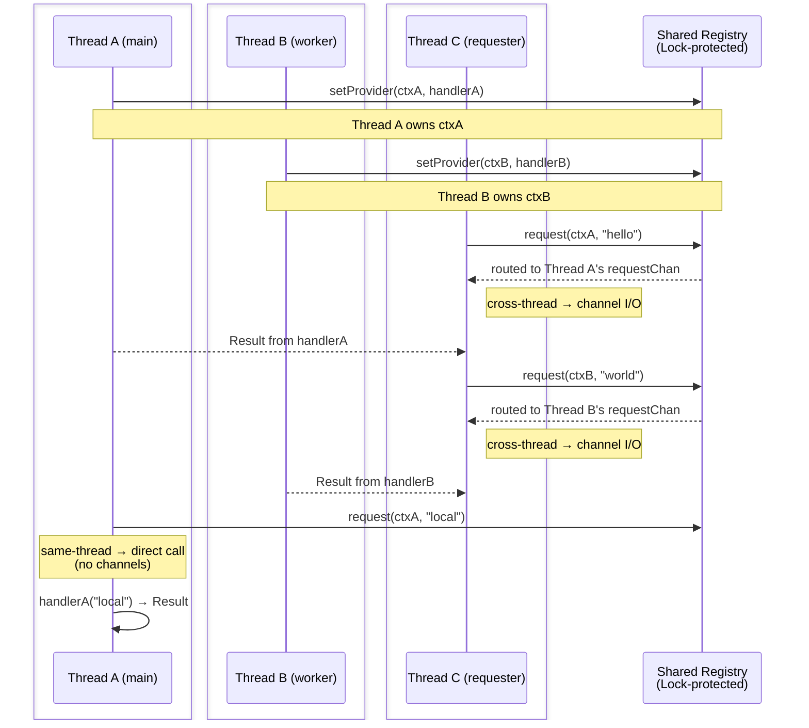

# Multi-Thread RequestBroker

## Overview

`RequestBroker(mt):` generates a **multi-thread capable** request/response broker.
The provider runs on the thread that called `setProvider` and serves requests from
any thread in the process. Same-thread requests bypass channels entirely and call the
provider directly.

The broker **does not own or spawn threads**. Thread management is your responsibility.

```nim
import brokers/request_broker

RequestBroker(mt):
  type Weather = object
    city*: string
    tempC*: float
    humidity*: int

  proc signature*(city: string): Future[Result[Weather, string]] {.async.}
```

This generates:

| Proc | Description |
|------|-------------|
| `Weather.setProvider(handler)` | Register a provider on the current thread (default context) |
| `Weather.setProvider(ctx, handler)` | Register a provider on the current thread (keyed context) |
| `Weather.request(city)` | Issue a request (default context) |
| `Weather.request(ctx, city)` | Issue a request (keyed context) |
| `Weather.clearProvider()` | Unregister provider + send shutdown to dispatch poller (default context) |
| `Weather.clearProvider(ctx)` | Unregister provider + send shutdown to dispatch poller (keyed context) |
| `Weather.setRequestTimeout(duration)` | Set cross-thread request timeout (default: 5 seconds) |
| `Weather.requestTimeout()` | Get current cross-thread request timeout |

---

## Quick Start

### Single provider, cross-thread request

```nim
import std/atomics
import chronos
import brokers/request_broker

RequestBroker(mt):
  type Greeting = object
    message*: string

  proc signature*(name: string): Future[Result[Greeting, string]] {.async.}

# ── Provider thread (main) ─────────────────────────────

proc main() {.async.} =
  check Greeting.setProvider(
    proc(name: string): Future[Result[Greeting, string]] {.async.} =
      ok(Greeting(message: "Hello, " & name & "!"))
  ).isOk()

  # Spawn a worker thread that issues a request.
  var done: Atomic[bool]
  done.store(false)

  proc worker() {.thread.} =
    let res = waitFor Greeting.request("Alice")
    assert res.isOk()
    echo res.value.message       # "Hello, Alice!"
    done.store(true)

  var t: Thread[void]
  t.createThread(worker)

  # Keep event loop alive so the process loop can serve the request.
  while not done.load():
    await sleepAsync(10.milliseconds)

  t.joinThread()
  Greeting.clearProvider()

waitFor main()
```

### Multiple isolated contexts

```nim
let ctxEN = NewBrokerContext()
let ctxDE = NewBrokerContext()

check Greeting.setProvider(ctxEN,
  proc(name: string): Future[Result[Greeting, string]] {.async.} =
    ok(Greeting(message: "Hello, " & name & "!"))
).isOk()

check Greeting.setProvider(ctxDE,
  proc(name: string): Future[Result[Greeting, string]] {.async.} =
    ok(Greeting(message: "Hallo, " & name & "!"))
).isOk()

let en = await Greeting.request(ctxEN, "Bob")  # "Hello, Bob!"
let de = await Greeting.request(ctxDE, "Bob")  # "Hallo, Bob!"
```

---

## Important Notices

### 1. The provider thread must keep its chronos event loop running

`setProvider` registers a poll fn in the **current thread's shared broker dispatcher** (`brokerDispatchLoop`). If the event loop stops (e.g. `waitFor` returns), the dispatcher can no longer receive cross-thread requests.

When writing tests or applications, keep the event loop alive:

```nim
# GOOD: async loop stays alive while worker threads run.
proc main() {.async.} =
  check MyType.setProvider(handler).isOk()
  var t: Thread[void]
  t.createThread(worker)
  while not done.load():
    await sleepAsync(10.milliseconds)
  t.joinThread()
  MyType.clearProvider()
waitFor main()

# BAD: waitFor blocks the event loop — cross-thread requests will hang.
proc main() =
  check MyType.setProvider(handler).isOk()
  var t: Thread[void]
  t.createThread(worker)
  t.joinThread()             # Blocks! Process loop is starved.
  MyType.clearProvider()
```

### 2. Thread procs cannot be closures — but provider handlers can

Nim's `{.thread.}` pragma requires `nimcall` convention (no captured
variables). This applies to procs passed to `createThread`, i.e. your
**worker/requester thread procs**. Use module-level procs with global
`Atomic` variables for synchronization:

```nim
var gDone: Atomic[bool]

proc worker() {.thread.} =
  let res = waitFor MyType.request("data")
  doAssert res.isOk()
  gDone.store(true)
```

**Provider handlers** are not affected by this restriction. The handler
closure passed to `setProvider` is stored in a `threadvar` on the provider
thread and called locally by the dispatch handler — it never crosses a thread
boundary. Capturing variables from the provider thread's scope is safe:

```nim
proc main() {.async.} =
  var requestCount = 0

  check MyType.setProvider(
    proc(input: string): Future[Result[MyType, string]] {.async.} =
      requestCount += 1          # ✅ captured — runs on provider thread
      ok(MyType(value: input))
  ).isOk()
```

### 3. One provider per BrokerContext, one thread owns it

Each `BrokerContext` can only have one provider, and it is bound to the
thread that called `setProvider`. A second thread calling `setProvider` for
the same context will get an error:

```
RequestBroker(MyType): provider already set from another thread
```

Multiple contexts **can** coexist on the same thread or across different threads.

### 4. Use `waitFor` in non-async thread procs

Inside `{.thread.}` procs (which are synchronous), use `waitFor` to block
until the request completes:

```nim
proc worker() {.thread.} =
  let res = waitFor MyType.request("hello")
```

The `blockingAwait` template is also available as an alias for `waitFor`:

```nim
import brokers/request_broker  # exports blockingAwait
let res = blockingAwait MyType.request("hello")
```

Do **not** use chronos's `await` outside of `{.async.}` procs.

### 5. `clearProvider` must be called from the provider thread

`clearProvider` cleans threadvar entries, which are only accessible from the
thread that created them. Always call `clearProvider` from the same thread
that called `setProvider`.

### 6. ORC and refc compatibility

The broker works with both `--mm:orc` and `--mm:refc`. The global registry
uses `createShared` / `deallocShared` for raw memory (no GC involvement).
Provider closures live in threadvars (GC-managed, per-thread), avoiding
cross-thread GC issues entirely.

Under `--mm:refc`, threadvar addresses (`currentMtThreadId()`) can be reused
when threads exit and new ones are created. Each bucket stores a `threadGen`
(monotonically increasing counter from `currentMtThreadGen()`) alongside the
`threadId` to disambiguate thread incarnations. All identity checks match on
both `threadId` and `threadGen`.

**`clearProvider` on a dead provider thread:** If the provider thread exits
without calling `clearProvider`, a cross-thread `clearProvider` call sets
the bucket's `ring.closed` flag and fires the provider's signal. The
provider thread is gone, so nothing drains the ring — the ring + slab +
response slot pool sit unreclaimed. This is a small bounded memory leak
(per Invariant I0: the only safe deallocator is the bucket-owning
thread; if that thread is gone, freeing from another thread would
violate macOS+ORC's TLV-allocator hazard documented in
`design/LESSONS_LEARNED.md` §1.2. No OS resources held; no hang.

### 7. Cross-thread request timeout

Cross-thread requests have a configurable timeout (default: **5 seconds**). If the
provider thread does not respond within the timeout, `request()` returns an error
result instead of hanging indefinitely. This protects against blocked or
unresponsive provider threads.

```nim
# Check current timeout
echo Weather.requestTimeout()          # 5 seconds (default)

# Set a shorter timeout
Weather.setRequestTimeout(chronos.seconds(2))

# Cross-thread requests now time out after 2 seconds
let res = waitFor Weather.request("Berlin")
if res.isErr() and "timed out" in res.error():
  echo "Provider did not respond in time"
```

**Important notes:**

- The timeout applies **only to cross-thread requests**. Same-thread requests call
  the provider directly and are not affected by the timeout setting.
- The timeout variable is per-type, module-level — it is shared across all threads
  and all `BrokerContext` instances for that broker type.
- When a timeout occurs, the requester calls `pool.abandon(slotIdx)` —
  CAS `Empty → Abandoned` on the response slot's state. If the abandon
  succeeds, the provider's eventual `beginWrite` CAS will fail (state is
  Abandoned, not Empty); the provider releases the slot back to the
  pool without writing. If the abandon CAS fails (provider already in
  `Writing` or `Ready` state), the requester's response poller may still
  process the late response normally — but its future has been
  cancelled, so it just decRefs the slot and discards. Either way the
  slot returns to the pool cleanly; no leak per timed-out request.

### 8. Compile with `--threads:on`

Multi-thread mode requires the Nim compiler flag `--threads:on`.

---

## Call Sequence Diagrams

### Cross-Thread Request (the common case)

```mermaid
sequenceDiagram
  box Provider Thread owns event loop
        participant PT as Provider Thread
        participant DL as brokerDispatchLoop
    participant H as handler args
    end
  box Requester Thread thread proc
        participant RT as Requester Thread
        participant RDL as requester dispatchLoop
    end
  participant R as ring<br/>Vyukov MPSC
  participant SL as request slab<br/>(per-bucket)
  participant SP as response slot pool<br/>(per-bucket)

  Note over PT: setProvider handler already called<br/>Poll fn registered in provider thread<br/>brokerDispatchLoop

  DL ->> R: tryDequeue no item yet returns 0
  Note right of DL: Yields and waits for shared signal

  RT ->> RT: Lock find bucket unlock
  RT ->> SP: claim response slot
    activate SP
  RT ->> SL: claim slab cell
    activate SL
  RT ->> SL: marshal ReqMsg into cell bytes<br/>(includes responseSlotIdx + requesterSignal)
  RT ->> R: tryEnqueue cellIdx
  RT ->> PT: fireBrokerSignal providerSignal

  RT ->> RDL: register one-shot response poller for slotIdx

  DL ->> R: tryDequeue returns cellIdx
  DL ->> SL: read+unmarshal cell into ReqMsg on provider heap
  DL ->> SL: release cell
    deactivate SL
  DL ->> H: asyncSpawn handleMsg
    activate H
  Note over H: NON BLOCKING<br/>runs on provider thread<br/>event loop

  RT ->> RT: waitFor withTimeout responseFut timeout
    activate RT
  Note left of RT: BLOCKS<br/>spins chronos event loop<br/>until response or timeout default 5s

  H -->> DL: Result T string
    deactivate H

  DL ->> SP: beginWrite slot (CAS Empty→Writing)
  DL ->> SP: marshal Result into slot bytes; commitWrite
  DL ->> RT: fireBrokerSignal requesterSignal

  RDL ->> SP: readyState true → unmarshal Result onto requester heap
  RDL ->> SP: release slot
    deactivate SP
  RDL ->> RDL: complete responseFut

  RT -->> RT: return Result T string
    deactivate RT
```

**Blocking points summary:**

| Operation | Thread | Blocking? | Duration |
|-----------|--------|-----------|----------|
| `slab.claim(cell)` + `pool.claim(slot)` | Requester | Near-instant | Atomic free-list pop; fails only on exhaustion (back-pressure) |
| `marshalReqMsg(...) + ring.tryEnqueue` | Requester | Near-instant | Memcpy/marshal + atomic CAS into ring slot; fails on ring full (back-pressure) |
| `fireBrokerSignal(providerSignal)` | Requester | Near-instant | Fires OS fd |
| `waitFor withTimeout(responseFut, timeout)` | Requester | **Blocks** | Until provider responds or timeout (default 5s) |
| `ring.tryDequeue` | Provider | Non-blocking | Returns false if empty; called from dispatchLoop |
| `asyncSpawn handleMsg(...)` | Provider | Non-blocking | Dispatched on provider's event loop |
| `pool.beginWrite + marshal + commitWrite` | Provider | Near-instant | Atomic CAS + memcpy + atomic release-store on state |


### Same-Thread Request (fast path)




### setProvider Flow (detailed)




### clearProvider Flow




### Multi-Context, Multi-Thread Overview



---

## Memory Layout

```
                 SHARED MEMORY (createShared)                      THREAD-LOCAL (threadvar)
                ┌─────────────────────────────────────┐             ┌──────────────────────────┐
                │  gBuckets: ptr UncheckedArray       │             │ Thread A:                │
                │  ┌───────────────────────────────┐  │             │  tvCtxs:     [ctx0,ctx1] │
                │  │ [0] brokerCtx: ctx0           │  │             │  tvHandlers: [h0,  h1  ] │
                │  │     ring:             ───────►│──│─►ring0      │                          │
                │  │     slab:             ───────►│──│─►slab0      │                          │
                │  │     responseSlotPool: ───────►│──│─►pool0      ├──────────────────────────┤
                │  │     threadId: addrA           │  │             │ Thread B:                │
                │  │     threadGen: 0              │  │             │  tvCtxs:     [ctx2]      │
                │  ├───────────────────────────────┤  │             │  tvHandlers: [h2  ]      │
                │  │ [1] brokerCtx: ctx1           │  │             │                          │
                │  │     ring:             ───────►│──│─►ring0 ◄┐   │                          │
                │  │     slab:             ───────►│──│─►slab0 ◄┤   │                          │
                │  │     responseSlotPool: ───────►│──│─►pool0 ◄┘   │                          │
                │  │     threadId: addrA           │  │ (shared)    └──────────────────────────┘
                │  │     threadGen: 0              │  │
                │  ├───────────────────────────────┤  │
                │  │ [2] brokerCtx: ctx2           │  │
                │  │     ring:             ───────►│──│─►ring2
                │  │     slab:             ───────►│──│─►slab2
                │  │     responseSlotPool: ───────►│──│─►pool2
                │  │     threadId: addrB           │  │
                │  │     threadGen: 1              │  │
                │  └───────────────────────────────┘  │
                │  gBucketCount: 3                    │
                │  gBucketCap: 4                      │
                │  gLock: Lock                        │
                └─────────────────────────────────────┘

Each bucket owns its own `ring` (Vyukov MPSC), `slab` (per-bucket
payload-cell pool for marshaled ReqMsg), and `responseSlotPool`
(per-bucket pool of byte-buffer response slots). Bucket-owning thread
allocates and frees these via `createShared`; other threads use them
only via atomic claim/release on pre-allocated cells.

When two contexts run on the same thread (ctx0 and ctx1 on Thread A
above) they nonetheless get **independent** bucket entries — each with
its own ring/slab/pool. (Past behavior shared one request channel per
thread; the new design isolates per-bucket to keep ownership clean.)
```

---

## Performance and Memory Footprint Analysis

### Per-Broker Overhead (one-time, at `setProvider`)

| Component | Size | Lifetime |
|-----------|------|----------|
| Global bucket array | `4 * sizeof(MtBucket)` initially (~256 bytes), doubles on growth | Process lifetime |
| `Lock` (OS mutex) | ~40-64 bytes (platform-dependent) | Process lifetime |
| Init + count + cap vars | 3 `int` + 1 `bool` = ~25 bytes | Process lifetime |
| `VyukovMpscRing[uint32]` per bucket | ring header (~256 B w/ cache padding) + `maxQueueDepth × 16 B` slots | Until `clearProvider` (deferred-free with 50ms grace) |
| `PayloadSlab` per bucket (request side) | `slabCapacity × (16 + maxPayloadBytes)` bytes + free-list (~1 KB) | Until `clearProvider` |
| `ResponseSlotPool` per bucket | `responseSlots × (16 + maxResponseBytes)` bytes + free-list (~1 KB) | Until `clearProvider` |
| `ThreadSignalPtr` (providerSignal) | ~2 OS fds (macOS), shared by all broker types on the thread | Thread lifetime |
| Threadvar seqs (per provider thread) | 2 `seq` headers (~32 bytes) + entries | Thread lifetime |
| Poll fn closure | Registered in `gBrokerThreadPollers` (~32 bytes) | Until `clearProvider` (returns 2 → removed) |
| `brokerDispatchLoop` coroutine | One shared `Future` per thread (~128 bytes) | Thread lifetime (shared by all broker types) |

**Default sizing per bucket:**
- `maxQueueDepth = 256` → ring ~4.3 KB
- `slabCapacity = 64`, `maxPayloadBytes = 1024` → slab ~67 KB
- `responseSlots = 256`, `maxResponseBytes = 64 KB` → pool ~16.5 MB

The pool default is sized for typical complex responses (full board
state, large `seq[byte]`, etc.); tune via the broker-declaration
defaults if your responses are small (e.g. POD scalars).

### Per-Request Overhead

#### Same-thread request (fast path)

| Operation | Cost |
|-----------|------|
| Lock acquire + bucket scan + unlock | ~50-200 ns (uncontended mutex + linear scan over <=N buckets) |
| Threadvar seq scan | ~10-50 ns (linear scan, typically 1-3 entries) |
| Provider call | Direct `await handler(args)` — zero allocation overhead |

**Total: equivalent to a virtual function call + mutex.**

No allocations. No data copying beyond normal parameter passing.

#### Cross-thread request

| Operation | Cost |
|-----------|------|
| Lock acquire + bucket scan + unlock | ~50-200 ns |
| `pool.claim` (atomic free-list pop) | ~10-30 ns; fails on pool exhaustion (back-pressure) |
| `slab.claim` (atomic free-list pop) | ~10-30 ns; fails on slab exhaustion (back-pressure) |
| Marshal `ReqMsg` into cell bytes | ~10-100 ns depending on payload shape (POD memcpy vs recursive `seq[Obj]` marshal) |
| `ring.tryEnqueue` (atomic CAS into ring slot) | ~20-50 ns |
| `fireBrokerSignal(providerSignal)` | Wakes provider's `brokerDispatchLoop` |
| Register one-shot response poller | Appends closure to requester's `gBrokerThreadPollers` |
| `await withTimeout(responseFut, timeout)` | Requester blocks (via `waitFor` spinning a temporary event loop) |
| Provider unmarshal request, run handler | Handler-dominated; broker overhead is a memcpy + a few branches |
| Provider `pool.beginWrite + marshal Result + commitWrite` | ~30-150 ns (atomic CAS + marshal + atomic release-store) |
| `fireBrokerSignal(requesterSignal)` | Wakes requester's `brokerDispatchLoop` |
| Requester unmarshal Result on requester heap | Symmetric to marshal cost |
| Slot/cell release back to pool/slab | Atomic free-list push, ~10-30 ns each |

**Total broker-layer overhead per cross-thread request: ~200-800 ns + handler
runtime** (the marshal/claim/enqueue/release work above).

This is **not** the end-to-end latency. A single blocking cross-thread request
also pays two thread wake-ups — `fireBrokerSignal` to the provider, then back to
the requester — plus the chronos Future/poller resume on the requester side.
Those dominate and are outside the broker layer's control: measured end-to-end
round-trip is **~50-120 µs** (Apple M4, `-d:release`), of which the requester
wake + resume is the largest leg (~85-90 µs). It is platform-dependent (OS
thread-wake latency). Because that cost is per blocking request, **pipelining**
amortizes it across many in-flight requests — see *Calling Pattern: Serial vs
Pipelined Requests* below.

### Allocation profile

**No allocator on the hot path.** Slab cells and response slots are
pre-allocated at `setProvider` time. Senders only:
- atomic pop from the slab/pool free-list (CAS on a 64-bit tagged head),
- memcpy/marshal into pre-allocated bytes,
- atomic enqueue into the ring (CAS on the slot's sequence atomic),
- fire the per-thread shared signal.

This is the channel-dispatch refactor fix in practice: under both
`--mm:orc` and `--mm:refc`, the broker no longer touches the Nim
allocator's per-thread arena on the cross-thread hot path, so
sender-thread exit cannot strand any allocator state. See
`doc/design/LESSONS_LEARNED.md` §1 for the full historical analysis.

### Lock Contention

The global `Lock` is held **only** during:
- `setProvider` (bucket registration) — once per provider setup
- `request` (bucket lookup) — brief read-only scan per request
- `clearProvider` (bucket removal) — once per cleanup

The lock is **not** held during handler execution or channel I/O. Under
typical usage (1-4 contexts, rare provider changes), contention is
negligible. The lock acquisition is the standard OS mutex fast path
(~20-50 ns uncontended).

### Response Slot Strategy

Each cross-thread request claims a one-shot **response slot** from the
provider bucket's pre-allocated `ResponseSlotPool` (claim is a single
atomic free-list pop; no allocator call). The provider writes the
marshaled `Result[T, string]` bytes into the slot and atomically flips
its state to `Ready`; the requester reads the bytes, unmarshals into a
local `Result` on its own GC heap, and releases the slot back to the
pool.

- **Pro:** Zero allocator interaction on the hot path — pool cells are
  pre-allocated at `setProvider`, claimed and released via atomic
  free-list ops.
- **Pro:** No risk of response mismatch between concurrent requesters
  (each owns its slot index).
- **Pro:** Response payload is marshaled to bytes by the provider and
  unmarshaled by the requester, so strings/seqs inside the `Result`
  live on the consumer thread's heap — no cross-thread Nim `=copy`.
- **Con:** Pool size (`responseSlots`) caps concurrent in-flight
  requests per provider. Default 256 is sufficient for most workloads;
  back-pressure (err return) on exhaustion.
- **Con:** Each pool slot reserves `maxResponseBytes` regardless of
  actual response size. Default 64 KB × 256 slots = ~16 MB per bucket;
  tune `maxResponseBytes` down for small-response brokers.

### Scaling Characteristics

| Dimension | Scaling |
|-----------|---------|
| Number of contexts | Linear bucket scan under lock. Practical limit: ~100 contexts (scan is ~microseconds) |
| Number of concurrent requesters | Each gets its own response slot from the per-bucket pool. Provider serves sequentially via event loop. Throughput limited by handler execution time. |
| Number of provider threads | Each owns independent contexts. No cross-provider contention. |
| Message size | Linear with marshal cost (memcpy for POD, recursive walk for non-POD). MM-agnostic — the marshaler does its own bytewise work regardless of `--mm:orc` vs `--mm:refc`. |

### Calling Pattern: Serial vs Pipelined Requests

A cross-thread `request` is a synchronous request/response: the caller blocks
(cooperatively, via `await` / `waitFor`) until *its* reply returns. Each call
therefore pays one cross-thread round-trip — and the bulk of that round-trip is
the requester being **woken and resumed** when the response is ready (signal
wake + chronos Future/poller resume), not the broker's own marshal/enqueue
work. **How you issue requests dominates throughput:**

- **Serial** — `await` / `waitFor` each request before issuing the next. Every
  request pays its full round-trip wake before the next one starts, so aggregate
  throughput is bound by round-trip *latency*, not handler time. With `N`
  requester threads you get at most `N` requests in flight.
- **Pipelined** — issue a window of requests *without* awaiting (collect their
  `Future`s), then `await allFinished(window)`. The requester's event loop stays
  hot with many in-flight requests, so the per-request wake **amortizes across
  the whole window** and throughput becomes bound by the provider's processing
  rate instead.

Measured (`test/ffibench/perf_inproc.nim`, Apple M4, `-d:release`, 5 requester
threads × 512 B echo payload, 2500 requests):

| Calling pattern | Throughput (orc) | Throughput (refc) |
|-----------------|------------------|-------------------|
| Serial (`waitFor` per request) | ~44 K req/s | ~42 K req/s |
| Pipelined (window 64) | ~630 K req/s | ~634 K req/s |
| Same-thread fast path (reference ceiling) | ~1.6 M req/s | ~1.1 M req/s |

Pipelining lifts cross-thread throughput **~15×** with no broker changes — only
the calling pattern differs.

```nim
# Pipelined: fire a window, then await it together.
var futs: seq[Future[Result[MyReq, string]]]
for item in batch: # batch size <= the in-flight window
  futs.add(MyReq.request(item)) # fire — do NOT await yet
discard await allFinished(futs) # async-wait for the whole window
for f in futs:
  let r = f.read() # consume each result
```

Caveats:

- **Size the pools to your window.** In-flight requests = window ×
  concurrent requesters, and this must stay within the bucket's
  `slabCapacity`, `queueDepth`, and `responseSlots`, or fired requests hit
  back-pressure (`err` return). The defaults (slab 64 / queue 256 / slots 256)
  cap in-flight; raise them via
  `RequestBroker(mt, queueDepth = 512, slabCapacity = 512, responseSlots = 512)`
  (see `MT_BROKER_CONFIG.md`).
- **Pipelining improves throughput, not single-request latency.** Individual
  requests now overlap/queue, so each one's latency is the same or higher — only
  aggregate throughput rises. For the lowest single-call latency, co-locate the
  provider on the caller's thread (the same-thread fast path).
- Out-of-order completion holds: a fast request can finish before an earlier
  slow one (the provider `asyncSpawn`s each handler — see the dispatch flow).

### Comparison with Single-Thread RequestBroker

| Aspect | `RequestBroker():` (single-thread) | `RequestBroker(mt):` (multi-thread) |
|--------|------------------------------------|-------------------------------------|
| Provider storage | `{.threadvar.}` | `{.threadvar.}` + shared bucket registry |
| Request dispatch | Direct proc call | Same-thread: direct. Cross-thread: channel I/O |
| Lock overhead | None | One mutex acquire/release per request |
| Memory per request | Zero | Cross-thread: ~200 bytes (response channel) |
| Thread safety | None (same thread only) | Full cross-thread support |
| Latency (same thread) | ~10 ns | ~50-200 ns (lock overhead) |
| Latency (cross thread, blocking) | N/A | ~200-800 ns broker overhead, but **~50-120 us end-to-end** incl. two thread wake-ups (platform-dependent; see *Per-Request Overhead* and *Calling Pattern*) |
| Throughput (cross thread) | N/A | ~40 K req/s serial; **~600 K+ req/s pipelined** (see *Calling Pattern*) |

---

## Compilation

```sh
# ORC (recommended)
nim c -r --mm:orc --threads:on --path:. test/test_multi_thread_request_broker.nim

# refc (compatible)
nim c -r --mm:refc --threads:on --path:. test/test_multi_thread_request_broker.nim
```

Or via nimble:

```sh
nimble test
```
