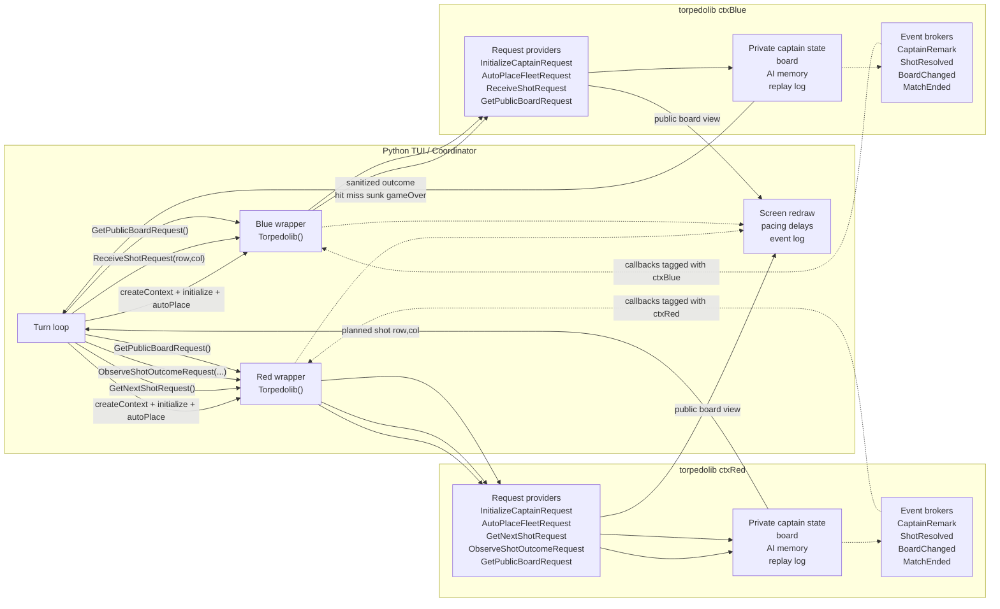

# Torpedo Duel Design

## Objective

Design a realistic Broker FFI API example in which a Nim shared library owns a
non-trivial state machine and a foreign application presents that state through
a text UI.

The example is meant to show how nim-brokers can be used to expose a rich,
stateful backend through generated C, C++, and Python interfaces while keeping
the authoritative logic inside Nim.

## Design Goals

The example should demonstrate all of the following clearly:

- one shared library with multiple independent contexts
- request-driven commands and queries
- event-driven notifications for streaming state changes
- hidden state kept entirely inside Nim
- foreign code acting as a coordinator rather than as the game engine
- deterministic execution for tests and demos
- human-followable pacing via explicit delays in the foreign app

## Non-Goals

The first version should not attempt to solve every game problem.

Avoid in version 1:

- human-vs-AI interaction
- networking
- graphical UI
- advanced weapons or fog-of-war variants
- physics simulation
- direct context-to-context communication inside the library

## Core Runtime Model

The example uses a single shared library, `torpedolib`, but creates two active
contexts from it in one foreign process.

Each context represents one captain and owns:

- its own board and ship placement
- its own attack history and enemy knowledge map
- its own random seed and AI mode
- its own replay log
- its own internal broker providers
- its own FFI lifecycle, request surface, and event subscriptions

The foreign application owns the match loop.

That separation is intentional.

The library decides game state.

The foreign application decides when to ask for the next action, when to redraw
the screen, how much to delay between steps, and how to forward requests between
the two contexts.

## Control And Event Flow

Solid arrows show control and request flow. Dashed arrows show event callbacks
coming back from each library context into the Python coordinator.



## Context Interaction Pattern

Contexts do not directly invoke each other.

The foreign app acts as the relay:

1. call `GetNextShotRequest` on attacker context
2. submit returned coordinate to defender context through `ReceiveShotRequest`
3. render the outcome in the text UI
4. call `ObserveShotOutcomeRequest` on attacker context so it can update its
   own targeting model
5. continue until one side emits or returns a terminal state

This keeps the per-context isolation honest and visible.

## Suggested Foreign Consumer

Python should be the first-class consumer for this example.

Reasons:

- fastest path to an expressive text UI
- existing generated Python wrapper support already fits the repo well
- easy sleep-based pacing for a spectator-friendly demo
- simpler replay and event-log rendering than in the first C++ pass

A C++ application can still be added later as a parity example, but it should
not block the first version.

## Game Rules For Version 1

Use a simple Battleship-style ruleset with torpedo flavor.

Recommended rules:

- board size: `8x8`
- fixed fleet: ship lengths `4, 3, 3, 2`
- one shot per turn
- shot outcomes: miss, hit, sunk, game over
- no special actions
- automatic ship placement only
- alternating turns only

This is enough to keep the example interesting without burying the FFI story.

## State Model

Each context should maintain three conceptual views of state.

### 1. Private authoritative state

Only available inside the Nim backend.

Contains:

- full own board with ship positions
- damage state for all own ships
- enemy belief map used by AI
- shot history
- internal replay log
- current turn counters and match status

### 2. Public spectator state

Safe to expose to the foreign app.

Contains:

- own fleet health summary
- known enemy hits and misses
- last action summary
- whose turn it is
- winner if the game is over

### 3. Optional debug state

Useful for tests, traceability, and screenshot generation.

Contains:

- full own board plus full known enemy board
- ship positions and sunk markers
- AI reasoning hints
- seed and move counters

This should be gated behind a debug-only request or an explicit `debugMode`
configuration flag.

## Exported FFI API Sketch

The exported API should remain small and procedural. The foreign app should be
able to drive a whole match without reading internal data structures directly.

### Shared API types

Suggested FFI-safe value types:

- `Coord`
- `ShipStatus`
- `PublicCell`
- `PublicBoardView`
- `ShotOutcome`
- `ReplayEntry`

Possible Nim sketch:

```nim
ApiType:
  type Coord = object
    row*: int32
    col*: int32

ApiType:
  type ShotOutcome = object
    row*: int32
    col*: int32
    hit*: bool
    sunk*: bool
    shipName*: string
    gameOver*: bool

ApiType:
  type ReplayEntry = object
    turnNumber*: int32
    side*: string
    phase*: string
    message*: string
```

### Request brokers to export

#### `InitializeCaptainRequest`

Inputs:

- captain name
- board size
- AI mode
- seed
- optional debug flag

Purpose:

- initialize per-context game state
- select deterministic AI behavior
- configure any replay verbosity

#### `AutoPlaceFleetRequest`

Inputs:

- none, or optional placement policy string

Purpose:

- place the fleet deterministically from the configured seed

#### `GetNextShotRequest`

Inputs:

- none

Outputs:

- turn number
- coordinate
- optional reasoning label

Purpose:

- ask the current captain to choose its next torpedo target

#### `ReceiveShotRequest`

Inputs:

- coordinate fired by the opponent

Outputs:

- sanitized `ShotOutcome`

Purpose:

- apply the incoming shot to the defending captain's private board

#### `ObserveShotOutcomeRequest`

Inputs:

- `ShotOutcome` returned by the opponent context

Purpose:

- let the attacker update its knowledge map and AI state

#### `GetPublicBoardRequest`

Inputs:

- none

Outputs:

- current public board view
- fleet summary
- last known result

Purpose:

- give the UI enough state to redraw the match without leaking private board
  data

#### `GetReplaySliceRequest`

Inputs:

- starting index
- maximum count

Outputs:

- recent replay entries

Purpose:

- support a scrolling log in the Python TUI without forcing the app to infer
  every message from low-level events

#### `ShutdownRequest`

Purpose:

- orderly teardown through the generated library lifecycle

### Event brokers to export

The exported events should complement the request API instead of duplicating it.

Recommended event types:

- `ThinkingStarted`
- `ThinkingFinished`
- `IncomingShotRegistered`
- `ShotResolved`
- `ShipSunk`
- `BoardChanged`
- `CaptainRemark`
- `MatchEnded`

These help demonstrate callback registration, handle-based unsubscribe, and
context-specific event routing.

## Internal Broker Split

The Nim library should not put all logic directly into the exported API request
providers.

Instead, keep two layers:

1. exported Broker FFI API layer
2. internal broker-driven engine layer

This is valuable because it shows that FFI brokers are a surface over a real
broker-oriented subsystem rather than the entirety of the design.

Suggested internal request brokers:

- `ConfigureGameRequest`
- `PlaceFleetRequest`
- `PlanShotRequest`
- `ApplyIncomingShotRequest`
- `RecordShotOutcomeRequest`
- `GetPublicViewRequest`
- `GetDebugStateRequest`

Suggested internal event brokers:

- `GameConfigured`
- `FleetPlaced`
- `TurnStarted`
- `ShotPlanned`
- `ShotApplied`
- `ShipDestroyed`
- `GameOver`
- `ReplayAppended`

The exported API layer can adapt these to FFI-safe structures and naming.

## Match Coordinator Loop

The foreign app controls the pace of the demonstration.

Recommended loop:

1. create `ctxRed`
2. create `ctxBlue`
3. initialize both captains with different seeds and names
4. auto-place both fleets
5. subscribe to events on both contexts
6. while no side has lost:
   - ask active attacker for next shot
   - sleep for `700ms`
   - submit shot to defender
   - redraw UI
   - sleep for `400ms`
   - submit returned outcome back to attacker
   - redraw UI
   - sleep for `400ms`
   - swap turns

Recommended pacing defaults:

- thinking delay: `700ms`
- shot travel delay: `300ms`
- resolution delay: `400ms`
- sunk banner delay: `900ms`

Delays should live in the foreign app, not in the Nim backend, so the FFI demo
is easier to explain and tune.

## Python Text UI Sketch

The Python TUI can stay simple and still be effective.

Suggested layout:

```text
Torpedo Duel
Turn 12  |  Active: Red Fleet  |  Delay: 0.7s

RED FLEET                               BLUE FLEET
Own Waters          Enemy Chart         Own Waters          Enemy Chart
  A B C D E F G H     A B C D E F G H     A B C D E F G H     A B C D E F G H
1 . . S S . . . .   1 . . o . . . . .   1 . . . . . . . .   1 . x x . o . . .
2 . . . . . . . .   2 . . . . . . . .   2 S S S . . . . .   2 . . . . . . . .
3 . . . . . . . .   3 . x . . . . . .   3 . . . . . . . .   3 . . . . . . . .

Event Log
- Red thinking...
- Red fires at C3
- Blue reports HIT on Patrol Boat
- Red updates target map
```

Recommended symbols:

- `.` unknown
- `S` own ship segment
- `o` miss
- `x` hit
- `*` sunk ship segment

The UI should be able to render from `GetPublicBoardRequest` plus replay/event
data without peeking into backend-private state.

## Determinism Strategy

The example will be more useful if it can be replayed predictably.

Recommendations:

- require an explicit seed in `InitializeCaptainRequest`
- keep `AutoPlaceFleetRequest` deterministic for a given seed
- add a `scripted` AI mode for test cases
- make replay order stable and timestamp-free in tests where possible

This matters more than sophisticated AI in the first version.

## Test Plan

The most important tests are not UI tests. They are isolation and correctness
tests.

### Nim tests

- fleet placement validity
- hit / miss / sunk transitions
- game-over detection
- AI target selection behavior for deterministic seeds
- public view never leaks private enemy board state

### FFI integration tests

- create two contexts in one process
- subscribe to both event streams
- verify events are routed to the correct context only
- run a short scripted match end-to-end
- verify shutdown and cleanup for both contexts

### Python smoke test

- build generated wrapper
- run a short duel in fast mode
- assert process exit code and a few expected replay lines

## Planned File Layout

This is the target structure once implementation begins:

```text
examples/torpedo/
  README.md
  DESIGN.md
  nimlib/
    torpedolib.nim
  python_example/
    main.py
  cpp_example/
    main.cpp
```

Additional files that may be useful later:

- `examples/torpedo/CMakeLists.txt`
- `examples/torpedo/testdata/`
- `test/test_torpedo_library_init.nim`
- `test/test_torpedo_duel_flow.nim`

## Implementation Phases

### Phase 1

- implement Nim game engine state and rules
- expose minimal FFI request surface
- write deterministic integration tests

### Phase 2

- add Python wrapper demo
- add text UI and replay log rendering
- tune pacing and event wording

### Phase 3

- add optional C++ consumer
- add debug-only views and richer traces

## Key Message Of The Example

The point of the torpedo example is not just that Nim can export a game library.

The point is that nim-brokers can support:

- isolated multi-context runtimes
- request and event collaboration across a foreign boundary
- rich stateful backends
- foreign orchestration without surrendering backend authority

That is the design principle the implementation should preserve.