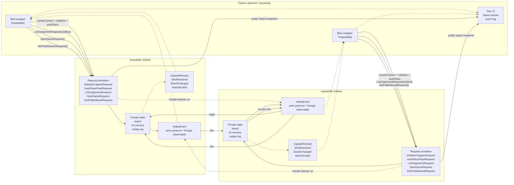

# Torpedo Duel Design

## Objective

Torpedo Duel is a demonstration-oriented FFI example for `nim-brokers` in which
the Nim shared library owns the full duel state machine and two library
contexts can play against each other directly.

The foreign application is intentionally reduced to setup and observation.

That is the point of the example: show that an exported Broker API can expose a
rich, stateful system while still allowing internal context-to-context behavior
to remain inside Nim.

## Design Goals

The implemented design demonstrates all of the following:

- one shared library with multiple independent contexts
- request brokers for setup, linking, starting, and querying state
- event brokers for streaming state changes to foreign code
- native Nim listeners attached to `EventBroker(API)` events across contexts
- hidden authoritative game state kept entirely inside Nim
- deterministic execution via seeds
- human-followable pacing controlled by backend delay settings

## Non-Goals

The current example does not try to solve everything.

Out of scope for now:

- human-vs-AI interaction
- networking
- graphical UI
- advanced weapons or variant rules
- cheating prevention or a referee context
- strict event ordering guarantees for foreign observers

## Implemented Runtime Model

The example uses one shared library, `torpedolib`, with two active contexts in
the same foreign process.

Each context owns:

- its own board and ship placement
- its own enemy knowledge map
- its own replay log
- its own AI state
- its own provider registrations
- its own event subscriptions

Python creates both contexts, initializes them, and links them together by
passing the peer `BrokerContext` handle through `LinkOpponentRequest`.

Once linked, each side installs a native Nim listener on the peer context's
`VolleyEvent`. After Python calls `StartGameRequest` on one side, the captains
exchange volleys autonomously inside Nim until one side loses.

## Control And Event Flow

Solid arrows show control and request flow. Dashed arrows show observable event
callbacks delivered back to Python.



## Context Interaction Pattern

This is no longer a foreign-app relay model.

The implemented interaction is:

1. Python creates and initializes both contexts.
2. Python links each side to the other.
3. Each context installs a native listener on the peer's `VolleyEvent`.
4. One side starts the duel.
5. A `fire` volley emitted by one context is consumed by the other.
6. The defender resolves the shot, emits a `reply`, and if still alive plans
   the next attack.
7. Python watches events and polls public board state for redraws.

This shows that `EventBroker(API)` is usable both as a foreign-observable API
surface and as an internal multi-context protocol channel.

## Game Rules

The duel uses a simple torpedo-flavored Battleship ruleset.

- board size defaults to `8x8`
- fleet lengths are `4, 3, 3, 2`
- one shot per turn
- outcomes are miss, hit, sunk, and game over
- fleet placement is automatic
- AI targeting is deterministic for a given seed

## State Model

### Private authoritative state

Kept inside Nim only:

- own ship positions
- damage state
- incoming hit and miss map
- enemy belief map
- replay log
- pending volley state
- peer link state

### Public observer state

Exposed through `GetPublicBoardRequest`:

- captain name
- board size and AI mode
- configured turn delay
- own board view
- enemy knowledge board
- fleet summary
- replay tail
- linked and started flags
- winner / loser state
- shot counters
- peer context handle

## Exported API Surface

### Requests

#### `InitializeCaptainRequest`

Inputs:

- captain name
- board size
- AI mode
- seed
- `turnDelayMs`

Purpose:

- configure deterministic captain state
- configure backend pacing

#### `AutoPlaceFleetRequest`

Purpose:

- place the fleet from the configured seed
- return the initial own-board snapshot and fleet summary

#### `LinkOpponentRequest`

Input:

- raw peer `BrokerContext` handle as `uint32`

Purpose:

- bind this context to its opponent
- install the native peer listener on the opponent's `VolleyEvent`

#### `StartGameRequest`

Purpose:

- trigger the opening volley from one side

#### `GetPublicBoardRequest`

Purpose:

- provide enough public state for the foreign UI to redraw at any point

#### `ShutdownRequest`

Purpose:

- stop the context and drop any installed peer listener

### Events

#### `VolleyEvent`

Used for both internal protocol and foreign observation.

Payload includes:

- `exchangeId`
- `stage` (`fire` or `reply`)
- coordinate
- reasoning
- hit / sunk / gameOver flags
- human-readable message

#### `CaptainRemark`

High-level lifecycle and narration messages.

#### `ShotResolved`

Normalized attack/defense outcome for the current side.

#### `BoardChanged`

Shot counters changed and a new board snapshot is worth fetching.

#### `MatchEnded`

Winner / loser terminal event.

## Foreign Consumer Role

Python is currently the reference foreign consumer because it is the fastest way
to show a readable text UI and to prove the generated wrapper surface.

Its role is intentionally narrow:

- create contexts
- initialize them
- auto-place fleets
- link them
- subscribe to events
- start one side
- poll public board state for redraws

It does not drive turns anymore.

## Important Tradeoffs

The example deliberately accepts the following tradeoffs because it is a demo of
broker flexibility rather than a production protocol design:

- `VolleyEvent` is both protocol traffic and UI-visible telemetry
- Python observers are not promised a strict causal ordering across all events
- protocol payloads stay within FFI-safe exported types
- foreign listeners still run through the generated API delivery mechanism

Those constraints are acceptable here because they make the underlying broker
design easier to see.

- `ThinkingStarted`
- `ThinkingFinished`
- `IncomingShotRegistered`
- `ShotResolved`
- `ShipSunk`
- `BoardChanged`
- `CaptainRemark`
- `MatchEnded`

These help demonstrate callback registration, handle-based unsubscribe, and
context-specific event routing.

## Internal Broker Split

The Nim library should not put all logic directly into the exported API request
providers.

Instead, keep two layers:

1. exported Broker FFI API layer
2. internal broker-driven engine layer

This is valuable because it shows that FFI brokers are a surface over a real
broker-oriented subsystem rather than the entirety of the design.

Suggested internal request brokers:

- `ConfigureGameRequest`
- `PlaceFleetRequest`
- `PlanShotRequest`
- `ApplyIncomingShotRequest`
- `RecordShotOutcomeRequest`
- `GetPublicViewRequest`
- `GetDebugStateRequest`

Suggested internal event brokers:

- `GameConfigured`
- `FleetPlaced`
- `TurnStarted`
- `ShotPlanned`
- `ShotApplied`
- `ShipDestroyed`
- `GameOver`
- `ReplayAppended`

The exported API layer can adapt these to FFI-safe structures and naming.

## Match Coordinator Loop

The foreign app controls the pace of the demonstration.

Recommended loop:

1. create `ctxRed`
2. create `ctxBlue`
3. initialize both captains with different seeds and names
4. auto-place both fleets
5. subscribe to events on both contexts
6. while no side has lost:
   - ask active attacker for next shot
   - sleep for `700ms`
   - submit shot to defender
   - redraw UI
   - sleep for `400ms`
   - submit returned outcome back to attacker
   - redraw UI
   - sleep for `400ms`
   - swap turns

Recommended pacing defaults:

- thinking delay: `700ms`
- shot travel delay: `300ms`
- resolution delay: `400ms`
- sunk banner delay: `900ms`

Delays should live in the foreign app, not in the Nim backend, so the FFI demo
is easier to explain and tune.

## Python Text UI Sketch

The Python TUI can stay simple and still be effective.

Suggested layout:

```text
Torpedo Duel
Turn 12  |  Active: Red Fleet  |  Delay: 0.7s

RED FLEET                               BLUE FLEET
Own Waters          Enemy Chart         Own Waters          Enemy Chart
  A B C D E F G H     A B C D E F G H     A B C D E F G H     A B C D E F G H
1 . . S S . . . .   1 . . o . . . . .   1 . . . . . . . .   1 . x x . o . . .
2 . . . . . . . .   2 . . . . . . . .   2 S S S . . . . .   2 . . . . . . . .
3 . . . . . . . .   3 . x . . . . . .   3 . . . . . . . .   3 . . . . . . . .

Event Log
- Red thinking...
- Red fires at C3
- Blue reports HIT on Patrol Boat
- Red updates target map
```

Recommended symbols:

- `.` unknown
- `S` own ship segment
- `o` miss
- `x` hit
- `*` sunk ship segment

The UI should be able to render from `GetPublicBoardRequest` plus replay/event
data without peeking into backend-private state.

## Determinism Strategy

The example will be more useful if it can be replayed predictably.

Recommendations:

- require an explicit seed in `InitializeCaptainRequest`
- keep `AutoPlaceFleetRequest` deterministic for a given seed
- add a `scripted` AI mode for test cases
- make replay order stable and timestamp-free in tests where possible

This matters more than sophisticated AI in the first version.

## Test Plan

The most important tests are not UI tests. They are isolation and correctness
tests.

### Nim tests

- fleet placement validity
- hit / miss / sunk transitions
- game-over detection
- AI target selection behavior for deterministic seeds
- public view never leaks private enemy board state

### FFI integration tests

- create two contexts in one process
- subscribe to both event streams
- verify events are routed to the correct context only
- run a short scripted match end-to-end
- verify shutdown and cleanup for both contexts

### Python smoke test

- build generated wrapper
- run a short duel in fast mode
- assert process exit code and a few expected replay lines

## Planned File Layout

This is the target structure once implementation begins:

```text
examples/torpedo/
  README.md
  DESIGN.md
  nimlib/
    torpedolib.nim
  python_example/
    main.py
  cpp_example/
    main.cpp
```

Additional files that may be useful later:

- `examples/torpedo/CMakeLists.txt`
- `examples/torpedo/testdata/`
- `test/test_torpedo_library_init.nim`
- `test/test_torpedo_duel_flow.nim`

## Implementation Phases

### Phase 1

- implement Nim game engine state and rules
- expose minimal FFI request surface
- write deterministic integration tests

### Phase 2

- add Python wrapper demo
- add text UI and replay log rendering
- tune pacing and event wording

### Phase 3

- add optional C++ consumer
- add debug-only views and richer traces

## Key Message Of The Example

The point of the torpedo example is not just that Nim can export a game library.

The point is that nim-brokers can support:

- isolated multi-context runtimes
- request and event collaboration across a foreign boundary
- rich stateful backends
- foreign orchestration without surrendering backend authority

That is the design principle the implementation should preserve.