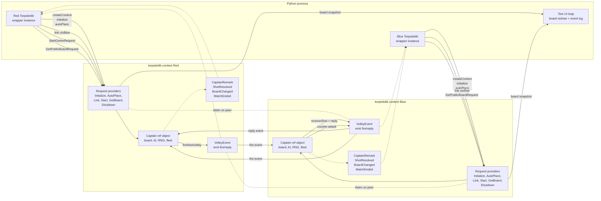
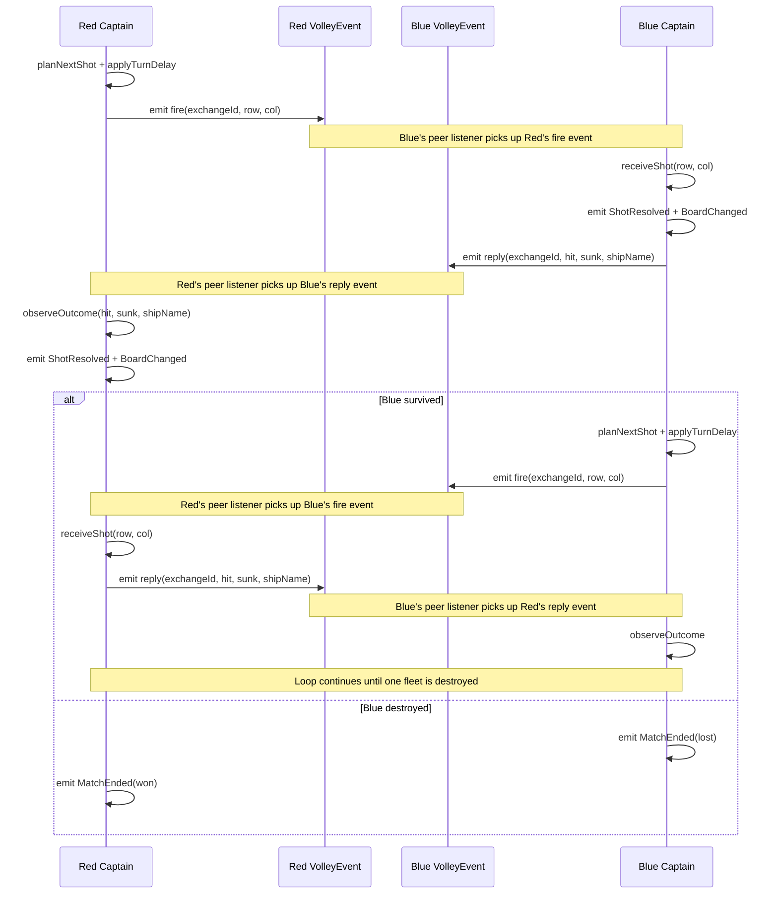
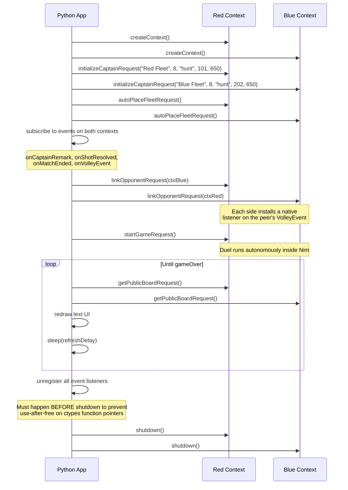

# Torpedo Duel Design

## Objective

Torpedo Duel is a demonstration-oriented FFI example for `nim-brokers` in which
the Nim shared library owns the full duel state machine and two library
contexts can play against each other directly.

The foreign application is intentionally reduced to setup and observation.

That is the point of the example: show that an exported Broker API can expose a
rich, stateful system while still allowing internal context-to-context behavior
to remain inside Nim.

## Design Goals

The implemented design demonstrates all of the following:

- one shared library with multiple independent contexts
- request brokers for setup, linking, starting, and querying state
- event brokers for streaming state changes to foreign code
- native Nim listeners attached to `EventBroker(API)` events across contexts
- hidden authoritative game state kept entirely inside Nim
- deterministic execution via seeds
- human-followable pacing controlled by backend delay settings

## Non-Goals

Out of scope:

- human-vs-AI interaction
- networking
- graphical UI
- advanced weapons or variant rules
- cheating prevention or a referee context
- strict event ordering guarantees for foreign observers

## Runtime Model

The example uses one shared library, `torpedolib`, with two active contexts in
the same foreign process.

Each context owns a `Captain` ref object that holds:

- own board and ship placement
- enemy knowledge map
- replay log
- AI state and RNG
- pending volley state
- peer link and listener handle
- lifecycle flags (placed, linked, started, gameOver, hasWon)

The `Captain` is created by `InitializeCaptainRequest` and destroyed by
`ShutdownRequest`. Only two threadvars exist per processing thread:
`gProviderCtx` (the broker context handle) and `gCaptain` (the Captain
instance, nil until initialization).

Python creates both contexts, initializes them, and links them together by
passing the peer `BrokerContext` handle through `LinkOpponentRequest`.

Once linked, each side installs a native Nim listener on the peer context's
`VolleyEvent`. After Python calls `StartGameRequest` on one side, the captains
exchange volleys autonomously inside Nim until one side loses.

## Thread Model

Each library context spawns two threads:

| Thread | Purpose |
|--------|---------|
| Processing thread | Hosts request providers and game logic. All Captain mutations happen here on the chronos event loop. |
| Delivery thread | Hosts the event listener registration provider. Receives cross-thread events and calls C callbacks into Python. |

Both threads share the same `BrokerContext`. MT EventBroker routes events by
context — `emit(ctx, event)` on the processing thread reaches listeners on the
delivery thread via `AsyncChannel`.

Because the framework guarantees one processing thread per context, no locking
is required on the Captain.

## Control And Event Flow

Solid arrows show control and request flow. Dashed arrows show observable event
callbacks delivered back to Python.



## Volley Exchange Sequence

The autonomous duel loop after `StartGameRequest`:



## Bootstrap Sequence

The Python app orchestrates setup, then becomes a passive observer:



## Captain State Model

All mutable game state lives inside the `Captain` ref object:

```nim
type Captain = ref object
  # Identity & configuration
  ctx: BrokerContext
  name: string
  aiMode: string          # "hunt", "random", or "sweep"
  boardSize: int32
  seed: int64
  turnDelayMs: int32

  # RNG — XorShift64 (Marsaglia 2003, triple 13/7/17)
  rngState: uint64

  # Lifecycle flags
  fleetPlaced: bool
  linked: bool
  started: bool
  gameOver: bool
  hasWon: bool

  # Own board
  ships: seq[Ship]
  shipIndexBoard: seq[seq[int]]   # (row,col) -> ship index, -1 = water
  incomingHit: seq[seq[bool]]
  incomingMiss: seq[seq[bool]]

  # Enemy board knowledge
  enemyState: seq[seq[int32]]     # EnemyUnknown/ShotMiss/ShotHit/ShotSunk

  # Combat state
  shotsFired: int32
  shotsReceived: int32
  pendingShot: bool
  pendingExchangeId: int32
  pendingTurn: int32
  pendingRow: int32
  pendingCol: int32
  nextExchangeId: int32

  # Peer link
  opponentCtx: BrokerContext
  peerVolleyHandle: VolleyEventListener
  peerListenerInstalled: bool

  # Replay log (bounded to MaxReplayLogSize = 256)
  replayLog: seq[ReplayEntry]
```

### Public observer state

Exposed through `GetPublicBoardRequest`:

- captain name, board size, AI mode, turn delay
- own board cell grid (with state codes: water, ship, miss, hit, sunk)
- enemy knowledge cell grid
- fleet summary (name, length, hits, sunk per ship)
- replay tail (last 14 entries)
- lifecycle flags (placed, linked, started, gameOver, hasWon)
- shot counters (fired, received)
- peer context handle

## Exported API Surface

### Requests

#### `InitializeCaptainRequest`

Creates a new `Captain` ref object with the given configuration. Tears down
any previous captain on the same context.

Inputs: `captainName`, `boardSize` (6..12), `aiMode`, `seed`, `turnDelayMs` (0..10000)

#### `AutoPlaceFleetRequest`

Deterministically places the fleet using the seeded XorShift64 PRNG.
Returns the initial own-board snapshot and fleet summary.

Requires: captain initialized.

#### `LinkOpponentRequest`

Binds this context to its opponent by installing a native Nim listener on the
peer's `VolleyEvent`. Drops any existing link first.

Input: `opponentCtx` as raw `uint32` handle.

#### `StartGameRequest`

Fires the opening volley, kicking off the autonomous duel loop.

Requires: captain initialized, fleet placed, opponent linked, not already started.

#### `GetPublicBoardRequest`

Returns a snapshot of both boards, fleet status, replay tail, and all
lifecycle flags. Safe to call at any time (even mid-volley).

#### `ShutdownRequest`

Drops the peer listener and nils the Captain. Called automatically by
the library context shutdown.

### Events

#### `VolleyEvent`

Dual-purpose: serves as the internal protocol between linked contexts AND
as a foreign-observable event stream.

Fields: `captainName`, `exchangeId`, `stage` (`"fire"` or `"reply"`),
`row`, `col`, `reasoning`, `hit`, `sunk`, `shipName`, `gameOver`, `message`.

#### `CaptainRemark`

High-level lifecycle and narration messages. Emitted during init, setup, link,
start, target selection, and error conditions.

Fields: `captainName`, `phase`, `message`, `turnNumber`.

#### `ShotResolved`

Normalized attack/defense outcome. Emitted once per shot on the owning
captain's context.

Fields: `captainName`, `turnNumber`, `row`, `col`, `incoming`, `hit`, `sunk`,
`shipName`, `gameOver`.

#### `BoardChanged`

Signals that shot counters changed. Useful for UI poll optimization.

Fields: `captainName`, `turnNumber`, `totalShotsFired`, `totalShotsReceived`.

#### `MatchEnded`

Terminal event. Emitted once per side at game end.

Fields: `captainName`, `outcome` (`"won"` or `"lost"`), `message`, `turnNumber`.

## AI Targeting Modes

Three modes are implemented:

| Mode | Strategy |
|------|----------|
| `hunt` | If any enemy cell is `ShotHit` (hit but not yet sunk), probe adjacent unknown cells to finish the ship. Otherwise, pick randomly from all unknown cells. |
| `sweep` | Deterministic top-left-to-bottom-right scan of unknown cells. |
| `random` | Uniform random selection from all unknown cells. |

All modes are deterministic for a given seed. The `hunt` mode produces the
most realistic-looking games.

## Game Rules

- board size defaults to `8x8` (configurable 6..12)
- fleet: Battleship (4), Cruiser (3), Submarine (3), Patrol Boat (2)
- one shot per turn
- outcomes: miss, hit, sunk, game over
- fleet placement is automatic via seeded PRNG
- ships cannot overlap and must fit within the board
- up to 256 random placement attempts per ship

## Cell State Codes

| Code | Name | Meaning |
|------|------|---------|
| 0 | `EnemyUnknown` | Enemy cell not yet targeted |
| 1 | `OwnWater` | Own cell with no ship |
| 2 | `OwnShip` | Own cell occupied by a ship (not yet hit) |
| 3 | `ShotMiss` | Shot landed in water |
| 4 | `ShotHit` | Shot hit a ship (not yet sunk) |
| 5 | `ShotSunk` | Shot hit and sank a ship |

Python renders these with symbols: `.` water/unknown, `S` own ship, `o` miss,
`x` hit, `*` sunk.

## Foreign Consumer Role

Python is the reference foreign consumer. Its role is intentionally narrow:

1. Create and initialize two contexts with different seeds
2. Auto-place both fleets
3. Subscribe to events on both contexts (with handle-based registration)
4. Link contexts together
5. Start one side
6. Poll public board state on a timer for redraws
7. Unregister all event listeners before shutdown (critical for callback safety)
8. Shut down both contexts

It does not drive turns. The duel is fully autonomous after `StartGameRequest`.

## Callback Lifetime Safety

C callbacks registered via `onXxx()` run on the Nim delivery thread. In Python,
these are `ctypes.CFUNCTYPE` objects stored in `_cb_refs`. The critical
invariant:

**All event listeners must be unregistered before `shutdown()` is called.**

If `shutdown()` joins the delivery thread while it still holds raw pointers to
Python CFUNCTYPE objects, and Python then clears `_cb_refs`, the delivery thread
may invoke freed function pointers (use-after-free / SIGSEGV).

The Python example enforces this with a `try/finally` block that calls
`unregister_callbacks()` before the context manager invokes `shutdown()`.

## Determinism

- Each captain requires an explicit seed in `InitializeCaptainRequest`
- Fleet placement is deterministic for a given seed via XorShift64
- AI targeting is deterministic for a given seed
- Same seeds always produce the same game when the same side opens

## Important Tradeoffs

The example deliberately accepts these tradeoffs because it is a demo of
broker flexibility rather than a production protocol design:

- `VolleyEvent` is both protocol traffic and UI-visible telemetry
- Python observers are not promised strict causal ordering across all events
- Protocol payloads stay within FFI-safe exported types
- Foreign listeners run through the generated API delivery mechanism
- No internal broker split — game logic lives directly in request providers
  rather than behind a second layer of internal brokers

Those constraints are acceptable here because they make the underlying broker
design easier to see.

## File Layout

```text
examples/torpedo/
  README.md              Top-level overview and build instructions
  DESIGN.md              This file
  nimlib/
    README.md            Backend overview
    torpedolib.nim       Nim shared library backend (Captain class + providers)
    build/               Generated artifacts (dylib, .py wrapper, .h header)
  python_example/
    README.md            Python consumer overview
    main.py              Text UI observer and bootstrap app
  cpp_example/
    README.md            Reserved for future C++ consumer
    main.cpp             Placeholder
```

## Key Message

The point of the torpedo example is not just that Nim can export a game library.

The point is that nim-brokers can support:

- isolated multi-context runtimes sharing one shared library
- request and event collaboration across a foreign boundary
- rich stateful backends with object-oriented state management
- cross-context native event listeners as an internal protocol
- foreign orchestration without surrendering backend authority
- safe callback lifecycle management across language boundaries
